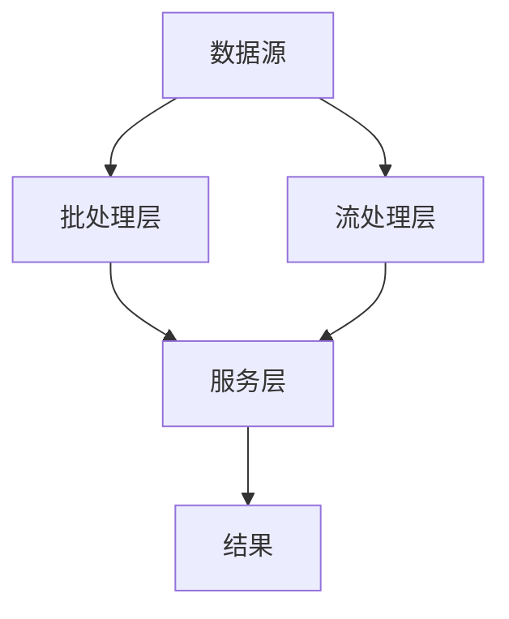
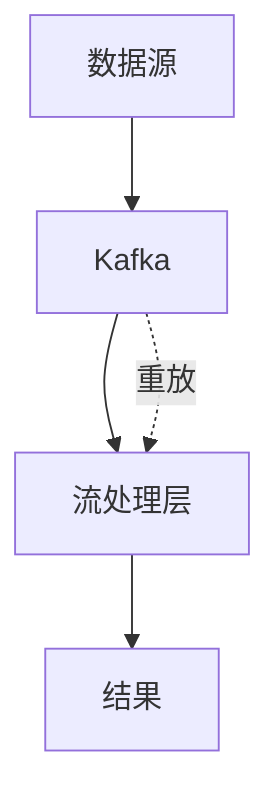

# 3.5.5 数据流处理与架构

## 📑 目录

- [3.5.5 数据流处理与架构](#355-数据流处理与架构)
  - [📑 目录](#-目录)
  - [1. 概述](#1-概述)
    - [1.1. 数据流处理定义](#11-数据流处理定义)
    - [1.2. 流处理意义](#12-流处理意义)
    - [1.3. 批处理vs流处理](#13-批处理vs流处理)
  - [2. 主流数据流处理架构](#2-主流数据流处理架构)
    - [2.1. Lambda架构](#21-lambda架构)
      - [2.1.1. Lambda架构定义](#211-lambda架构定义)
      - [2.1.2. Lambda架构实现](#212-lambda架构实现)
    - [2.2. Kappa架构](#22-kappa架构)
      - [2.2.1. Kappa架构定义](#221-kappa架构定义)
      - [2.2.2. Kappa架构实现](#222-kappa架构实现)
    - [2.3. 混合架构](#23-混合架构)
      - [2.3.1. 混合架构定义](#231-混合架构定义)
  - [3. 主流流处理框架](#3-主流流处理框架)
    - [3.1. Apache Kafka](#31-apache-kafka)
      - [3.1.1. Kafka特点](#311-kafka特点)
    - [3.2. Apache Flink](#32-apache-flink)
      - [3.2.1. Flink特点](#321-flink特点)
    - [3.3. Apache Spark Streaming](#33-apache-spark-streaming)
      - [3.3.1. Spark Streaming特点](#331-spark-streaming特点)
    - [3.4. Apache Storm](#34-apache-storm)
      - [3.4.1. Storm特点](#341-storm特点)
  - [4. 流处理模式](#4-流处理模式)
    - [4.1. 事件驱动处理](#41-事件驱动处理)
      - [4.1.1. 事件驱动模式](#411-事件驱动模式)
    - [4.2. 窗口处理](#42-窗口处理)
      - [4.2.1. 窗口类型](#421-窗口类型)
    - [4.3. 状态管理](#43-状态管理)
      - [4.3.1. 状态类型](#431-状态类型)
  - [5. 流处理优化](#5-流处理优化)
    - [5.1. 延迟优化](#51-延迟优化)
    - [5.2. 吞吐量优化](#52-吞吐量优化)
    - [5.3. 容错优化](#53-容错优化)
  - [6. 实际应用案例](#6-实际应用案例)
    - [6.1. 金融行业案例](#61-金融行业案例)
    - [6.2. 互联网行业案例](#62-互联网行业案例)
  - [7. 形式化定义](#7-形式化定义)
    - [7.1. 流处理形式化](#71-流处理形式化)
  - [8. 多表征](#8-多表征)
  - [9. 总结与展望](#9-总结与展望)
    - [9.1. 总结](#91-总结)
    - [9.2. 发展趋势](#92-发展趋势)

## 1. 概述

### 1.1. 数据流处理定义

**数据流处理**是指对实时产生的数据进行持续处理和分析，适用于高吞吐、低延迟场景。

**流处理形式化定义**：

设流处理函数 $S: Stream \to Result$，其中：

- $Stream = \{e_1, e_2, \ldots, e_n, \ldots\}$：事件流
- $Result$：处理结果

### 1.2. 流处理意义

**数据流处理的意义**：

1. **实时性**：实时处理数据，低延迟
2. **连续性**：连续处理数据流
3. **高吞吐**：高吞吐量处理
4. **事件驱动**：事件驱动处理

### 1.3. 批处理vs流处理

**批处理vs流处理对比**：

| 特性 | 批处理 | 流处理 |
|------|--------|--------|
| **延迟** | 高（分钟到小时） | 低（毫秒到秒） |
| **数据量** | 大批量 | 连续流 |
| **处理方式** | 定时处理 | 实时处理 |
| **状态管理** | 无状态 | 有状态 |
| **容错** | 重跑任务 | 检查点恢复 |

---

## 2. 主流数据流处理架构

### 2.1. Lambda架构

#### 2.1.1. Lambda架构定义

**Lambda架构**：结合批处理和流处理的混合架构。

**架构层次**：

1. **批处理层**：处理历史数据
2. **流处理层**：处理实时数据
3. **服务层**：合并批处理和流处理结果

**Lambda架构图**：



#### 2.1.2. Lambda架构实现

**Lambda架构实现**：

```python
class LambdaArchitecture:
    def __init__(self, batch_processor, stream_processor, serving_layer):
        self.batch_processor = batch_processor
        self.stream_processor = stream_processor
        self.serving_layer = serving_layer

    def process(self, data):
        """处理数据"""
        # 批处理
        batch_result = self.batch_processor.process(data)

        # 流处理
        stream_result = self.stream_processor.process(data)

        # 合并结果
        result = self.serving_layer.merge(batch_result, stream_result)
        return result
```

### 2.2. Kappa架构

#### 2.2.1. Kappa架构定义

**Kappa架构**：统一使用流处理处理所有数据。

**架构特点**：

- **单一处理层**：只有流处理层
- **重放机制**：通过重放历史数据处理批处理任务
- **简化架构**：架构更简单

**Kappa架构图**：



#### 2.2.2. Kappa架构实现

**Kappa架构实现**：

```python
class KappaArchitecture:
    def __init__(self, stream_processor, kafka):
        self.stream_processor = stream_processor
        self.kafka = kafka

    def process_realtime(self, data):
        """实时处理"""
        return self.stream_processor.process(data)

    def process_batch(self, start_time, end_time):
        """批处理（通过重放）"""
        # 从Kafka重放历史数据
        historical_data = self.kafka.replay(start_time, end_time)
        return self.stream_processor.process(historical_data)
```

### 2.3. 混合架构

#### 2.3.1. 混合架构定义

**混合架构**：根据场景选择批处理或流处理。

---

## 3. 主流流处理框架

### 3.1. Apache Kafka

#### 3.1.1. Kafka特点

**Kafka特点**：

- **消息队列**：分布式消息队列
- **高吞吐**：高吞吐量
- **持久化**：数据持久化
- **分布式**：分布式架构

**Kafka示例**：

```python
from kafka import KafkaProducer, KafkaConsumer
import json

# 生产者
producer = KafkaProducer(
    bootstrap_servers=['localhost:9092'],
    value_serializer=lambda v: json.dumps(v).encode('utf-8')
)

producer.send('my-topic', {'key': 'value'})

# 消费者
consumer = KafkaConsumer(
    'my-topic',
    bootstrap_servers=['localhost:9092'],
    value_deserializer=lambda m: json.loads(m.decode('utf-8'))
)

for message in consumer:
    print(message.value)
```

### 3.2. Apache Flink

#### 3.2.1. Flink特点

**Flink特点**：

- **流批一体**：统一的流批处理
- **低延迟**：低延迟处理
- **状态管理**：强大的状态管理
- **容错机制**：检查点容错

**Flink示例**：

```python
from pyflink.datastream import StreamExecutionEnvironment
from pyflink.table import StreamTableEnvironment

env = StreamExecutionEnvironment.get_execution_environment()
table_env = StreamTableEnvironment.create(env)

# 定义源表
table_env.execute_sql("""
    CREATE TABLE source (
        id INT,
        name STRING,
        value DOUBLE
    ) WITH (
        'connector' = 'kafka',
        'topic' = 'input-topic'
    )
""")

# 定义目标表
table_env.execute_sql("""
    CREATE TABLE sink (
        id INT,
        name STRING,
        value DOUBLE
    ) WITH (
        'connector' = 'jdbc',
        'url' = 'jdbc:postgresql://localhost:5432/mydb',
        'table-name' = 'target_table'
    )
""")

# 执行流处理
table_env.execute_sql("""
    INSERT INTO sink
    SELECT id, name, value
    FROM source
""")
```

### 3.3. Apache Spark Streaming

#### 3.3.1. Spark Streaming特点

**Spark Streaming特点**：

- **微批处理**：基于微批处理
- **统一API**：与Spark统一API
- **容错机制**：RDD容错机制

**Spark Streaming示例**：

```python
from pyspark import SparkContext
from pyspark.streaming import StreamingContext

sc = SparkContext("local[2]", "StreamingApp")
ssc = StreamingContext(sc, 1)  # 1秒批处理间隔

# 创建DStream
lines = ssc.socketTextStream("localhost", 9999)

# 处理数据
words = lines.flatMap(lambda line: line.split(" "))
word_counts = words.map(lambda word: (word, 1)).reduceByKey(lambda a, b: a + b)
word_counts.pprint()

ssc.start()
ssc.awaitTermination()
```

### 3.4. Apache Storm

#### 3.4.1. Storm特点

**Storm特点**：

- **实时处理**：真正的实时处理
- **低延迟**：毫秒级延迟
- **可扩展**：水平扩展

---

## 4. 流处理模式

### 4.1. 事件驱动处理

#### 4.1.1. 事件驱动模式

**事件驱动处理**：基于事件的处理模式。

**实现示例**：

```python
class EventDrivenProcessor:
    def __init__(self):
        self.handlers = {}

    def register_handler(self, event_type, handler):
        """注册事件处理器"""
        self.handlers[event_type] = handler

    def process_event(self, event):
        """处理事件"""
        event_type = event['type']
        if event_type in self.handlers:
            return self.handlers[event_type](event)
        return None
```

### 4.2. 窗口处理

#### 4.2.1. 窗口类型

**窗口类型**：

1. **时间窗口**：基于时间的窗口
2. **计数窗口**：基于事件数量的窗口
3. **滑动窗口**：滑动窗口
4. **会话窗口**：会话窗口

**时间窗口示例**：

```python
from pyflink.datastream import StreamExecutionEnvironment
from pyflink.datastream.window import TumblingEventTimeWindows

env = StreamExecutionEnvironment.get_execution_environment()

# 时间窗口处理
stream.key_by(lambda x: x[0]) \
    .window(TumblingEventTimeWindows.of(Time.seconds(10))) \
    .sum(1)
```

### 4.3. 状态管理

#### 4.3.1. 状态类型

**状态类型**：

1. **键控状态**：键控状态
2. **算子状态**：算子状态
3. **检查点状态**：检查点状态

---

## 5. 流处理优化

### 5.1. 延迟优化

**延迟优化策略**：

1. **并行处理**：增加并行度
2. **本地处理**：减少网络传输
3. **异步处理**：异步处理

### 5.2. 吞吐量优化

**吞吐量优化策略**：

1. **批量处理**：批量处理事件
2. **背压处理**：处理背压
3. **资源优化**：优化资源配置

### 5.3. 容错优化

**容错优化策略**：

1. **检查点**：定期检查点
2. **状态恢复**：快速状态恢复
3. **重试机制**：失败重试

---

## 6. 实际应用案例

### 6.1. 金融行业案例

**场景**：

- 实时风控系统，基于流处理实现交易监控与异常检测
- 典型架构：Kafka+Flink+Redis 实时处理与告警

**实现**：

```python
# 使用Flink进行实时风控
from pyflink.datastream import StreamExecutionEnvironment

env = StreamExecutionEnvironment.get_execution_environment()

# 从Kafka读取交易数据
transactions = env.add_source(KafkaSource('transactions-topic'))

# 实时风控检测
risk_alerts = transactions \
    .key_by(lambda t: t['user_id']) \
    .window(TumblingEventTimeWindows.of(Time.minutes(1))) \
    .process(RiskDetectionFunction())

# 发送告警
risk_alerts.add_sink(AlertSink())
```

### 6.2. 互联网行业案例

**场景**：

- 实时日志分析，支撑用户行为分析与推荐
- 典型架构：Kafka+Spark Streaming+Elasticsearch

**实现**：

```python
# 使用Spark Streaming进行实时日志分析
from pyspark.streaming import StreamingContext

ssc = StreamingContext(sc, 1)

# 从Kafka读取日志
logs = ssc.kafkaStream('log-topic')

# 实时分析
user_behavior = logs \
    .filter(lambda log: log['event_type'] == 'click') \
    .map(lambda log: (log['user_id'], 1)) \
    .reduceByKey(lambda a, b: a + b)

# 写入Elasticsearch
user_behavior.foreachRDD(lambda rdd: write_to_elasticsearch(rdd))
```

---

## 7. 形式化定义

### 7.1. 流处理形式化

**流处理定义**：

设流处理函数 $S: Stream \to Result$，其中：

$$Stream = \{e_1, e_2, \ldots, e_n, \ldots\}$$

流处理对每个事件 $e_i$ 应用函数 $f$：

$$Result_i = f(e_i, State_{i-1})$$

---

## 8. 多表征

本主题支持多种表征方式：

1. **符号表征**：形式化定义、数学公式
2. **图结构**：架构图、流程图
3. **代码实现**：流处理代码示例
4. **自然语言**：概念定义、架构描述
5. **可视化**：架构可视化、监控面板

---

## 9. 总结与展望

### 9.1. 总结

数据流处理与架构的核心要点：

1. **处理架构**：Lambda架构、Kappa架构
2. **流处理框架**：Kafka、Flink、Spark Streaming、Storm
3. **处理模式**：事件驱动、窗口处理、状态管理
4. **优化策略**：延迟、吞吐量、容错优化

### 9.2. 发展趋势

**未来发展方向**：

1. **流批一体**：统一的流批处理框架
2. **低延迟**：更低的处理延迟
3. **智能化**：AI驱动的流处理优化

---

**参考文献**：

1. Kreps, J. (2014). "Questioning the Lambda Architecture"
2. Akidau, T., et al. (2015). "The Dataflow Model: A Practical Approach to Balancing Correctness, Latency, and Cost in Massive-Scale, Unbounded, Out-of-Order Data Processing"

---

[返回数据分析与ETL导航](../README.md)
