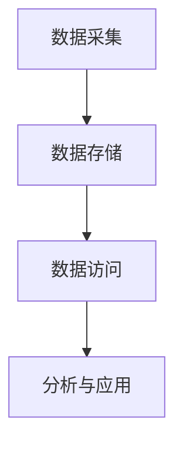

# 3.5.7 数据存储与访问

## 3.5.7.1 数据存储类型

- 关系型数据库（PostgreSQL、MySQL等）
- NoSQL数据库（MongoDB、Redis、Cassandra等）
- 数据湖、数据仓库、向量数据库

## 3.5.7.2 数据访问方法

- SQL、ORM、API、分布式访问

## 3.5.7.3 代码示例

```python
import psycopg2
conn = psycopg2.connect(dbname='test', user='user', password='pwd')
cur = conn.cursor()
cur.execute('SELECT * FROM table')
print(cur.fetchall())
```

## 3.5.7.4 相关内容跳转

- 详见 3.5.6-数据结构转换与建模.md

## 3.5.7.5 行业案例与多表征

### 金融行业案例

- 交易数据存储于PostgreSQL，支持高并发查询与风控分析。
- 典型架构：OLTP+OLAP混合，冷热分层存储。

### 互联网行业案例

- 用户行为数据存储于ClickHouse/Elasticsearch，支撑实时分析与推荐。
- 典型架构：分布式NoSQL+向量数据库混合。

### 多表征示例

- 存储架构图、数据访问流程图、冷热分层表。


