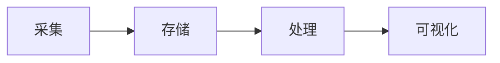

# 3.5.8 数据处理软件堆栈综述

## 3.5.8.1 数据处理全流程软件堆栈

- 数据采集：Logstash、Fluentd、Kafka Connect
- 数据存储：PostgreSQL、MySQL、MongoDB、ClickHouse、Elasticsearch、HDFS、S3
- 数据处理：Pandas、Spark、Flink、Presto、Trino
- 数据ETL：Airflow、Kettle、Talend
- 数据可视化：Tableau、PowerBI、Superset、Grafana

## 3.5.8.2 行业主流开源框架对比

- 各环节主流开源框架的优缺点、适用场景

## 3.5.8.3 典型数据处理架构案例

- 批处理架构、流处理架构、混合架构

## 3.5.8.4 相关内容跳转

- 详见 3.5.2-ETL理论与实践.md
- 详见 3.5.5-数据流处理与架构.md

## 3.5.8.5 行业案例与多表征

### 金融行业案例

- 端到端数据处理：采集（Fluentd）→ 存储（PostgreSQL）→ 处理（Flink）→ 可视化（Superset）。
- 典型场景：实时风控、合规报表、资产分析。

### 零售行业案例

- 端到端数据处理：采集（Kafka Connect）→ 存储（ClickHouse）→ 处理（Spark）→ 可视化（Tableau）。
- 典型场景：销售分析、库存优化、用户画像。

### 多表征示例

- 端到端数据流架构图、各环节主流工具对比表。

