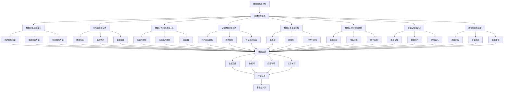

# 3.5-数据分析与ETL 分支导航

## 📑 目录

- [3.5-数据分析与ETL 分支导航](#35-数据分析与etl-分支导航)
  - [📑 目录](#-目录)
  - [1. 概述](#1-概述)
  - [2. 目录结构与本地跳转](#2-目录结构与本地跳转)
  - [3. 核心概念](#3-核心概念)
    - [3.1. 数据分析基础](#31-数据分析基础)
    - [3.2. ETL理论与实践](#32-etl理论与实践)
    - [3.3. 数据可视化](#33-数据可视化)
    - [3.4. 数据流处理](#34-数据流处理)
  - [4. 理论基础](#4-理论基础)
    - [4.1. ETL形式化定义](#41-etl形式化定义)
    - [4.2. 数据分析方法](#42-数据分析方法)
    - [4.3. 数据质量理论](#43-数据质量理论)
  - [5. 应用场景](#5-应用场景)
    - [5.1. 数据仓库建设](#51-数据仓库建设)
    - [5.2. 商业智能（BI）](#52-商业智能bi)
    - [5.3. 大数据处理](#53-大数据处理)
    - [5.4. 实时数据分析](#54-实时数据分析)
  - [6. 行业案例与多表征](#6-行业案例与多表征)
    - [6.1. 典型行业案例](#61-典型行业案例)
    - [6.2. 多表征示例](#62-多表征示例)
  - [7. 主题交叉引用](#7-主题交叉引用)
  - [8. 全链路知识流](#8-全链路知识流)
  - [9. 多表征](#9-多表征)
  - [10. 形式化语义](#10-形式化语义)
  - [11. 形式化语法与证明](#11-形式化语法与证明)
  - [12. 工具与实现](#12-工具与实现)
    - [12.1. ETL工具](#121-etl工具)
    - [12.2. 数据分析工具](#122-数据分析工具)
    - [12.3. 可视化工具](#123-可视化工具)
    - [12.4. 流处理框架](#124-流处理框架)
  - [13. 学习与研究路径](#13-学习与研究路径)
    - [13.1. 基础知识](#131-基础知识)
    - [13.2. 核心技能](#132-核心技能)
    - [13.3. 实践应用](#133-实践应用)
  - [14. 总结](#14-总结)

---

## 1. 概述

数据分析与ETL（Extract-Transform-Load）是数据科学的核心环节，涵盖了从数据提取、转换、加载到分析、可视化的完整数据管道。ETL是数据仓库和数据湖建设的基础，数据分析则是从数据中提取价值的关键过程。

**核心特征**：

1. **数据集成**：整合多个异构数据源
2. **数据转换**：清洗、转换、验证数据
3. **数据加载**：高效加载到目标系统
4. **数据分析**：统计分析和数据挖掘
5. **数据可视化**：直观展示数据洞察

**应用领域**：

- 数据仓库建设
- 商业智能（BI）
- 大数据处理
- 实时数据分析
- 数据科学项目
- 企业数据治理

---

## 2. 目录结构与本地跳转

- [3.5.1-数据分析基础理论](3.5.1-数据分析基础理论.md) - 数据分析基础理论文档
- [3.5.2-ETL理论与实践](3.5.2-ETL理论与实践.md) - ETL理论与实践文档
- [3.5.3-数据可视化方法与工具](3.5.3-数据可视化方法与工具.md) - 数据可视化文档
- [3.5.4-专业数据分析算法](3.5.4-专业数据分析算法.md) - 专业数据分析算法文档
- [3.5.5-数据流处理与架构](3.5.5-数据流处理与架构.md) - 数据流处理文档
- [3.5.6-数据结构转换与建模](3.5.6-数据结构转换与建模.md) - 数据结构转换文档
- [3.5.7-数据存储与访问](3.5.7-数据存储与访问.md) - 数据存储与访问文档
- [3.5.8-数据质量与治理](3.5.8-数据质量与治理.md) - 数据质量与治理文档
- [3.5.9-数据分析与ETL实践案例](3.5.9-数据分析与ETL实践案例.md) - 实践案例文档

---

## 3. 核心概念

### 3.1. 数据分析基础

数据分析是从数据中提取有用信息和洞察的过程。

**数据分析类型**：

1. **描述性分析**：
   - 描述数据的基本特征
   - 统计摘要、分布分析
   - 回答"发生了什么"

2. **诊断性分析**：
   - 分析数据的原因
   - 相关性分析、根因分析
   - 回答"为什么发生"

3. **预测性分析**：
   - 预测未来趋势
   - 时间序列分析、机器学习
   - 回答"可能发生什么"

4. **规范性分析**：
   - 提供行动建议
   - 优化算法、决策支持
   - 回答"应该做什么"

**统计分析方法**：

- **描述统计**：均值、中位数、标准差、分位数
- **推断统计**：假设检验、置信区间、回归分析
- **多元分析**：主成分分析、因子分析、聚类分析

### 3.2. ETL理论与实践

ETL是数据集成和数据仓库建设的核心过程。

**ETL三个阶段**：

1. **Extract（抽取）**：
   - 从各种数据源提取数据
   - 支持全量抽取和增量抽取
   - 支持多种数据源类型

2. **Transform（转换）**：
   - 数据清洗：去重、去空、异常值处理
   - 数据转换：格式转换、计算字段
   - 数据验证：完整性、一致性检查

3. **Load（加载）**：
   - 将数据加载到目标系统
   - 支持批量加载和实时加载
   - 支持多种加载策略

**ETL模式**：

- **批处理ETL**：定时批量处理
- **流处理ETL**：实时流式处理
- **混合ETL**：批处理和流处理结合

### 3.3. 数据可视化

数据可视化是将数据转换为图形或图像的过程。

**可视化类型**：

1. **基础图表**：
   - 柱状图、折线图、饼图
   - 散点图、热力图

2. **高级可视化**：
   - 仪表盘、交互式图表
   - 地理信息可视化
   - 网络图、树状图

3. **可视化工具**：
   - Tableau、Power BI
   - D3.js、Plotly
   - Matplotlib、Seaborn

### 3.4. 数据流处理

数据流处理是实时处理数据流的技术。

**流处理架构**：

1. **Lambda架构**：
   - 批处理层：处理历史数据
   - 速度层：处理实时数据
   - 服务层：合并结果

2. **Kappa架构**：
   - 统一流处理
   - 简化架构
   - 更好的实时性

**流处理框架**：

- **Apache Kafka**：消息队列
- **Apache Flink**：流处理引擎
- **Apache Storm**：实时计算
- **Apache Spark Streaming**：微批处理

---

## 4. 理论基础

### 4.1. ETL形式化定义

**ETL过程形式化**：

设ETL过程为三元组 $ETL = (E, T, L)$，其中：

- $E: S \to D_{raw}$：抽取函数，从数据源集合 $S$ 抽取原始数据 $D_{raw}$
- $T: D_{raw} \to D_{clean}$：转换函数，将原始数据转换为清洗后的数据 $D_{clean}$
- $L: D_{clean} \to T$：加载函数，将清洗后的数据加载到目标系统 $T$

**ETL流水线**：

$$ETL(s, t) = L(T(E(s)), t)$$

其中$s$是数据源，$t$是目标系统。

### 4.2. 数据分析方法

**统计分析**：

- **描述统计**：$\bar{x} = \frac{1}{n}\sum_{i=1}^n x_i$（均值）
- **推断统计**：$t = \frac{\bar{x} - \mu_0}{s/\sqrt{n}}$（t检验）
- **回归分析**：$y = \beta_0 + \beta_1 x + \epsilon$（线性回归）

**数据挖掘方法**：

- **聚类**：$C = \{C_1, C_2, \ldots, C_k\}$，其中$\bigcup_{i=1}^k C_i = D$
- **分类**：$f: X \to Y$，其中$Y$是类别集合
- **关联规则**：$A \Rightarrow B$，支持度和置信度

### 4.3. 数据质量理论

**数据质量维度**：

1. **完整性**：$Completeness = \frac{|Non-null|}{|Total|}$
2. **准确性**：$Accuracy = \frac{|Correct|}{|Total|}$
3. **一致性**：$Consistency = \frac{|Consistent|}{|Total|}$
4. **时效性**：$Timeliness = f(t_{current} - t_{data})$

**数据质量评估**：

$$Quality(D) = w_1 \cdot Completeness(D) + w_2 \cdot Accuracy(D) + w_3 \cdot Consistency(D) + w_4 \cdot Timeliness(D)$$

其中$w_i$是权重，$\sum_{i=1}^4 w_i = 1$。

---

## 5. 应用场景

### 5.1. 数据仓库建设

ETL在数据仓库建设中的应用：

- **数据集成**：整合多个业务系统数据
- **数据清洗**：保证数据质量
- **数据转换**：转换为星型或雪花型模型
- **定期加载**：定时更新数据仓库

### 5.2. 商业智能（BI）

数据分析在商业智能中的应用：

- **报表生成**：自动生成业务报表
- **仪表盘**：实时监控业务指标
- **数据挖掘**：发现业务规律
- **决策支持**：为决策提供数据支持

### 5.3. 大数据处理

ETL和数据分析在大数据处理中的应用：

- **数据湖建设**：存储原始数据
- **批处理分析**：处理历史数据
- **流处理分析**：实时分析数据流
- **机器学习**：训练和部署模型

### 5.4. 实时数据分析

实时数据分析的应用：

- **实时监控**：监控系统指标
- **实时推荐**：个性化推荐
- **实时风控**：风险实时检测
- **实时告警**：异常实时告警

---

## 6. 行业案例与多表征

### 6.1. 典型行业案例

- **数据库系统**：ETL在数据仓库中的应用（详见[1-数据库系统](../../../1-数据库系统/README.md)）
- **AI与机器学习**：数据分析在机器学习中的应用（详见[3.4-AI与机器学习算法](../3.4-AI与机器学习算法/README.md)）
- **金融数据分析**：ETL和数据分析在金融领域的应用（详见[5.1-金融数据分析](../../../5-行业应用与场景/5.1-金融数据分析/README.md)）
- **可视化技术**：数据可视化在知识图谱中的应用（详见[6.3-可视化技术](../../../6-知识图谱与可视化/6.3-可视化技术/README.md)）

### 6.2. 多表征示例

- **符号表征**：ETL流程、数据转换规则、统计公式、质量指标
- **图结构**：ETL流程图、数据流图、依赖关系图、可视化图表
- **向量/张量**：数据向量、特征向量、嵌入表示
- **自然语言**：定义、注释、描述、业务规则
- **图像/可视化**：ETL架构图、数据流程图、可视化图表、仪表盘

---

## 7. 主题交叉引用

| 主题      | 基础理论 | 形式化模型 | 应用场景 | 算法实现 | 行业案例 | 多表征 |
|-----------|----------|------------|----------|----------|----------|--------|
| 数据分析基础理论| ✅ | ✅       | ✅     | ✅     | ✅     | ✅   |
| ETL理论与实践| ✅ | ✅       | ✅     | ✅     | ✅     | ✅   |
| 数据可视化方法与工具| ✅ | ✅       | ✅     | ✅     | ✅     | ✅   |
| 专业数据分析算法| ✅ | ✅       | ✅     | ✅     | ✅     | ✅   |
| 数据流处理与架构| ✅ | ✅       | ✅     | ✅     | ✅     | ✅   |
| 数据结构转换与建模| ✅ | ✅       | ✅     | ✅     | ✅     | ✅   |
| 数据存储与访问| ✅ | ✅       | ✅     | ✅     | ✅     | ✅   |
| 数据质量与治理| ✅ | ✅       | ✅     | ✅     | ✅     | ✅   |

**交叉引用**：

- [1-数据库系统](../../../1-数据库系统/README.md)：数据仓库和数据库
- [3.4-AI与机器学习算法](../3.4-AI与机器学习算法/README.md)：机器学习中的数据分析
- [5.1-金融数据分析](../../../5-行业应用与场景/5.1-金融数据分析/README.md)：金融领域应用
- [6.3-可视化技术](../../../6-知识图谱与可视化/6.3-可视化技术/README.md)：数据可视化

---

## 8. 全链路知识流

---

## 9. 多表征

本分支支持多种表征方式，包括：

- **符号表征**：ETL流程、数据转换规则、统计公式、质量指标、分析模型
- **图结构**：ETL流程图、数据流图、依赖关系图、可视化图表、架构图
- **向量/张量**：数据向量、特征向量、嵌入表示、张量数据
- **自然语言**：定义、注释、描述、业务规则、分析报告
- **图像/可视化**：ETL架构图、数据流程图、可视化图表、仪表盘、统计图表

这些表征可互映，提升数据分析与ETL表达力。

---

## 10. 形式化语义

**语义域**：$D$，包括：

- 数据源集合：$S = \{s_1, s_2, \ldots, s_n\}$
- 原始数据域：$D_{raw}$
- 清洗数据域：$D_{clean}$
- 目标系统集合：$T = \{t_1, t_2, \ldots, t_m\}$
- 分析结果域：$R$

**解释函数**：$I: \mathcal{L} \to D$，将数据分析与ETL规范映射到语义对象：

- $I(\text{source}) \in S$：数据源的解释
- $I(\text{extract}) = E$：抽取函数的解释
- $I(\text{transform}) = T$：转换函数的解释
- $I(\text{load}) = L$：加载函数的解释
- $I(\text{analyze}) = A$：分析函数的解释

**语义一致性**：每个ETL流程/分析过程/数据转换在$D$中有明确定义，满足：

- **功能性**：ETL流程的功能正确
- **数据质量**：保证数据质量要求
- **性能要求**：满足性能指标
- **一致性**：数据转换的一致性

---

## 11. 形式化语法与证明

**语法规则**：

数据分析与ETL的产生式：

- **ETL语法**：$ETL ::= Extract \mid Transform \mid Load \mid ETL; ETL$
- **分析语法**：$Analysis ::= Descriptive \mid Diagnostic \mid Predictive \mid Prescriptive$
- **转换语法**：$Transform ::= Clean \mid Convert \mid Validate \mid Transform; Transform$

**推理规则**：

数据分析与ETL的推理规则：

- **ETL组合**：$\frac{E(s) = d_1 \quad T(d_1) = d_2 \quad L(d_2, t) = r}{ETL(s, t) = r}$
- **质量保证**：$\frac{Quality(d) \geq threshold}{d \text{ is valid}}$
- **分析正确性**：$\frac{Analysis(data) = result \quad Validate(result)}{result \text{ is correct}}$

**定理**：数据分析与ETL分支的语法系统具一致性与可扩展性。

**证明**：由ETL产生式、分析规则与转换规则递归定义，保证系统一致与可扩展。具体证明包括：

1. 语法系统的递归定义保证可判定性
2. ETL流程的正确性保证数据质量
3. 分析方法的有效性保证结果正确
4. 性能优化保证系统效率

---

## 12. 工具与实现

### 12.1. ETL工具

**开源ETL工具**：

1. **Apache Airflow**：
   - 工作流编排
   - DAG定义
   - 任务调度

2. **Apache Spark**：
   - 大数据处理
   - ETL流水线
   - 分布式计算

3. **Apache NiFi**：
   - 数据流管理
   - 可视化设计
   - 实时处理

**商业ETL工具**：

1. **Informatica**：
   - 企业级ETL
   - 数据集成
   - 数据质量

2. **Talend**：
   - 开源和商业版本
   - 可视化设计
   - 大数据支持

### 12.2. 数据分析工具

**统计分析工具**：

1. **Python生态系统**：
   - Pandas：数据处理
   - NumPy：数值计算
   - SciPy：科学计算
   - Scikit-learn：机器学习

2. **R语言**：
   - 统计分析
   - 数据可视化
   - 统计建模

3. **SQL**：
   - 数据查询
   - 聚合分析
   - 窗口函数

### 12.3. 可视化工具

**可视化工具**：

1. **Tableau**：
   - 商业智能
   - 交互式可视化
   - 仪表盘

2. **Power BI**：
   - Microsoft BI工具
   - 数据可视化
   - 报表生成

3. **开源工具**：
   - D3.js：Web可视化
   - Plotly：交互式图表
   - Matplotlib：Python绘图

### 12.4. 流处理框架

**流处理工具**：

1. **Apache Kafka**：
   - 消息队列
   - 流数据平台
   - 事件流处理

2. **Apache Flink**：
   - 流处理引擎
   - 批流一体
   - 低延迟处理

3. **Apache Storm**：
   - 实时计算
   - 流处理
   - 高吞吐量

---

## 13. 学习与研究路径

### 13.1. 基础知识

1. **数据基础**：
   - 数据库原理
   - SQL语言
   - 数据结构

2. **统计基础**：
   - 统计学
   - 概率论
   - 数据分析方法

### 13.2. 核心技能

1. **ETL技能**：
   - ETL工具使用
   - 数据清洗技术
   - 数据转换方法
   - 性能优化

2. **分析技能**：
   - 统计分析方法
   - 数据挖掘算法
   - 机器学习基础
   - 可视化技术

### 13.3. 实践应用

1. **项目实践**：
   - 数据仓库项目
   - 数据分析项目
   - 实时数据处理项目

2. **工具掌握**：
   - ETL工具使用
   - 数据分析工具
   - 可视化工具

3. **研究前沿**：
   - 实时ETL
   - 流式分析
   - 自动化数据管道
   - 数据治理

---

## 14. 总结

数据分析与ETL是数据科学的核心环节，涵盖了从数据提取、转换、加载到分析、可视化的完整数据管道。ETL为数据仓库和数据湖建设提供基础，数据分析则从数据中提取价值，为业务决策提供支持。

**核心价值**：

1. **数据集成**：整合多个异构数据源
2. **数据质量**：保证数据质量和一致性
3. **数据分析**：从数据中提取洞察
4. **业务价值**：为业务决策提供支持

**应用前景**：

随着大数据、人工智能、实时分析等技术的发展，数据分析与ETL将继续发展，特别是在实时ETL、流式分析、自动化数据管道等领域，数据分析与ETL将提供更强大的功能和更好的性能。

---

[返回数据模型与算法总导航](../README.md)
