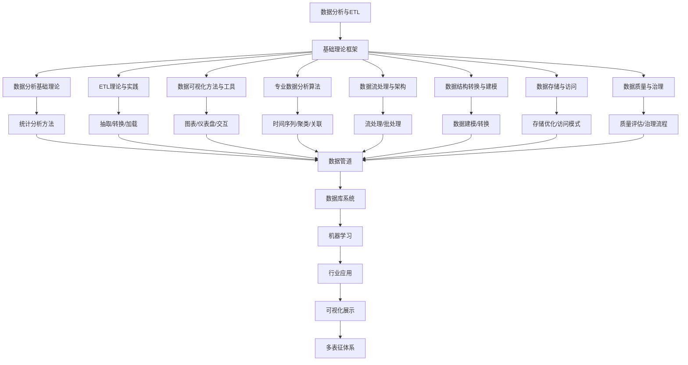

# 3.5-数据分析与ETL 分支导航

## 目录结构与本地跳转

- [3.5.1-数据分析基础理论](3.5.1-数据分析基础理论.md) - 预留分支
- [3.5.2-ETL理论与实践](3.5.2-ETL理论与实践.md) - 预留分支
- [3.5.3-数据可视化方法与工具](3.5.3-数据可视化方法与工具.md) - 预留分支
- [3.5.4-专业数据分析算法](3.5.4-专业数据分析算法.md) - 预留分支
- [3.5.5-数据流处理与架构](3.5.5-数据流处理与架构.md) - 预留分支
- [3.5.6-数据结构转换与建模](3.5.6-数据结构转换与建模.md) - 预留分支
- [3.5.7-数据存储与访问](3.5.7-数据存储与访问.md) - 预留分支
- [3.5.8-数据质量与治理](3.5.8-数据质量与治理.md) - 预留分支

---

## 主题交叉引用

| 主题      | 基础理论 | 形式化模型 | 应用场景 | 算法实现 | 行业案例 | 多表征 |
|-----------|----------|------------|----------|----------|----------|--------|
| 数据分析基础理论| 预留 | 预留       | 预留     | 预留     | 预留     | 预留   |
| ETL理论与实践| 预留   | 预留       | 预留     | 预留     | 预留     | 预留   |
| 数据可视化方法与工具| 预留 | 预留       | 预留     | 预留     | 预留     | 预留   |
| 专业数据分析算法| 预留 | 预留       | 预留     | 预留     | 预留     | 预留   |
| 数据流处理与架构| 预留 | 预留       | 预留     | 预留     | 预留     | 预留   |
| 数据结构转换与建模| 预留 | 预留       | 预留     | 预留     | 预留     | 预留   |
| 数据存储与访问| 预留   | 预留       | 预留     | 预留     | 预留     | 预留   |
| 数据质量与治理| 预留   | 预留       | 预留     | 预留     | 预留     | 预留   |

- 交叉引用：[1-数据库系统](../../../1-数据库系统/README.md)、[3.4-AI与机器学习算法](../3.4-AI与机器学习算法/README.md)、[5.1-金融数据分析](../../../5-行业应用与场景/5.1-金融数据分析/README.md)、[6.3-可视化技术](../../../6-知识图谱与可视化/6.3-可视化技术/README.md)

---

## 全链路知识流（Mermaid流程图）

---

[返回数据模型与算法总导航](../README.md)
