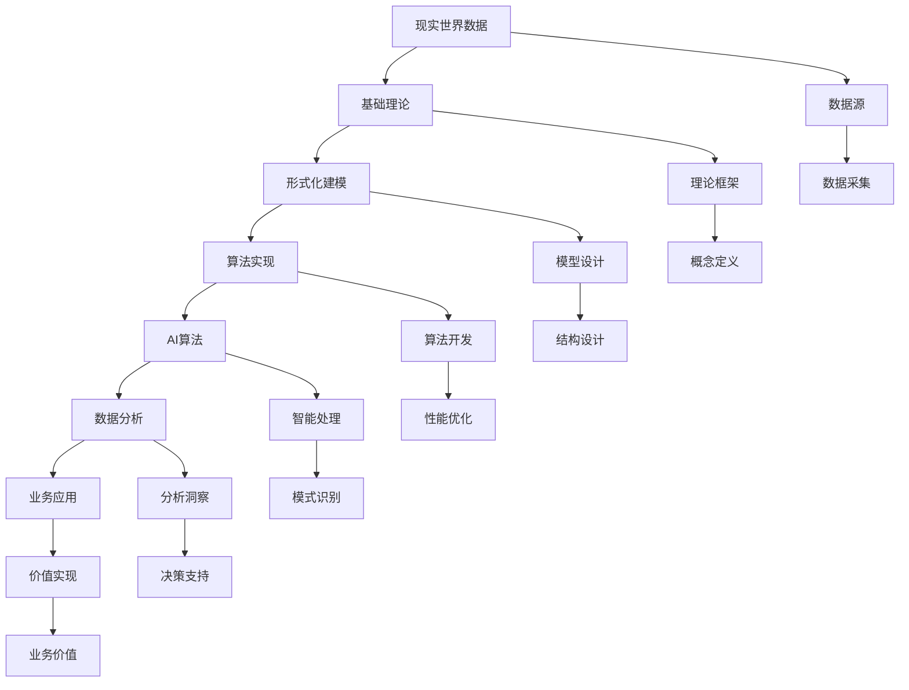

# 3-数据模型与算法

## 1. 📋 概述

数据模型与算法是数据科学的核心基础，涵盖了从基础理论到形式化模型，再到算法实现的完整知识体系。本分支系统性地阐述数据建模的理论框架、分类体系、关联性分析，以及各种数据处理算法的实现和应用。

## 2. ️ 目录结构

```text
3-数据模型与算法/
├── 3.1-基础理论/
│   ├── 3.1.1-数据科学基础理论框架.md
│   └── README.md
├── 3.2-形式化模型/
│   ├── 3.2.1-数据模型的形式化理论.md
│   ├── 3.2.2-概念建模与语义模型.md
│   ├── 3.2.3-数据资源模型与行业模型.md
│   └── README.md
├── 3.3-算法实现/
│   ├── 3.3.1-核心数据处理算法.md
│   ├── 3.3.2-查询优化算法.md
│   ├── 3.3.3-并发控制算法.md
│   └── README.md
├── 3.4-AI与机器学习算法/
│   ├── 3.4.1-机器学习基础理论.md
│   ├── 3.4.2-监督学习算法.md
│   ├── 3.4.3-无监督学习算法.md
│   ├── 3.4.4-深度学习算法.md
│   ├── 3.4.5-强化学习算法.md
│   ├── 3.4.6-自然语言处理算法.md
│   ├── 3.4.7-计算机视觉算法.md
│   ├── 3.4.8-推荐系统算法.md
│   ├── 3.4.9-图神经网络算法.md
│   ├── 3.4.10-多模态与大规模AI.md
│   └── README.md
├── 3.5-数据分析与ETL/
│   ├── 3.5.1-数据分析基础理论.md
│   ├── 3.5.2-ETL理论与实践.md
│   ├── 3.5.3-数据可视化方法与工具.md
│   ├── 3.5.4-数据挖掘算法.md
│   ├── 3.5.5-统计分析算法.md
│   ├── 3.5.6-时间序列分析.md
│   └── README.md
└── README.md
```

## 3. 🔗 主题交叉引用表

| 主题 | 基础理论 | 形式化模型 | 算法实现 | AI算法 | 数据分析 | 应用场景 |
|------|----------|------------|----------|--------|----------|----------|
| **数据建模基础** | 3.1.1 | 3.2.1 | 3.3.1 | - | 3.5.1 | 系统设计 |
| **概念建模** | - | 3.2.2 | - | - | - | 需求分析 |
| **语义模型** | - | 3.2.2 | - | 3.4.6 | - | 知识表示 |
| **数据资源模型** | - | 3.2.3 | - | - | 3.5.2 | 数据治理 |
| **行业模型** | - | 3.2.3 | - | - | - | 行业应用 |
| **核心算法** | - | - | 3.3.1-3.3.3 | - | 3.5.4 | 数据处理 |
| **机器学习** | - | - | - | 3.4.1-3.4.5 | - | 智能应用 |
| **深度学习** | - | - | - | 3.4.4, 3.4.9 | - | AI应用 |
| **NLP算法** | - | - | - | 3.4.6 | - | 文本处理 |
| **计算机视觉** | - | - | - | 3.4.7 | - | 图像处理 |
| **推荐系统** | - | - | - | 3.4.8 | - | 个性化服务 |
| **数据分析** | - | - | - | - | 3.5.1-3.5.6 | 业务分析 |
| **ETL处理** | - | - | 3.3.1 | - | 3.5.2 | 数据集成 |
| **数据可视化** | - | - | - | - | 3.5.3 | 数据展示 |

## 4. 🌊 全链路知识流



## 5. 知识体系特色

### 5.1. 理论严谨性

- **数学基础**：基于严格的数学理论构建算法体系
- **形式化表达**：采用形式化方法描述数据模型和算法
- **理论完备性**：从基础理论到高级应用的完整理论体系

### 5.2. 方法系统性

- **层次化设计**：从概念到逻辑到物理的完整建模
- **算法分类**：系统性的算法分类和实现方法
- **标准化流程**：标准化的数据处理和分析流程

### 5.3. 技术先进性

- **AI集成**：深度集成机器学习和人工智能技术
- **大规模处理**：支持大规模数据的处理和分析
- **实时计算**：支持实时数据流处理和计算

### 5.4. 应用实践性

- **行业导向**：针对不同行业的专业算法和模型
- **业务驱动**：以业务需求为导向的算法设计
- **技术实现**：提供具体的技术实现方案和工具

## 6. 学习路径建议

### 6.1. 入门路径

```text
1. 基础理论 (3.1)
   ├── 数据科学基础理论框架
   └── 核心概念和原理

2. 形式化模型 (3.2)
   ├── 数据模型的形式化理论
   ├── 概念建模与语义模型
   └── 数据资源模型与行业模型

3. 算法实现 (3.3)
   ├── 核心数据处理算法
   ├── 查询优化算法
   └── 并发控制算法

4. AI算法 (3.4)
   ├── 机器学习基础理论
   ├── 监督学习算法
   └── 深度学习算法

5. 数据分析 (3.5)
   ├── 数据分析基础理论
   ├── ETL理论与实践
   └── 数据可视化方法
```

### 6.2. 进阶路径

```text
1. 深度算法研究
   ├── 高级机器学习算法
   ├── 深度学习架构
   ├── 强化学习算法
   └── 图神经网络

2. 专业领域应用
   ├── 自然语言处理
   ├── 计算机视觉
   ├── 推荐系统
   └── 多模态AI

3. 高级数据分析
   ├── 数据挖掘算法
   ├── 统计分析算法
   ├── 时间序列分析
   └── 大规模数据处理
```

### 6.3. 专家路径

```text
1. 算法创新
   ├── 新算法设计
   ├── 算法优化
   ├── 算法理论创新
   └── 跨领域算法融合

2. 系统架构设计
   ├── 大规模系统设计
   ├── 分布式算法
   ├── 实时计算系统
   └── 智能系统架构

3. 行业标准制定
   ├── 算法标准
   ├── 数据标准
   ├── 行业规范
   └── 技术标准
```

## 7. ⚡ 快速导航

### 7.1. 核心理论

- **[基础理论](3.1-基础理论/README.md)** - 数据科学基础理论框架
- **[形式化模型](3.2-形式化模型/README.md)** - 数据建模的形式化理论和方法
- **[算法实现](3.3-算法实现/README.md)** - 核心数据处理算法实现
- **[AI算法](3.4-AI与机器学习算法/README.md)** - 机器学习和深度学习算法
- **[数据分析](3.5-数据分析与ETL/README.md)** - 数据分析和ETL处理

### 7.2. 🛠️ 实用工具

- **建模工具**：ER图、UML、本体编辑器
- **算法库**：NumPy、Pandas、Scikit-learn、TensorFlow、PyTorch
- **数据处理**：Apache Spark、Hadoop、Kafka
- **可视化工具**：Matplotlib、Seaborn、Plotly、Tableau

### 7.3. 应用场景

- **系统设计**：数据模型设计、系统架构
- **智能应用**：机器学习、深度学习、AI应用
- **数据分析**：业务分析、数据挖掘、可视化
- **行业应用**：金融、医疗、制造、零售、教育

## 8. 技术栈映射

| 技术领域 | 核心技术 | 相关工具 | 应用场景 |
|----------|----------|----------|----------|
| **数据建模** | ER模型、UML、本体 | Lucidchart、Protégé | 系统设计、知识表示 |
| **数据处理** | 关系代数、图算法 | SQL、Neo4j、Spark | 数据查询、图分析 |
| **机器学习** | 监督学习、无监督学习 | Scikit-learn、XGBoost | 预测分析、模式识别 |
| **深度学习** | 神经网络、CNN、RNN | TensorFlow、PyTorch | 图像识别、自然语言处理 |
| **数据分析** | 统计分析、数据挖掘 | Pandas、NumPy、R | 业务分析、数据洞察 |
| **可视化** | 图表、仪表板 | Matplotlib、Tableau | 数据展示、决策支持 |

## 9. 应用场景体系

### 9.1. 系统设计与开发

- **数据模型设计**：数据库设计、数据仓库建模
- **系统架构设计**：微服务架构、分布式系统
- **API设计**：RESTful API、GraphQL

### 9.2. 智能应用与AI

- **机器学习应用**：预测分析、分类、聚类
- **深度学习应用**：图像识别、语音识别、自然语言处理
- **推荐系统**：个性化推荐、内容推荐
- **智能决策**：基于AI的决策支持系统

### 9.3. 数据分析与挖掘

- **业务分析**：销售分析、用户行为分析
- **数据挖掘**：模式发现、异常检测
- **统计分析**：描述性统计、推断性统计
- **时间序列分析**：趋势分析、预测建模

### 9.4. 行业应用与场景

- **金融科技**：风险建模、反欺诈、智能投顾
- **医疗健康**：医学影像分析、药物发现、临床决策
- **制造业**：预测性维护、质量控制、供应链优化
- **零售电商**：客户画像、商品推荐、库存管理
- **教育科技**：学习分析、个性化教学、智能评估

### 9.5. 数据工程与治理

- **ETL处理**：数据提取、转换、加载
- **数据质量**：数据清洗、验证、监控
- **数据安全**：数据加密、访问控制、隐私保护
- **数据治理**：数据标准、元数据管理、数据生命周期

## 10. 🔮 发展趋势与前沿

### 10.1. 技术发展趋势

- **AI算法**：深度学习、强化学习、联邦学习
- **大规模计算**：分布式计算、边缘计算、量子计算
- **实时处理**：流式计算、实时分析、实时决策
- **多模态融合**：文本、图像、音频、视频的统一处理

### 10.2. 应用发展趋势

- **智能化应用**：AI驱动的智能应用和服务
- **个性化服务**：基于算法的个性化推荐和服务
- **自动化决策**：基于算法的自动化决策系统
- **跨领域融合**：多领域知识的融合应用

### 10.3. 标准化趋势

- **算法标准**：标准化的算法实现和评估
- **数据标准**：统一的数据格式和交换标准
- **行业标准**：各行业的算法应用标准
- **伦理标准**：AI算法的伦理和公平性标准

## 11. 学习资源推荐

### 11.1. 理论资源

- **数学基础**：线性代数、概率论、统计学、优化理论
- **算法理论**：数据结构、算法设计、计算复杂性
- **机器学习理论**：统计学习理论、深度学习理论
- **数据科学理论**：数据建模、数据分析、数据挖掘

### 11.2. 🛠️ 实践资源

- **编程语言**：Python、R、Java、Scala
- **算法库**：NumPy、Pandas、Scikit-learn、TensorFlow、PyTorch
- **数据处理工具**：Apache Spark、Hadoop、Kafka、Flink
- **可视化工具**：Matplotlib、Seaborn、Plotly、Tableau、PowerBI

### 11.3. 研究资源

- **学术论文**：机器学习、深度学习、数据挖掘、数据科学
- **技术报告**：算法优化、系统设计、行业应用
- **开源项目**：算法实现、工具库、框架系统
- **在线课程**：Coursera、edX、Udacity、DataCamp

---

-**📖 相关导航**

- [返回上级目录](../README.md)
- [2-形式科学理论](../2-形式科学理论/README.md)
- [4-软件架构与工程](../4-软件架构与工程/README.md)
- [5-行业应用与场景](../5-行业应用与场景/README.md)

## 12. 多表征

本分支支持多种表征方式，包括：

- 符号表征（数据结构、算法、模型、公式等）
- 图结构（数据流图、模型结构图、算法流程图等）
- 向量/张量（特征向量、嵌入、参数矩阵）
- 自然语言（定义、注释、描述）
- 图像/可视化（结构图、流程图、可视化结果等）
这些表征可互映，提升理论与算法表达力。

## 13. 形式化语义

- 语义域：$D$，如数据对象集、模型空间、算法操作空间
- 解释函数：$I: S \to D$，将符号/结构映射到具体语义对象
- 语义一致性：每个结构/公式/算法在$D$中有明确定义

## 14. 形式化语法与证明

- 语法规则：如数据结构定义、算法伪代码、推理规则、约束条件
- **定理**：本分支的语法系统具一致性与可扩展性。
- **证明**：由数据结构、算法定义与推理规则递归定义，保证系统一致与可扩展。

---

## 15. 核心算法详解

### 15.1. 数据处理算法

**排序算法**：

- **快速排序**：平均时间复杂度$O(n \log n)$，最坏$O(n^2)$
- **归并排序**：稳定排序，时间复杂度$O(n \log n)$
- **堆排序**：原地排序，时间复杂度$O(n \log n)$

**查找算法**：

- **二分查找**：时间复杂度$O(\log n)$，要求有序数组
- **哈希查找**：平均时间复杂度$O(1)$，最坏$O(n)$

**聚合算法**：

- **SUM/AVG/COUNT**：基本聚合函数
- **分组聚合**：GROUP BY操作
- **窗口函数**：OVER子句

### 15.2. 机器学习算法

**监督学习**：

- **线性回归**：$y = \theta^T x + b$
- **逻辑回归**：$P(y=1|x) = \frac{1}{1+e^{-\theta^T x}}$
- **决策树**：基于信息增益或基尼不纯度
- **随机森林**：集成多个决策树
- **支持向量机**：$\min_{\theta} \frac{1}{2}||\theta||^2 + C\sum_{i=1}^m \xi_i$

**无监督学习**：

- **K-means聚类**：$\min \sum_{i=1}^k \sum_{x \in C_i} ||x - \mu_i||^2$
- **PCA降维**：主成分分析，最大化方差
- **DBSCAN**：基于密度的聚类

**深度学习**：

- **前馈神经网络**：$h^{(l)} = \sigma(W^{(l)} h^{(l-1)} + b^{(l)})$
- **卷积神经网络**：$y = \text{Conv}(x, W) + b$
- **循环神经网络**：$h_t = \tanh(W_{hh} h_{t-1} + W_{xh} x_t + b)$
- **Transformer**：$\text{Attention}(Q, K, V) = \text{softmax}\left(\frac{QK^T}{\sqrt{d_k}}\right)V$

### 15.3. 优化算法

**梯度下降**：

$$\theta_{t+1} = \theta_t - \alpha \nabla_\theta J(\theta_t)$$

**Adam优化器**：

$$m_t = \beta_1 m_{t-1} + (1-\beta_1) g_t$$
$$v_t = \beta_2 v_{t-1} + (1-\beta_2) g_t^2$$
$$\theta_t = \theta_{t-1} - \frac{\alpha}{\sqrt{v_t} + \epsilon} m_t$$

---

## 16. 实际应用案例

### 16.1. 电商推荐系统

**技术栈**：

- 协同过滤算法
- 矩阵分解
- 深度学习推荐模型

**应用场景**：

- 商品推荐
- 个性化搜索
- 广告投放

### 16.2. 金融风控系统

**技术栈**：

- 逻辑回归
- 随机森林
- XGBoost
- 深度学习

**应用场景**：

- 信用评分
- 反欺诈检测
- 风险预警

### 16.3. 医疗影像分析

**技术栈**：

- 卷积神经网络
- 迁移学习
- 图像分割

**应用场景**：

- 疾病诊断
- 病灶检测
- 影像分析

### 16.4. 自然语言处理

**技术栈**：

- Transformer
- BERT
- GPT
- 预训练模型

**应用场景**：

- 机器翻译
- 文本分类
- 情感分析
- 问答系统

---

## 17. 工具与框架

### 17.1. 数据处理工具

**Python生态系统**：

- **Pandas**：数据分析和处理
- **NumPy**：数值计算
- **SciPy**：科学计算
- **Dask**：并行计算

**大数据工具**：

- **Apache Spark**：大数据处理
- **Apache Hadoop**：分布式存储和计算
- **Apache Kafka**：流数据处理
- **Apache Flink**：流处理引擎

### 17.2. 机器学习框架

**传统机器学习**：

- **Scikit-learn**：Python机器学习库
- **XGBoost**：梯度提升框架
- **LightGBM**：轻量级梯度提升

**深度学习**：

- **TensorFlow**：Google深度学习框架
- **PyTorch**：Facebook深度学习框架
- **Keras**：高级神经网络API
- **JAX**：Google的自动微分框架

### 17.3. 可视化工具

**Python可视化**：

- **Matplotlib**：基础绘图库
- **Seaborn**：统计可视化
- **Plotly**：交互式可视化

**商业工具**：

- **Tableau**：商业智能和可视化
- **Power BI**：Microsoft BI工具

---

## 18. 性能优化与最佳实践

### 18.1. 算法优化

**时间复杂度优化**：

- 选择合适的数据结构
- 使用索引加速查找
- 算法复杂度分析

**空间复杂度优化**：

- 原地算法
- 内存管理
- 数据压缩

### 18.2. 系统优化

**并行计算**：

- 多线程处理
- 多进程处理
- 分布式计算

**缓存策略**：

- 内存缓存
- 分布式缓存
- 缓存更新策略

### 18.3. 模型优化

**模型压缩**：

- 模型剪枝
- 模型量化
- 知识蒸馏

**训练优化**：

- 批量归一化
- 学习率调度
- 早停策略

---

## 19. 总结

数据模型与算法是数据科学的核心基础，涵盖了从基础理论到形式化模型，再到算法实现的完整知识体系。从数据建模到算法实现，从传统机器学习到深度学习，从数据分析到AI应用，数据模型与算法为数据科学提供了完整的理论支撑和实践方法。

**核心价值**：

1. **理论基础**：为数据科学提供坚实的理论基础
2. **算法支持**：提供丰富的算法和实现方法
3. **应用广泛**：应用于各个领域和场景
4. **技术前沿**：推动数据科学和AI技术发展

**应用前景**：

随着大数据、人工智能、云计算等技术的发展，数据模型与算法将继续发展，特别是在大模型、多模态AI、实时计算、边缘计算等领域，数据模型与算法将提供更强大的功能和更好的性能。

**发展趋势**：

1. **AI算法**：更大规模的模型和更强的能力
2. **实时计算**：实时数据处理和分析
3. **边缘计算**：在边缘设备上部署算法
4. **可解释性**：提高算法的可解释性和可信度
5. **自动化**：自动化算法选择和优化

---

[返回上级目录](../README.md)
