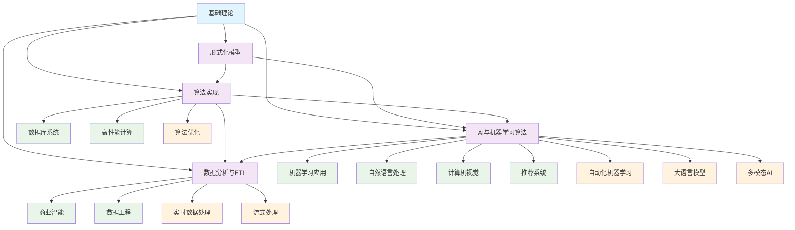

# 3-数据模型与算法 - 知识导航索引

## 📚 目录结构

```
3-数据模型与算法/
├── README.md                           # 本导航文件
├── 3.1-基础理论/                       # 数据科学理论基础
│   ├── 3.1.1-数据科学基础理论框架.md
│   └── README.md
├── 3.2-形式化模型/                     # 数据模型形式化
│   ├── 3.2.1-数据模型的形式化理论.md
│   └── README.md
├── 3.3-算法实现/                       # 核心算法实现
│   ├── 3.3.1-核心数据处理算法.md
│   ├── 3.3.2-查询优化算法.md
│   ├── 3.3.3-并发控制算法.md
│   └── README.md
├── 3.4-AI与机器学习算法/               # AI算法体系
│   ├── 3.4.1-机器学习基础理论.md
│   ├── 3.4.2-监督学习算法.md
│   ├── 3.4.3-无监督学习算法.md
│   ├── 3.4.4-强化学习算法.md
│   ├── 3.4.5-深度学习算法.md
│   ├── 3.4.6-自然语言处理算法.md
│   ├── 3.4.7-计算机视觉算法.md
│   ├── 3.4.8-推荐系统算法.md
│   ├── 3.4.9-图神经网络算法.md
│   ├── 3.4.10-多模态与大规模AI.md
│   └── README.md
└── 3.5-数据分析与ETL/                 # 数据处理流程
    ├── 3.5.1-数据分析基础理论.md
    ├── 3.5.2-ETL理论与实践.md
    ├── 3.5.3-数据可视化方法与工具.md
    ├── 3.5.4-数据质量与治理.md
    ├── 3.5.5-数据安全与隐私.md
    ├── 3.5.6-实时数据处理.md
    ├── 3.5.7-流式数据处理.md
    └── README.md
```

## 🔗 主题交叉引用表

| 算法分支 | 核心概念 | 关联理论 | 应用领域 |
|---------|---------|---------|---------|
| **基础理论** | 数据科学框架、方法论 | 形式科学理论、数学基础 | 科学研究、工程实践 |
| **形式化模型** | 数据模型、抽象化 | 类型理论、数学基础 | 数据库设计、系统建模 |
| **算法实现** | 数据处理、优化算法 | 自动机理论、控制理论 | 数据库系统、高性能计算 |
| **AI与机器学习** | 智能算法、模式识别 | 数学基础、统计理论 | 人工智能、数据分析 |
| **数据分析与ETL** | 数据流程、转换处理 | 算法实现、形式化模型 | 商业智能、数据工程 |

## 🌊 全链路知识流图



## 🎯 知识体系特色

### 🔬 **理论严谨性**

- 基于形式科学理论的算法设计
- 数学基础支撑的模型构建
- 可证明的算法正确性

### 🤖 **AI驱动创新**

- 机器学习算法的全面覆盖
- 从传统算法到AI算法的演进
- 多模态AI的前沿技术

### ⚡ **高性能优化**

- 算法效率的深度优化
- 并发控制与并行处理
- 大规模数据处理能力

### 🔄 **数据全链路**

- 从数据采集到分析的全流程
- ETL与实时处理的结合
- 数据质量与安全治理

## 📖 学习路径建议

### 🥇 **入门路径**

1. **基础理论** → 建立数据科学思维
2. **形式化模型** → 理解数据建模
3. **算法实现** → 掌握核心算法

### 🥈 **进阶路径**

1. **AI与机器学习算法** → 智能算法应用
2. **数据分析与ETL** → 数据处理流程
3. **算法优化** → 性能提升技术

### 🥉 **专家路径**

1. **多模态AI** → 前沿AI技术
2. **实时数据处理** → 流式处理技术
3. **自动化机器学习** → AI工程化

## 🔍 快速导航

- **[基础理论](./3.1-基础理论/)** - 数据科学理论基础
- **[形式化模型](./3.2-形式化模型/)** - 数据模型形式化
- **[算法实现](./3.3-算法实现/)** - 核心算法实现
- **[AI与机器学习算法](./3.4-AI与机器学习算法/)** - AI算法体系
- **[数据分析与ETL](./3.5-数据分析与ETL/)** - 数据处理流程

## 🚀 技术栈映射

### 🔧 **核心算法**

- 排序算法、搜索算法、图算法
- 动态规划、贪心算法、分治算法
- 并发算法、分布式算法

### 🤖 **AI算法**

- 监督学习：线性回归、决策树、SVM
- 无监督学习：聚类、降维、关联规则
- 深度学习：CNN、RNN、Transformer
- 强化学习：Q-learning、策略梯度

### 📊 **数据处理**

- ETL工具：Apache Airflow、Kafka
- 实时处理：Spark Streaming、Flink
- 可视化：D3.js、Tableau、PowerBI

---

*本导航为数据模型与算法体系提供系统化的知识组织框架，支持从基础理论到AI应用的完整学习路径。*
