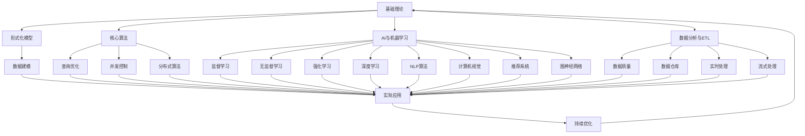

# 3-数据模型与算法

## 📁 目录结构

```
3-数据模型与算法/
├── 3.1-基础理论/
│   ├── 3.1.1-数据科学基础理论框架.md
│   └── README.md
├── 3.2-形式化模型/
│   ├── 3.2.1-数据模型的形式化理论.md
│   └── README.md
├── 3.3-算法实现/
│   ├── 3.3.1-核心数据处理算法.md
│   ├── 3.3.2-查询优化算法.md
│   ├── 3.3.3-并发控制算法.md
│   ├── 3.3.4-分布式算法.md
│   └── README.md
├── 3.4-AI与机器学习算法/
│   ├── 3.4.1-机器学习基础理论.md
│   ├── 3.4.2-监督学习算法.md
│   ├── 3.4.3-无监督学习算法.md
│   ├── 3.4.4-强化学习算法.md
│   ├── 3.4.5-深度学习算法.md
│   ├── 3.4.6-自然语言处理算法.md
│   ├── 3.4.7-计算机视觉算法.md
│   ├── 3.4.8-推荐系统算法.md
│   ├── 3.4.9-图神经网络算法.md
│   ├── 3.4.10-多模态与大规模AI.md
│   └── README.md
├── 3.5-数据分析与ETL/
│   ├── 3.5.1-数据分析基础理论.md
│   ├── 3.5.2-ETL理论与实践.md
│   ├── 3.5.3-数据可视化方法与工具.md
│   ├── 3.5.4-数据质量与治理.md
│   ├── 3.5.5-数据仓库与湖仓一体.md
│   ├── 3.5.6-实时数据处理.md
│   ├── 3.5.7-流式数据处理.md
│   └── README.md
└── README.md
```

## 🔗 主题交叉引用表

| 算法分支 | 关联理论 | 技术应用 | 实践场景 |
|---------|---------|---------|---------|
| **基础理论** | 形式科学理论、数学基础 | 算法设计、复杂度分析 | 系统设计、性能优化 |
| **形式化模型** | 类型理论、自动机理论 | 数据建模、模式设计 | 数据库设计、API设计 |
| **核心算法** | 数据结构、算法理论 | 排序搜索、图算法 | 搜索引擎、推荐系统 |
| **查询优化** | 数据库理论、复杂度理论 | 索引优化、查询重写 | 数据库性能调优 |
| **并发控制** | 分布式系统理论、Petri网 | 锁机制、事务管理 | 高并发系统、分布式数据库 |
| **分布式算法** | 一致性理论、容错理论 | 共识算法、分片技术 | 区块链、分布式存储 |
| **机器学习** | 统计学、优化理论 | 模型训练、特征工程 | 预测分析、模式识别 |
| **深度学习** | 神经网络理论、优化算法 | 模型架构、训练优化 | 图像识别、自然语言处理 |
| **NLP算法** | 语言学理论、语义理论 | 文本处理、语言模型 | 智能客服、机器翻译 |
| **计算机视觉** | 图像处理理论、几何学 | 图像识别、目标检测 | 自动驾驶、医疗影像 |
| **推荐系统** | 协同过滤、矩阵分解 | 个性化推荐、A/B测试 | 电商平台、内容推荐 |
| **图神经网络** | 图论、深度学习 | 图嵌入、图分类 | 社交网络、知识图谱 |
| **数据分析** | 统计学、可视化理论 | 数据挖掘、统计分析 | 商业智能、科学研究 |
| **ETL处理** | 数据流理论、批处理 | 数据清洗、转换加载 | 数据仓库、数据湖 |

## 🔄 全链路知识流图



## 🎯 知识体系特色

### 理论严谨性
- **数学基础**：基于严格的数学理论体系
- **算法分析**：时间复杂度、空间复杂度分析
- **正确性证明**：算法正确性的形式化证明

### 技术创新性
- **跨领域融合**：计算机科学、统计学、人工智能多学科交叉
- **算法创新**：新算法设计和优化技术
- **模型演进**：从传统算法到深度学习的演进

### 实践导向
- **工程实现**：算法在实际系统中的实现
- **性能优化**：针对实际场景的性能调优
- **可扩展性**：支持大规模数据处理

### 持续演进
- **算法发展**：跟随学术前沿持续更新
- **技术融合**：与新兴技术领域深度融合
- **应用拓展**：向更多应用场景扩展

## 📚 学习路径建议

### 🚀 入门路径
1. **基础理论** → 建立算法思维基础
2. **形式化模型** → 理解数据建模原理
3. **核心算法** → 掌握基础算法设计
4. **数据分析** → 学习数据处理方法

### 🔄 进阶路径
1. **查询优化** → 深入数据库算法
2. **并发控制** → 掌握并发算法设计
3. **分布式算法** → 理解分布式计算
4. **机器学习** → 学习AI算法基础

### 🎯 专家路径
1. **深度学习** → 掌握现代AI算法
2. **NLP与CV** → 深入特定领域算法
3. **图神经网络** → 学习图算法前沿
4. **大规模AI** → 探索AI系统设计

## 🚀 快速导航

### 基础理论
- [数据科学基础理论框架](3.1-基础理论/3.1.1-数据科学基础理论框架.md)
- [数据模型的形式化理论](3.2-形式化模型/3.2.1-数据模型的形式化理论.md)

### 核心算法
- [核心数据处理算法](3.3-算法实现/3.3.1-核心数据处理算法.md)
- [查询优化算法](3.3-算法实现/3.3.2-查询优化算法.md)
- [并发控制算法](3.3-算法实现/3.3.3-并发控制算法.md)
- [分布式算法](3.3-算法实现/3.3.4-分布式算法.md)

### AI算法
- [机器学习基础理论](3.4-AI与机器学习算法/3.4.1-机器学习基础理论.md)
- [监督学习算法](3.4-AI与机器学习算法/3.4.2-监督学习算法.md)
- [深度学习算法](3.4-AI与机器学习算法/3.4.5-深度学习算法.md)
- [多模态与大规模AI](3.4-AI与机器学习算法/3.4.10-多模态与大规模AI.md)

### 数据处理
- [数据分析基础理论](3.5-数据分析与ETL/3.5.1-数据分析基础理论.md)
- [ETL理论与实践](3.5-数据分析与ETL/3.5.2-ETL理论与实践.md)
- [数据可视化方法与工具](3.5-数据分析与ETL/3.5.3-数据可视化方法与工具.md)

## 🛠️ 技术栈映射

### 编程语言
- **Python**：NumPy、Pandas、Scikit-learn
- **R**：统计计算、数据可视化
- **Java**：大数据处理、企业级应用
- **Scala**：Spark、函数式编程
- **C++**：高性能计算、系统编程

### 大数据技术
- **Hadoop**：分布式存储、MapReduce
- **Spark**：内存计算、流处理
- **Kafka**：消息队列、流数据
- **Flink**：实时流处理
- **Elasticsearch**：搜索引擎、日志分析

### AI框架
- **TensorFlow**：深度学习、模型训练
- **PyTorch**：动态图、研究友好
- **Scikit-learn**：机器学习、特征工程
- **Hugging Face**：NLP模型、预训练模型

### 数据库技术
- **关系数据库**：PostgreSQL、MySQL
- **NoSQL**：MongoDB、Redis、Cassandra
- **图数据库**：Neo4j、ArangoDB
- **时序数据库**：InfluxDB、TimescaleDB

## 🎯 应用场景体系

### 互联网应用
- **搜索引擎**：PageRank、倒排索引
- **推荐系统**：协同过滤、深度学习
- **社交网络**：图算法、社区发现
- **电商平台**：个性化推荐、库存优化

### 金融科技
- **风险控制**：机器学习、异常检测
- **量化交易**：时间序列分析、预测模型
- **反欺诈**：图算法、行为分析
- **信用评估**：特征工程、模型训练

### 医疗健康
- **医学影像**：计算机视觉、图像分割
- **药物发现**：分子建模、虚拟筛选
- **基因组学**：序列分析、生物信息学
- **健康监测**：时序分析、异常检测

### 工业制造
- **预测性维护**：时间序列预测、异常检测
- **质量控制**：计算机视觉、统计过程控制
- **供应链优化**：运筹学、图优化
- **智能制造**：物联网、边缘计算

---

**📖 相关导航**
- [返回总导航](../README.md)
- [2-形式科学理论](../2-形式科学理论/README.md)
- [4-软件架构与工程](../4-软件架构与工程/README.md)
- [Matter/FormalModel](../Matter/FormalModel/)
