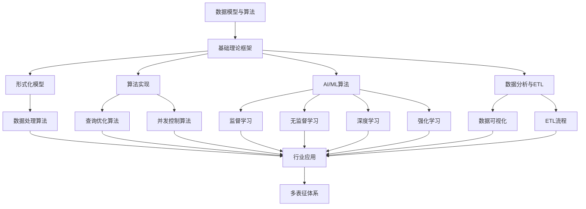

# 3-数据模型与算法 总导航

## 目录结构与本地跳转
- [3.1-基础理论](3.1-基础理论/README.md) - 预留分支
- [3.2-形式化模型](3.2-形式化模型/README.md) - 预留分支
- [3.3-算法实现](3.3-算法实现/README.md) - 预留分支
- [3.4-AI与机器学习算法](3.4-AI与机器学习算法/README.md) - 预留分支
- [3.5-数据分析与ETL](3.5-数据分析与ETL/README.md) - 预留分支

---

## 主题交叉引用
| 分支      | 基础理论 | 形式化模型 | 算法实现 | AI/ML算法 | 数据分析 | ETL | 可视化 | 行业案例 | 多表征 |
|-----------|----------|------------|----------|-----------|----------|-----|--------|----------|--------|
| 基础理论  | 预留     | 预留       | 预留     | 预留      | 预留     | 预留| 预留   | 预留     | 预留   |
| 形式化模型| 预留     | 预留       | 预留     | 预留      | 预留     | 预留| 预留   | 预留     | 预留   |
| 算法实现  | 预留     | 预留       | 预留     | 预留      | 预留     | 预留| 预留   | 预留     | 预留   |
| AI/ML算法 | 预留     | 预留       | 预留     | 预留      | 预留     | 预留| 预留   | 预留     | 预留   |
| 数据分析  | 预留     | 预留       | 预留     | 预留      | 预留     | 预留| 预留   | 预留     | 预留   |

- 交叉引用：[1-数据库系统](../1-数据库系统/README.md)、[2-形式科学理论](../2-形式科学理论/README.md)、[4-软件架构与工程](../4-软件架构与工程/README.md)、[5-行业应用与场景](../5-行业应用与场景/README.md)

---

## 全链路知识流（Mermaid流程图）

---

[返回Analysis总导航](../README.md) 