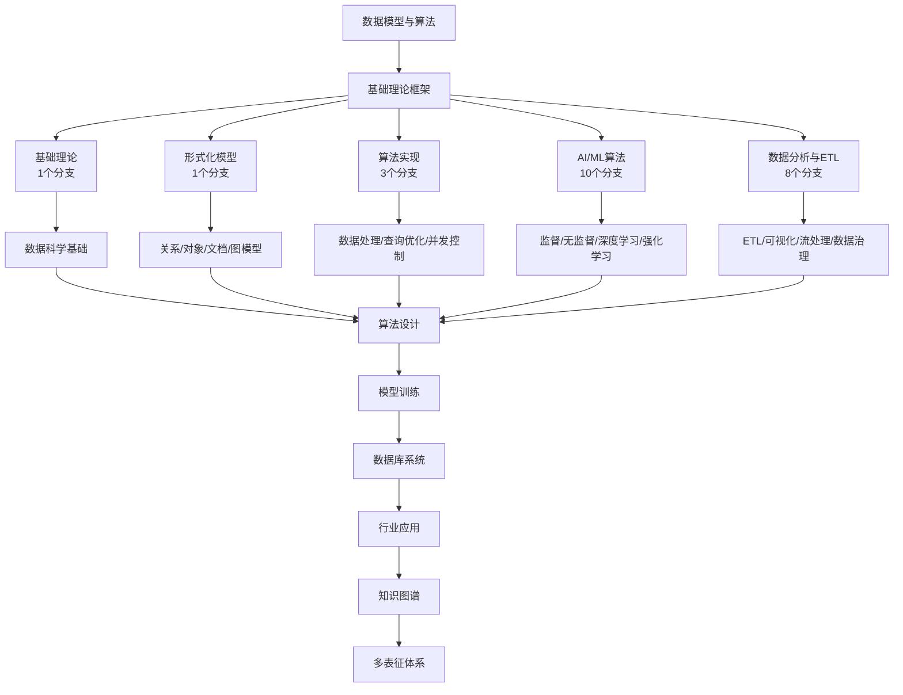

# 3-数据模型与算法 总导航

## 目录结构与完成情况
- [3.1-基础理论](3.1-基础理论/README.md) - **1个分支，预留框架**
- [3.2-形式化模型](3.2-形式化模型/README.md) - **1个分支，预留框架**
- [3.3-算法实现](3.3-算法实现/README.md) - **3个分支，预留框架**
- [3.4-AI与机器学习算法](3.4-AI与机器学习算法/README.md) - **10个分支，预留框架**
- [3.5-数据分析与ETL](3.5-数据分析与ETL/README.md) - **8个分支，预留框架**

---

## 主题交叉引用
| 分支      | 基础理论 | 形式化模型 | 算法实现 | AI/ML算法 | 数据分析 | ETL | 可视化 | 行业案例 | 多表征 |
|-----------|----------|------------|----------|-----------|----------|-----|--------|----------|--------|
| 基础理论  | 预留     | 预留       | 预留     | 预留      | 预留     | 预留| 预留   | 预留     | 预留   |
| 形式化模型| 预留     | 预留       | 预留     | 预留      | 预留     | 预留| 预留   | 预留     | 预留   |
| 算法实现  | 预留     | 预留       | 预留     | 预留      | 预留     | 预留| 预留   | 预留     | 预留   |
| AI/ML算法 | 预留     | 预留       | 预留     | 预留      | 预留     | 预留| 预留   | 预留     | 预留   |
| 数据分析  | 预留     | 预留       | 预留     | 预留      | 预留     | 预留| 预留   | 预留     | 预留   |

- 交叉引用：[1-数据库系统](../1-数据库系统/README.md)、[2-形式科学理论](../2-形式科学理论/README.md)、[4-软件架构与工程](../4-软件架构与工程/README.md)、[5-行业应用与场景](../5-行业应用与场景/README.md)、[6-知识图谱与可视化](../6-知识图谱与可视化/README.md)

---

## 全链路知识流（Mermaid流程图）

---

## 知识体系特色
- **理论基础**: 从数学基础到形式化建模的完整理论体系
- **算法实现**: 涵盖数据处理、AI/ML、ETL等核心算法
- **工程实践**: 与数据库、架构、行业应用深度结合
- **持续扩展**: 预留框架支持后续深度细化和算法发展

---

[返回Analysis总导航](../README.md)
