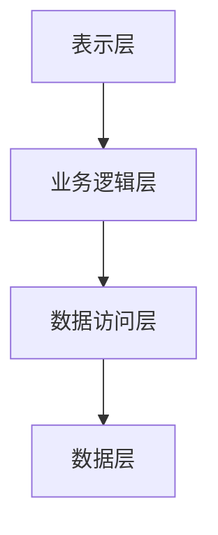
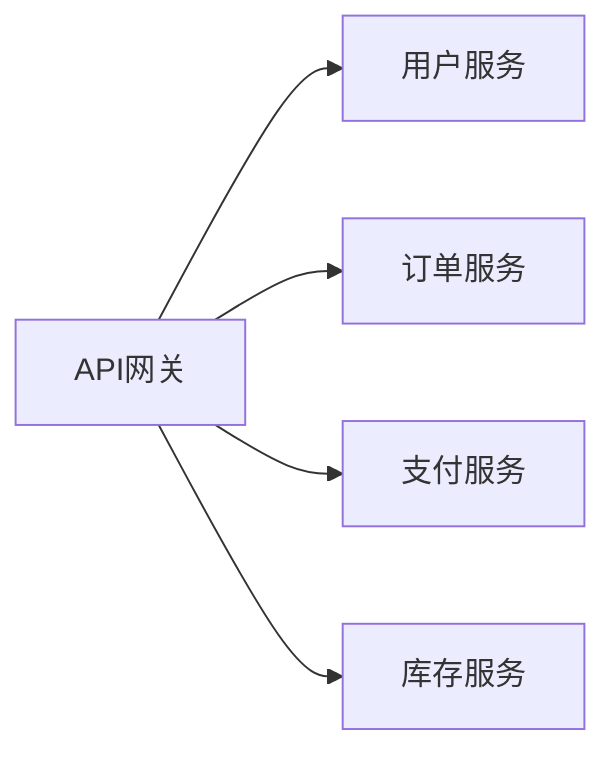
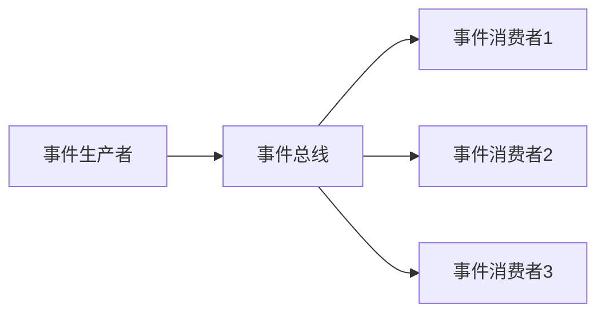

# 4.1.1 软件架构基础理论

## 摘要

本文件系统梳理软件架构设计的基础理论，涵盖架构设计原则、质量属性、架构模式、设计决策等核心概念，为数据科学系统的架构设计提供理论基础。

## 目录

- [4.1.1 软件架构基础理论](#411-软件架构基础理论)
  - [摘要](#摘要)
  - [目录](#目录)
  - [1. 软件架构概述](#1-软件架构概述)
    - [1.1 架构的定义](#11-架构的定义)
    - [1.2 架构的层次](#12-架构的层次)
  - [2. 架构设计原则](#2-架构设计原则)
    - [2.1 SOLID原则](#21-solid原则)
    - [2.2 其他重要原则](#22-其他重要原则)
  - [3. 质量属性](#3-质量属性)
    - [3.1 功能性质量属性](#31-功能性质量属性)
    - [3.2 非功能性质量属性](#32-非功能性质量属性)
  - [4. 架构模式](#4-架构模式)
    - [4.1 分层架构 (Layered Architecture)](#41-分层架构-layered-architecture)
    - [4.2 微服务架构 (Microservices)](#42-微服务架构-microservices)
    - [4.3 事件驱动架构 (Event-Driven Architecture)](#43-事件驱动架构-event-driven-architecture)
  - [5. 设计决策框架](#5-设计决策框架)
    - [5.1 ATAM (Architecture Tradeoff Analysis Method)](#51-atam-architecture-tradeoff-analysis-method)
    - [5.2 CBAM (Cost Benefit Analysis Method)](#52-cbam-cost-benefit-analysis-method)
    - [5.3 决策矩阵](#53-决策矩阵)
  - [6. 本地跳转与交叉引用](#6-本地跳转与交叉引用)

---

## 1. 软件架构概述

软件架构是系统的高级结构，定义了组件、组件间的关系以及设计原则。

### 1.1 架构的定义

**IEEE 1471标准定义**：
软件架构是系统的基本组织，体现在其组件、组件间的关系、组件与环境的关系以及指导其设计和演进的原则中。

### 1.2 架构的层次

1. **企业架构**：组织级别的IT架构
2. **系统架构**：单个系统的架构
3. **应用架构**：应用程序的架构
4. **技术架构**：技术实现的架构

## 2. 架构设计原则

### 2.1 SOLID原则

**单一职责原则 (SRP)**：一个类应该只有一个引起它变化的原因。

**开闭原则 (OCP)**：软件实体应该对扩展开放，对修改关闭。

**里氏替换原则 (LSP)**：子类必须能够替换其基类。

**接口隔离原则 (ISP)**：客户端不应该依赖它不使用的接口。

**依赖倒置原则 (DIP)**：高层模块不应该依赖低层模块，两者都应该依赖抽象。

### 2.2 其他重要原则

**DRY (Don't Repeat Yourself)**：避免代码重复，提高可维护性。

**KISS (Keep It Simple, Stupid)**：保持简单，避免过度设计。

**YAGNI (You Aren't Gonna Need It)**：不要实现当前不需要的功能。

## 3. 质量属性

### 3.1 功能性质量属性

**正确性**：系统按照规格说明正确执行。

**完整性**：系统包含所有必要的功能。

**一致性**：系统行为在不同场景下保持一致。

### 3.2 非功能性质量属性

**性能**：

- 响应时间：$T_{response} = T_{processing} + T_{network} + T_{database}$
- 吞吐量：$Throughput = \frac{Requests}{Time}$

**可用性**：$Availability = \frac{MTBF}{MTBF + MTTR}$

**可扩展性**：水平扩展和垂直扩展

**安全性**：机密性、完整性、可用性

## 4. 架构模式

### 4.1 分层架构 (Layered Architecture)

**优点**：

- 关注点分离
- 易于测试
- 松耦合

**缺点**：

- 可能产生性能瓶颈
- 层次过多时复杂

### 4.2 微服务架构 (Microservices)

**优点**：

- 独立部署
- 技术多样性
- 故障隔离

**缺点**：

- 分布式复杂性
- 网络延迟
- 数据一致性挑战

### 4.3 事件驱动架构 (Event-Driven Architecture)

**优点**：

- 松耦合
- 可扩展性
- 异步处理

**缺点**：

- 事件顺序问题
- 调试困难
- 事务管理复杂

## 5. 设计决策框架

### 5.1 ATAM (Architecture Tradeoff Analysis Method)

**步骤**：

1. 呈现ATAM
2. 呈现业务驱动因素
3. 呈现架构
4. 识别架构方法
5. 生成质量属性效用树
6. 分析架构方法
7. 头脑风暴和场景优先级排序
8. 分析架构方法
9. 呈现结果

### 5.2 CBAM (Cost Benefit Analysis Method)

**成本效益分析**：
$$ROI = \frac{Benefits - Costs}{Costs} \times 100\%$$

### 5.3 决策矩阵

| 方案 | 性能 | 可扩展性 | 成本 | 风险 | 总分 |
|------|------|----------|------|------|------|
| 方案A | 8 | 7 | 6 | 7 | 28 |
| 方案B | 6 | 9 | 8 | 6 | 29 |
| 方案C | 9 | 6 | 5 | 8 | 28 |

## 6. 本地跳转与交叉引用

- [跳转到设计模式](../4.2-设计模式/)
- [跳转到微服务架构](../4.3-微服务架构/)
- [跳转到数据科学基础理论](../../3-数据模型与算法/3.1-基础理论/3.1.1-数据科学基础理论框架.md)
- [跳转到PostgreSQL系统架构](../../1-数据库系统/1.1-PostgreSQL/1.1.2-系统架构.md)

---

**最后更新**: 2024年12月
**版本**: v1.0
**状态**: 进行中
