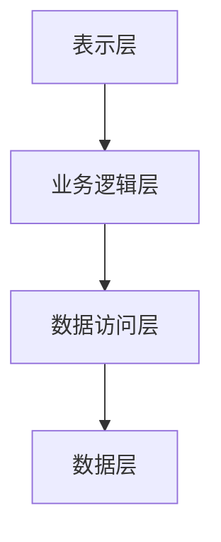
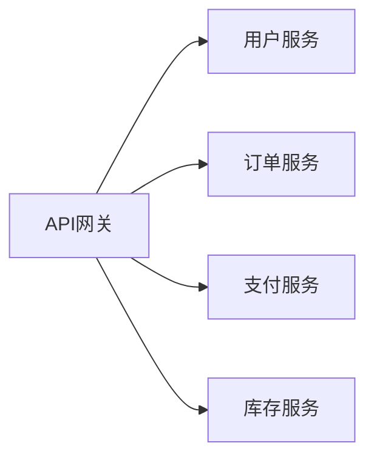
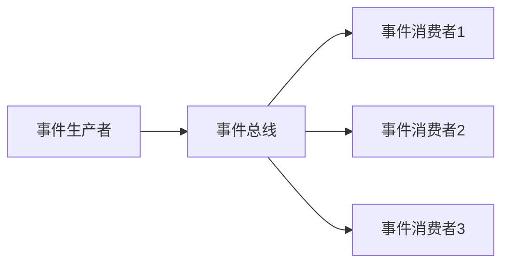

# 软件架构基础理论

## 交叉引用与关联

### 相关模块链接

#### 形式科学理论模块关联

- **[2.1 类型理论](../2-形式科学理论/2.1-类型理论/2.1.1-基础类型理论.md)** - 类型系统在软件架构中的应用
- **[2.2 自动机理论](../2-形式科学理论/2.2-自动机理论/2.2.1-自动机理论基础.md)** - 状态机在系统建模中的应用
- **[2.3 Petri网理论](../2-形式科学理论/2.3-Petri网理论/2.3.1-Petri网理论基础.md)** - 并发模型在分布式架构中的应用
- **[2.4 时态逻辑控制理论](../2-形式科学理论/2.4-时态逻辑控制理论/2.4.1-时态逻辑控制理论基础.md)** - 时间逻辑在系统验证中的应用
- **[2.5 分布式系统理论](../2-形式科学理论/2.5-分布式系统理论/2.5.1-分布式系统理论基础.md)** - 分布式理论在架构设计中的应用
- **[2.6 控制理论](../2-形式科学理论/2.6-控制理论/2.6.1-控制理论基础.md)** - 控制理论在系统稳定性中的应用
- **[2.7 数学基础理论](../2-形式科学理论/2.7-数学基础理论/2.7.1-数学基础理论框架.md)** - 数学在架构设计中的应用
- **[2.8 编程语言理论](../2-形式科学理论/2.8-编程语言理论/2.8.1-编程语言基础理论.md)** - 语言理论在架构实现中的应用
- **[2.9 哲学基础理论](../2-形式科学理论/2.9-哲学基础理论/2.9.1-哲学基础理论框架.md)** - 技术哲学在软件工程中的应用

#### 软件架构与工程模块内部关联

- **[4.2 设计模式基础理论](../4.2-设计模式/4.2.1-设计模式基础理论.md)** - 设计模式在架构设计中的应用
- **[4.3 微服务架构基础理论](../4.3-微服务架构/4.3.1-微服务架构基础理论.md)** - 微服务在分布式架构中的应用
- **[4.4 IOT基础理论](../4.4-IOT/4.4.1-IOT基础理论.md)** - 物联网在边缘计算架构中的应用
- **[4.5 工作流基础理论](../4.5-WorkflowDomain/4.5.1-工作流基础理论.md)** - 工作流在业务流程架构中的应用

#### 数据模型与算法模块关联

- **[3.1 数据科学基础理论](../3-数据模型与算法/3.1-基础理论/3.1.1-数据科学基础理论框架.md)** - 数据科学在软件架构中的应用
- **[3.2 数据模型的形式化理论](../3-数据模型与算法/3.2-形式化模型/3.2.1-数据模型的形式化理论.md)** - 数据模型在架构设计中的应用
- **[3.4 机器学习基础理论](../3-数据模型与算法/3.4-AI与机器学习算法/3.4.1-机器学习基础理论.md)** - 机器学习在智能架构中的应用

#### 数据库系统模块关联

- **[1.1 PostgreSQL形式模型](../1-数据库系统/1.1-PostgreSQL/1.1.1-形式模型.md)** - 数据库在软件架构中的基础作用

#### 持续集成与演进模块关联

- **[7.1 版本控制基础理论](../7-持续集成与演进/7.1-版本控制/7.1.1-版本控制基础理论.md)** - 版本控制在架构演进中的应用
- **[7.2 自动化测试基础理论](../7-持续集成与演进/7.2-自动化测试/7.2.1-自动化测试基础理论.md)** - 测试在架构质量保证中的应用
- **[7.3 部署流程基础理论](../7-持续集成与演进/7.3-部署流程/7.3.1-部署流程基础理论.md)** - 部署在架构交付中的应用
- **[7.4 CI_CD最佳实践](../7-持续集成与演进/7.4-CI_CD/7.4.1-CI_CD最佳实践.md)** - CI/CD在架构持续演进中的应用

### 核心概念映射

| 架构概念 | 理论基础 | 相关模块 |
|---------|---------|---------|
| 分层架构 | 抽象层次、关注点分离 | 2.1, 4.2 |
| 微服务架构 | 分布式系统、服务分解 | 2.5, 4.3 |
| 事件驱动架构 | 消息传递、异步处理 | 2.3, 2.4 |
| 领域驱动设计 | 领域建模、边界上下文 | 3.2, 4.2 |
| 响应式架构 | 响应式编程、流处理 | 2.8, 3.3 |
| 云原生架构 | 容器化、编排管理 | 4.3, 7.4 |
| 边缘计算架构 | 分布式计算、IoT | 4.4, 2.5 |
| 工作流架构 | 业务流程、状态管理 | 4.5, 2.3 |
| 数据架构 | 数据建模、存储策略 | 3.2, 1.1 |
| AI架构 | 机器学习、智能系统 | 3.4, 2.6 |

### 软件架构在数据科学中的核心作用

#### 理论基础

- **系统理论**：为复杂系统设计提供理论基础
- **设计原则**：为架构设计提供指导原则
- **质量属性**：为系统质量提供评估标准

#### 应用领域

- **数据管道架构**：ETL、流处理、批处理
- **机器学习平台**：模型训练、部署、监控
- **数据湖架构**：数据存储、查询、分析
- **实时分析架构**：流处理、实时计算
- **分布式计算架构**：大数据处理、并行计算
- **API架构**：数据服务、集成接口

## 摘要

本文件系统梳理软件架构设计的基础理论，涵盖架构设计原则、质量属性、架构模式、设计决策等核心概念，为数据科学系统的架构设计提供理论基础。

## 目录

- [软件架构基础理论](#软件架构基础理论)
  - [交叉引用与关联](#交叉引用与关联)
    - [相关模块链接](#相关模块链接)
      - [形式科学理论模块关联](#形式科学理论模块关联)
      - [软件架构与工程模块内部关联](#软件架构与工程模块内部关联)
      - [数据模型与算法模块关联](#数据模型与算法模块关联)
      - [数据库系统模块关联](#数据库系统模块关联)
      - [持续集成与演进模块关联](#持续集成与演进模块关联)
    - [核心概念映射](#核心概念映射)
    - [软件架构在数据科学中的核心作用](#软件架构在数据科学中的核心作用)
      - [理论基础](#理论基础)
      - [应用领域](#应用领域)
  - [摘要](#摘要)
  - [目录](#目录)
  - [1. 软件架构概述](#1-软件架构概述)
    - [1.1 架构的定义](#11-架构的定义)
    - [1.2 架构的层次](#12-架构的层次)
  - [2. 架构设计原则](#2-架构设计原则)
    - [2.1 SOLID原则](#21-solid原则)
    - [2.2 其他重要原则](#22-其他重要原则)
  - [3. 质量属性](#3-质量属性)
    - [3.1 功能性质量属性](#31-功能性质量属性)
    - [3.2 非功能性质量属性](#32-非功能性质量属性)
  - [4. 架构模式](#4-架构模式)
    - [4.1 分层架构 (Layered Architecture)](#41-分层架构-layered-architecture)
    - [4.2 微服务架构 (Microservices)](#42-微服务架构-microservices)
    - [4.3 事件驱动架构 (Event-Driven Architecture)](#43-事件驱动架构-event-driven-architecture)
  - [5. 设计决策框架](#5-设计决策框架)
    - [5.1 ATAM (Architecture Tradeoff Analysis Method)](#51-atam-architecture-tradeoff-analysis-method)
    - [5.2 CBAM (Cost Benefit Analysis Method)](#52-cbam-cost-benefit-analysis-method)
    - [5.3 决策矩阵](#53-决策矩阵)
  - [6. 本地跳转与交叉引用](#6-本地跳转与交叉引用)

---

## 1. 软件架构概述

软件架构是系统的高级结构，定义了组件、组件间的关系以及设计原则。

### 1.1 架构的定义

**IEEE 1471标准定义**：
软件架构是系统的基本组织，体现在其组件、组件间的关系、组件与环境的关系以及指导其设计和演进的原则中。

### 1.2 架构的层次

1. **企业架构**：组织级别的IT架构
2. **系统架构**：单个系统的架构
3. **应用架构**：应用程序的架构
4. **技术架构**：技术实现的架构

## 2. 架构设计原则

### 2.1 SOLID原则

**单一职责原则 (SRP)**：一个类应该只有一个引起它变化的原因。

**开闭原则 (OCP)**：软件实体应该对扩展开放，对修改关闭。

**里氏替换原则 (LSP)**：子类必须能够替换其基类。

**接口隔离原则 (ISP)**：客户端不应该依赖它不使用的接口。

**依赖倒置原则 (DIP)**：高层模块不应该依赖低层模块，两者都应该依赖抽象。

### 2.2 其他重要原则

**DRY (Don't Repeat Yourself)**：避免代码重复，提高可维护性。

**KISS (Keep It Simple, Stupid)**：保持简单，避免过度设计。

**YAGNI (You Aren't Gonna Need It)**：不要实现当前不需要的功能。

## 3. 质量属性

### 3.1 功能性质量属性

**正确性**：系统按照规格说明正确执行。

**完整性**：系统包含所有必要的功能。

**一致性**：系统行为在不同场景下保持一致。

### 3.2 非功能性质量属性

**性能**：

- 响应时间：$T_{response} = T_{processing} + T_{network} + T_{database}$
- 吞吐量：$Throughput = \frac{Requests}{Time}$

**可用性**：$Availability = \frac{MTBF}{MTBF + MTTR}$

**可扩展性**：水平扩展和垂直扩展

**安全性**：机密性、完整性、可用性

## 4. 架构模式

### 4.1 分层架构 (Layered Architecture)

**优点**：

- 关注点分离
- 易于测试
- 松耦合

**缺点**：

- 可能产生性能瓶颈
- 层次过多时复杂

### 4.2 微服务架构 (Microservices)

**优点**：

- 独立部署
- 技术多样性
- 故障隔离

**缺点**：

- 分布式复杂性
- 网络延迟
- 数据一致性挑战

### 4.3 事件驱动架构 (Event-Driven Architecture)

**优点**：

- 松耦合
- 可扩展性
- 异步处理

**缺点**：

- 事件顺序问题
- 调试困难
- 事务管理复杂

## 5. 设计决策框架

### 5.1 ATAM (Architecture Tradeoff Analysis Method)

**步骤**：

1. 呈现ATAM
2. 呈现业务驱动因素
3. 呈现架构
4. 识别架构方法
5. 生成质量属性效用树
6. 分析架构方法
7. 头脑风暴和场景优先级排序
8. 分析架构方法
9. 呈现结果

### 5.2 CBAM (Cost Benefit Analysis Method)

**成本效益分析**：
$$ROI = \frac{Benefits - Costs}{Costs} \times 100\%$$

### 5.3 决策矩阵

| 方案 | 性能 | 可扩展性 | 成本 | 风险 | 总分 |
|------|------|----------|------|------|------|
| 方案A | 8 | 7 | 6 | 7 | 28 |
| 方案B | 6 | 9 | 8 | 6 | 29 |
| 方案C | 9 | 6 | 5 | 8 | 28 |

## 6. 本地跳转与交叉引用

- [跳转到设计模式](../4.2-设计模式/)
- [跳转到微服务架构](../4.3-微服务架构/)
- [跳转到数据科学基础理论](../../3-数据模型与算法/3.1-基础理论/3.1.1-数据科学基础理论框架.md)
- [跳转到PostgreSQL系统架构](../../1-数据库系统/1.1-PostgreSQL/1.1.2-系统架构.md)

---

**最后更新**: 2024年12月
**版本**: v1.0
**状态**: 进行中
