# 软件架构基础理论

## 1. 📋 概述

软件架构基础理论是软件工程的核心支柱，它定义了如何设计、构建和维护复杂软件系统的理论基础和方法体系。本文档系统性地阐述软件架构的基本概念、设计原则、架构模式、评估方法等核心理论内容。

## 2. ️ 软件架构基础概念

### 2.1. 软件架构定义

软件架构是软件系统的高级抽象，描述了系统的结构、组件、接口、行为以及它们之间的关系。它是系统设计的基础，决定了系统的质量属性。

#### 2.1.1. 架构的层次结构

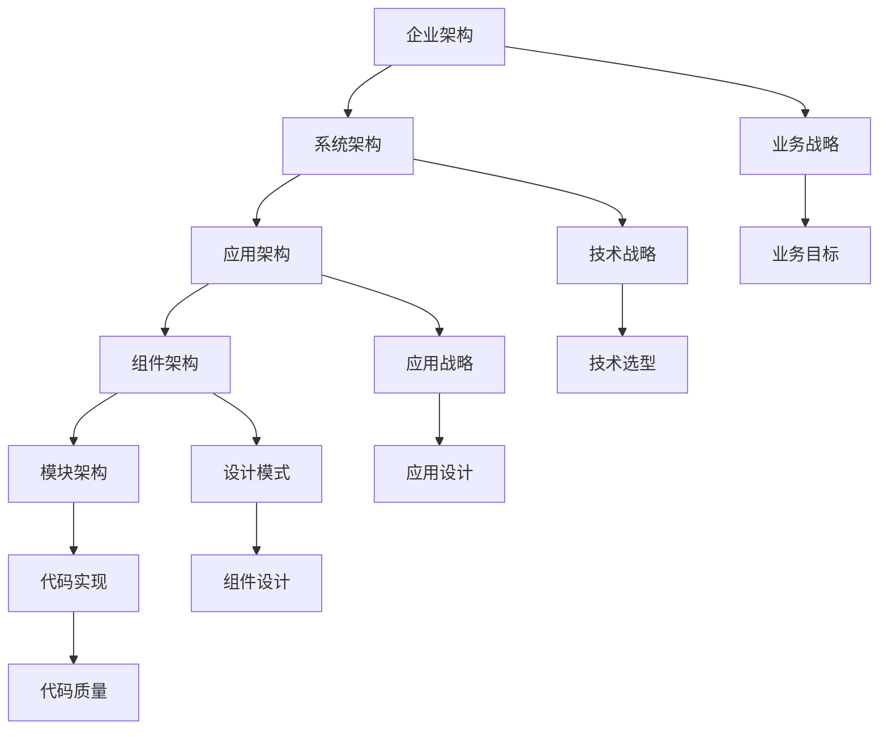

#### 2.1.2. 架构的核心要素

| 要素 | 定义 | 重要性 | 关注点 |
|------|------|--------|--------|
| **结构** | 系统的组织方式和组件关系 | 决定系统可理解性 | 模块化、分层、组件化 |
| **行为** | 系统如何响应外部事件 | 决定系统功能性 | 交互模式、状态管理 |
| **接口** | 组件间的通信契约 | 决定系统可维护性 | API设计、协议定义 |
| **质量属性** | 系统的非功能性需求 | 决定系统可用性 | 性能、安全、可扩展性 |

### 2.2. 架构设计原则

#### 2.2.1. 基础设计原则

**单一职责原则 (SRP)**:

- 每个组件只负责一个功能领域
- 降低组件间的耦合度
- 提高系统的可维护性

**开闭原则 (OCP)**:

- 对扩展开放，对修改封闭
- 支持新功能的添加
- 保持现有代码的稳定性

**里氏替换原则 (LSP)**:

- 子类可以替换父类
- 保持接口的一致性
- 确保多态的正确性

**接口隔离原则 (ISP)**:

- 客户端不应依赖不需要的接口
- 接口应该小而专注
- 避免接口污染

**依赖倒置原则 (DIP)**:

- 依赖抽象而非具体实现
- 高层模块不依赖低层模块
- 抽象不依赖细节

#### 2.2.2. 架构设计原则

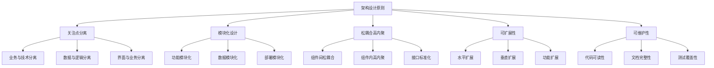

## 3. 架构质量属性

### 3.1. 功能性质量属性

#### 3.1.1. 可用性 (Availability)

**定义**：系统在指定时间内正常运行的能力

**度量指标**：

- **MTBF (Mean Time Between Failures)**：平均故障间隔时间
- **MTTR (Mean Time To Repair)**：平均修复时间
- **可用性百分比**：可用时间 / 总时间

**提升策略**：

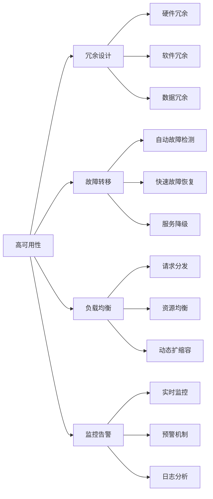

#### 3.1.2. 性能 (Performance)

**定义**：系统在给定资源约束下完成指定任务的能力

**关键指标**：

- **响应时间**：请求到响应的延迟
- **吞吐量**：单位时间内处理的请求数
- **并发度**：同时处理的请求数
- **资源利用率**：CPU、内存、网络使用率

**优化策略**：

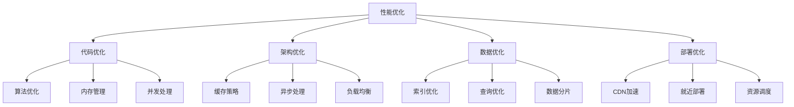

### 3.2. 非功能性质量属性

#### 3.2.1. 可扩展性 (Scalability)

**定义**：系统在负载增加时保持性能的能力

**扩展类型**：

| 类型 | 定义 | 优势 | 适用场景 |
|------|------|------|----------|
| **水平扩展** | 增加服务器节点 | 线性扩展、成本可控 | 无状态服务、微服务 |
| **垂直扩展** | 增加单机资源 | 简单直接、无需重构 | 有状态服务、单体应用 |
| **功能扩展** | 增加新功能模块 | 功能丰富、业务增长 | 业务扩展、新需求 |

**扩展策略**：

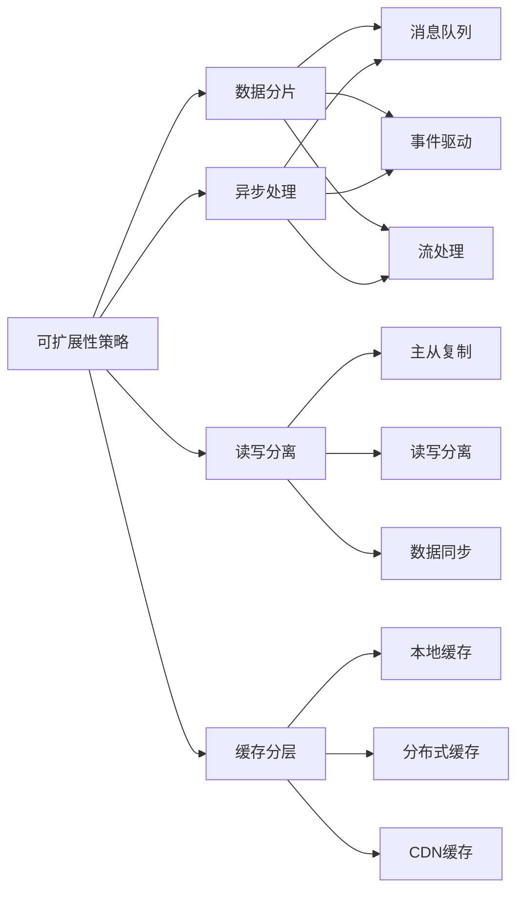

#### 3.2.2. 可维护性 (Maintainability)

**定义**：系统易于理解、修改和扩展的程度

**维护维度**：

| 维度 | 关注点 | 评估指标 | 改进方法 |
|------|--------|----------|----------|
| **可理解性** | 代码清晰度 | 代码复杂度、文档完整性 | 代码规范、文档更新 |
| **可修改性** | 变更影响范围 | 耦合度、内聚度 | 模块化、接口设计 |
| **可测试性** | 测试覆盖度 | 测试覆盖率、自动化程度 | 单元测试、集成测试 |
| **可部署性** | 部署复杂度 | 部署时间、成功率 | CI/CD、容器化 |

#### 3.2.3. 安全性 (Security)

**定义**：系统保护数据和功能免受未授权访问的能力

**安全层次**：

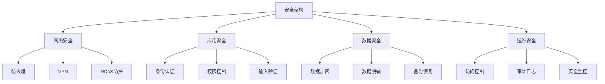

## 4. 🏛️ 架构模式

### 4.1. 分层架构 (Layered Architecture)

#### 4.1.1. 基本结构

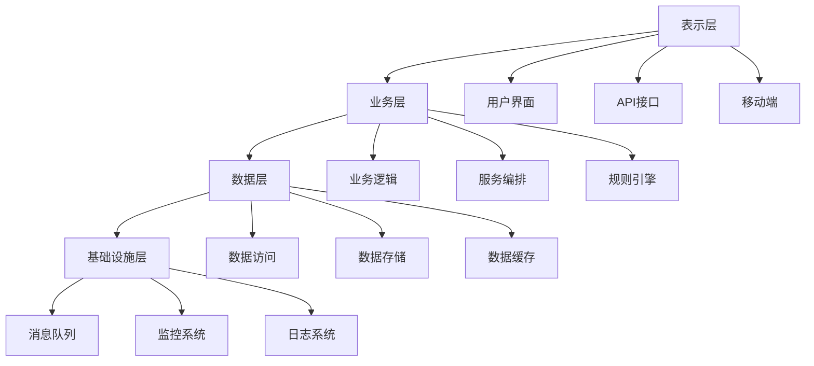

#### 4.1.2. 优势与劣势

| 方面 | 优势 | 劣势 |
|------|------|------|
| **可维护性** | 职责清晰、易于理解 | 层次过多可能复杂化 |
| **可测试性** | 各层可独立测试 | 层间依赖可能影响测试 |
| **可扩展性** | 可独立扩展各层 | 跨层功能可能影响性能 |
| **技术选型** | 各层可选用不同技术 | 技术栈可能不一致 |

### 4.2. 微服务架构 (Microservices Architecture)

#### 4.2.1. 架构特征

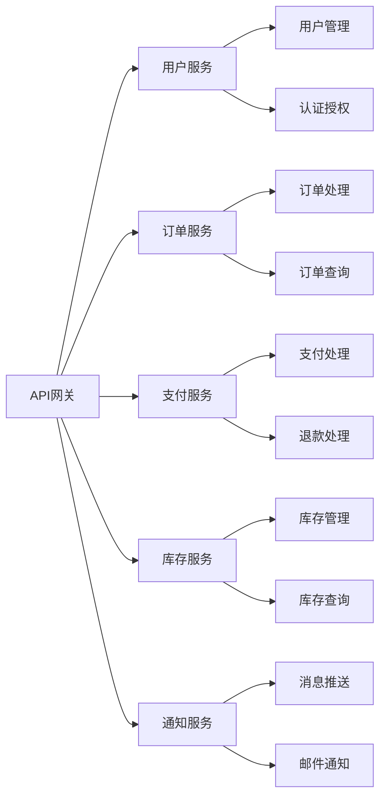

#### 4.2.2. 微服务设计原则

- **单一职责**：每个服务只负责一个业务功能
- **独立部署**：服务可独立开发、测试、部署
- **技术多样性**：不同服务可使用不同技术栈
- **数据隔离**：每个服务拥有自己的数据存储
- **故障隔离**：单个服务故障不影响整体系统

### 4.3. 事件驱动架构 (Event-Driven Architecture)

#### 4.3.1. 架构模式

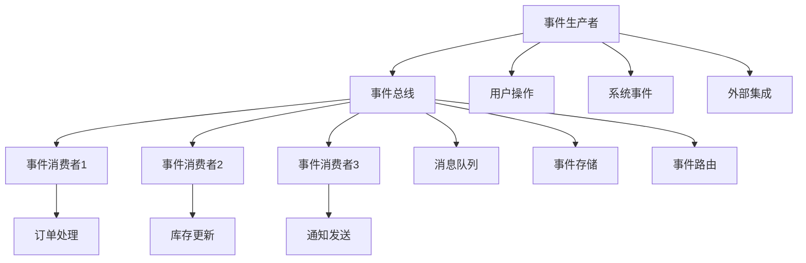

#### 4.3.2. 事件类型

| 类型 | 特征 | 应用场景 |
|------|------|----------|
| **领域事件** | 业务状态变化 | 订单创建、支付完成 |
| **集成事件** | 系统间通信 | 数据同步、状态通知 |
| **技术事件** | 系统运行状态 | 性能监控、错误告警 |

### 4.4. 云原生架构 (Cloud-Native Architecture)

#### 4.4.1. 云原生特征

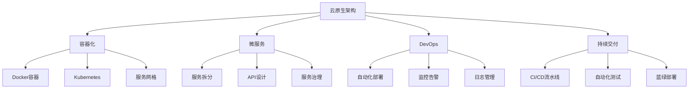

#### 4.4.2. 云原生优势

- **弹性伸缩**：根据负载自动扩缩容
- **高可用性**：多区域部署、故障自动恢复
- **成本优化**：按需付费、资源利用率高
- **快速交付**：自动化部署、持续集成

## 5. 架构评估方法

### 5.1. ATAM (Architecture Tradeoff Analysis Method)

#### 5.1.1. 评估步骤

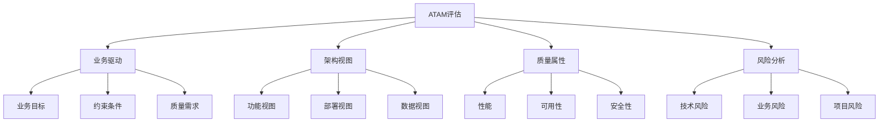

#### 5.1.2. 评估输出

- **架构决策记录**：关键决策及其理由
- **敏感点分析**：影响质量属性的关键点
- **权衡点分析**：不同质量属性间的冲突
- **风险清单**：潜在的技术和业务风险

### 5.2. CBAM (Cost Benefit Analysis Method)

#### 5.2.1. 成本效益分析

| 质量属性 | 改进成本 | 预期收益 | 投资回报率 |
|----------|----------|----------|------------|
| **性能** | 高 | 高 | 中等 |
| **可用性** | 高 | 高 | 中等 |
| **安全性** | 中等 | 高 | 高 |
| **可维护性** | 中等 | 中等 | 中等 |

## 6. 🛠️ 架构设计工具

### 6.1. 建模工具

| 工具类型 | 代表工具 | 主要功能 | 适用场景 |
|----------|----------|----------|----------|
| **UML工具** | Enterprise Architect、StarUML | 架构图绘制、代码生成 | 系统设计、文档管理 |
| **架构图工具** | Draw.io、Lucidchart | 流程图、架构图 | 快速原型、团队协作 |
| **代码生成** | JHipster、Spring Initializr | 项目脚手架、代码模板 | 快速开发、标准化 |

### 6.2. 监控工具

| 监控维度 | 工具示例 | 监控指标 | 应用场景 |
|----------|----------|----------|----------|
| **应用监控** | APM、New Relic | 响应时间、吞吐量 | 性能优化、故障诊断 |
| **基础设施** | Prometheus、Grafana | CPU、内存、网络 | 资源管理、容量规划 |
| **日志分析** | ELK Stack、Splunk | 错误日志、访问日志 | 问题排查、安全审计 |

## 7. 架构演进策略

### 7.1. 演进原则

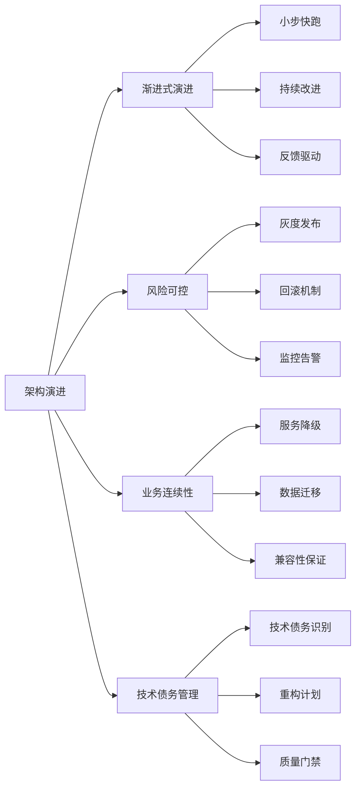

### 7.2. 演进策略

| 策略类型 | 适用场景 | 优势 | 风险 |
|----------|----------|------|------|
| **重构** | 技术债务严重 | 彻底解决问题 | 影响业务连续性 |
| **重写** | 架构根本性问题 | 采用新技术栈 | 开发周期长、风险高 |
| **迁移** | 技术栈升级 | 平滑过渡 | 兼容性问题 |
| **并行** | 新功能开发 | 风险可控 | 维护成本高 |

## 8. 🔮 发展趋势

### 8.1. 技术趋势

- **云原生**：容器化、微服务、服务网格
- **AI集成**：智能运维、自动化决策
- **边缘计算**：分布式部署、低延迟处理
- **量子计算**：新型计算范式、算法优化

### 8.2. 架构趋势

- **无服务器架构**：按需计算、成本优化
- **事件驱动架构**：松耦合、高扩展性
- **数据驱动架构**：实时分析、智能决策
- **安全优先架构**：零信任、隐私保护

### 8.3. 方法论趋势

- **DevOps**：开发运维一体化
- **GitOps**：Git作为单一事实源
- **SRE**：站点可靠性工程
- **Platform Engineering**：平台工程

---

**📖 相关导航**:

- [返回上级目录](../README.md)
- [4.2-设计模式](../4.2-设计模式/README.md)
- [4.3-微服务架构](../4.3-微服务架构/README.md)
