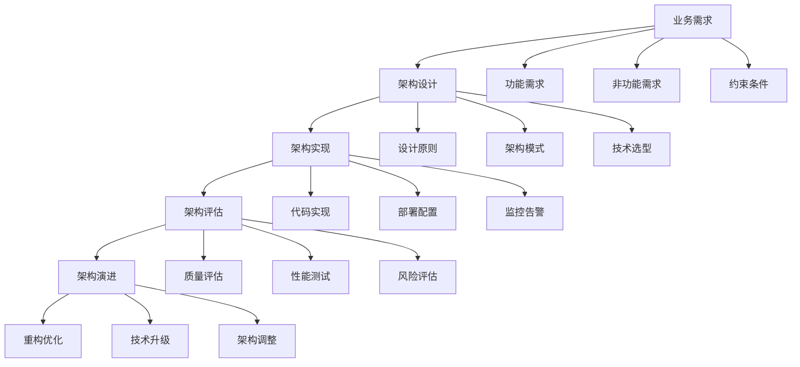

# 4.1-基础理论

## 1. 📋 概述

软件架构基础理论是软件工程的核心支柱，它定义了如何设计、构建和维护复杂软件系统的理论基础和方法体系。本分支涵盖了从架构设计原则到质量属性评估，从架构模式到演进策略的完整理论体系。

## 2. ️ 目录结构

```text
4.1-基础理论/
├── 4.1.1-软件架构基础理论.md     # 架构设计原则、模式、评估方法
└── README.md                      # 本导航文档
```

## 3. 🔗 主题交叉引用表

| 主题 | 相关文档 | 关联理论 | 应用场景 |
|------|----------|----------|----------|
| **架构设计原则** | 4.1.1 | SOLID原则、设计模式 | 系统设计、代码质量 |
| **架构质量属性** | 4.1.1 | 性能、可用性、安全性 | 系统评估、质量保证 |
| **架构模式** | 4.1.1 | 分层架构、微服务、事件驱动 | 架构选择、技术决策 |
| **架构评估** | 4.1.1 | ATAM、CBAM | 架构评审、风险评估 |
| **架构演进** | 4.1.1 | 重构、迁移、并行 | 系统升级、技术债务 |

## 4. 🌊 全链路知识流



## 5. 知识体系特色

### 5.1. 理论系统性

- **完整体系**：从基础概念到高级模式的完整理论体系
- **原则导向**：基于设计原则的架构决策方法
- **质量驱动**：以质量属性为核心的架构评估体系

### 5.2. 方法实用性

- **模式化设计**：提供可复用的架构模式
- **评估工具**：标准化的架构评估方法
- **演进策略**：系统化的架构演进指导

### 5.3. 技术前瞻性

- **云原生架构**：面向云环境的架构设计
- **微服务架构**：分布式系统的架构模式
- **事件驱动架构**：松耦合的架构设计

### 5.4. 实践导向性

- **案例驱动**：基于实际案例的理论讲解
- **工具支持**：提供具体的工具和方法
- **最佳实践**：总结行业最佳实践

## 6. 学习路径建议

### 6.1. 入门路径

```text
1. 软件架构基础理论 (4.1.1)
   ├── 架构基本概念
   ├── 设计原则
   ├── 质量属性
   └── 架构模式
```

### 6.2. 进阶路径

```text
1. 深度理论探索
   ├── 架构评估方法
   ├── 架构演进策略
   └── 新兴架构模式

2. 实践应用
   ├── 架构设计实践
   ├── 架构评估实践
   └── 架构演进实践

3. 技术深化
   ├── 云原生架构
   ├── 微服务架构
   └── 事件驱动架构
```

### 6.3. 专家路径

```text
1. 理论创新
   ├── 新架构模式
   ├── 评估方法创新
   └── 演进策略创新

2. 行业标准制定
   ├── 架构标准
   ├── 评估标准
   └── 最佳实践

3. 技术平台建设
   ├── 架构设计平台
   ├── 评估工具平台
   └── 演进管理平台
```

## 7. ⚡ 快速导航

### 7.1. 核心理论

- **[软件架构基础理论](4.1.1-软件架构基础理论.md)** - 架构设计原则、模式、评估方法

### 7.2. 🛠️ 实用工具

- **设计工具**：UML工具、架构图工具、代码生成工具
- **评估工具**：ATAM、CBAM、性能测试工具
- **监控工具**：APM、基础设施监控、日志分析

### 7.3. 应用场景

- **系统设计**：架构设计、技术选型、质量保证
- **系统评估**：性能评估、风险评估、质量评估
- **系统演进**：重构优化、技术升级、架构调整

## 8. 技术栈映射

| 技术领域 | 核心技术 | 相关工具 | 应用场景 |
|----------|----------|----------|----------|
| **架构设计** | UML、架构模式 | Enterprise Architect、Draw.io | 系统设计、文档管理 |
| **架构评估** | ATAM、CBAM | 评估工具、测试工具 | 架构评审、质量保证 |
| **架构监控** | APM、监控系统 | New Relic、Prometheus | 性能监控、故障诊断 |
| **架构演进** | 重构、迁移 | CI/CD、容器化 | 系统升级、技术债务 |

## 9. 应用场景体系

### 9.1. 系统设计与开发

- **架构设计**：系统架构设计、技术选型
- **代码实现**：基于架构的代码实现
- **质量保证**：架构质量评估和保证

### 9.2. 系统评估与优化

- **性能评估**：系统性能测试和优化
- **风险评估**：架构风险识别和评估
- **质量评估**：架构质量属性评估

### 9.3. 系统运维与演进

- **系统监控**：架构层面的系统监控
- **故障诊断**：基于架构的故障诊断
- **系统演进**：架构演进策略和实施

### 9.4. 团队协作与治理

- **架构治理**：架构决策和治理流程
- **团队协作**：基于架构的团队协作
- **知识管理**：架构知识和经验管理

## 10. 🔮 发展趋势与前沿

### 10.1. 技术发展趋势

- **云原生架构**：容器化、微服务、服务网格
- **AI集成架构**：智能运维、自动化决策
- **边缘计算架构**：分布式部署、低延迟处理
- **量子计算架构**：新型计算范式、算法优化

### 10.2. 架构模式趋势

- **无服务器架构**：按需计算、成本优化
- **事件驱动架构**：松耦合、高扩展性
- **数据驱动架构**：实时分析、智能决策
- **安全优先架构**：零信任、隐私保护

### 10.3. 方法论趋势

- **DevOps**：开发运维一体化
- **GitOps**：Git作为单一事实源
- **SRE**：站点可靠性工程
- **Platform Engineering**：平台工程

## 11. 学习资源推荐

### 11.1. 理论资源

- **架构理论**：软件架构设计、架构模式、质量属性
- **设计原则**：SOLID原则、设计模式、架构原则
- **评估方法**：ATAM、CBAM、架构评估方法

### 11.2. 🛠️ 实践资源

- **设计工具**：UML工具、架构图工具、建模工具
- **评估工具**：性能测试工具、监控工具、分析工具
- **案例资源**：架构设计案例、评估案例、演进案例

### 11.3. 研究资源

- **学术论文**：软件架构、架构评估、架构演进
- **技术报告**：架构标准、最佳实践、技术规范
- **开源项目**：架构框架、评估工具、监控系统

---

## 12. 核心概念详解

### 12.1. 软件架构定义

**定义 12.1.1** (软件架构)：

软件架构是一个系统的组织结构，包括：

- **组件**：系统的构建块
- **连接器**：组件间的交互机制
- **约束**：系统必须满足的条件
- **配置**：组件和连接器的拓扑结构

**形式化表示**：

$$Architecture = (Components, Connectors, Constraints, Configuration)$$

### 12.2. 架构质量属性

**性能**：响应时间、吞吐量、资源利用率

**可用性**：$Availability = \frac{MTBF}{MTBF + MTTR}$

**安全性**：身份认证、授权控制、数据加密

### 12.3. 架构设计原则

- **单一职责原则 (SRP)**：每个组件应该只有一个改变的理由
- **开闭原则 (OCP)**：对扩展开放，对修改关闭
- **里氏替换原则 (LSP)**：子类应该能够替换其父类
- **接口隔离原则 (ISP)**：客户端不应该依赖它不需要的接口
- **依赖倒置原则 (DIP)**：高层模块不应该依赖低层模块

---

## 13. 架构模式详解

### 13.1. 分层架构

**结构**：表示层 → 业务逻辑层 → 数据访问层 → 数据存储层

**特点**：清晰的层次划分、每层只依赖下层、易于测试和维护

### 13.2. 微服务架构

**特点**：服务独立、技术多样性、去中心化

**挑战**：分布式系统复杂性、数据一致性、服务间通信

### 13.3. 事件驱动架构

**组件**：事件生产者、事件总线、事件消费者

**优势**：松耦合、可扩展性、异步处理

---

## 14. 架构评估方法

### 14.1. ATAM (Architecture Tradeoff Analysis Method)

**步骤**：场景生成 → 架构描述 → 质量属性分析 → 权衡分析

### 14.2. CBAM (Cost Benefit Analysis Method)

**步骤**：场景优先级排序 → 架构策略评估 → 成本效益分析 → 决策支持

### 14.3. 架构评审

**评审内容**：架构设计是否符合需求、是否满足质量属性、是否存在风险、是否可维护

---

## 15. 实际应用案例

### 15.1. 电商系统架构

**架构特点**：微服务架构、分布式存储、缓存策略、消息队列

**技术栈**：Spring Cloud、Redis、RabbitMQ、MySQL

**完整架构实现示例**：

```python
# 电商系统微服务架构示例
from flask import Flask, request, jsonify
from flask_restful import Api, Resource
import redis
import pika
import mysql.connector
from functools import wraps
import json
import time

# Redis缓存服务
class CacheService:
    """缓存服务类"""
    def __init__(self, host='localhost', port=6379, db=0):
        self.redis_client = redis.Redis(host=host, port=port, db=db, decode_responses=True)

    def get(self, key):
        """获取缓存"""
        return self.redis_client.get(key)

    def set(self, key, value, expire=3600):
        """设置缓存"""
        return self.redis_client.setex(key, expire, json.dumps(value) if isinstance(value, dict) else value)

    def delete(self, key):
        """删除缓存"""
        return self.redis_client.delete(key)

    def cache_decorator(self, expire=3600):
        """缓存装饰器"""
        def decorator(func):
            @wraps(func)
            def wrapper(*args, **kwargs):
                cache_key = f"{func.__name__}:{str(args)}:{str(kwargs)}"
                cached = self.get(cache_key)
                if cached:
                    return json.loads(cached)
                result = func(*args, **kwargs)
                self.set(cache_key, result, expire)
                return result
            return wrapper
        return decorator

# 消息队列服务
class MessageQueueService:
    """消息队列服务"""
    def __init__(self, host='localhost'):
        self.connection = pika.BlockingConnection(
            pika.ConnectionParameters(host=host)
        )
        self.channel = self.connection.channel()

    def publish(self, exchange, routing_key, message):
        """发布消息"""
        self.channel.basic_publish(
            exchange=exchange,
            routing_key=routing_key,
            body=json.dumps(message)
        )

    def consume(self, queue, callback):
        """消费消息"""
        self.channel.queue_declare(queue=queue)
        self.channel.basic_consume(
            queue=queue,
            on_message_callback=callback,
            auto_ack=True
        )
        self.channel.start_consuming()

# 数据库服务
class DatabaseService:
    """数据库服务"""
    def __init__(self, host, user, password, database):
        self.connection = mysql.connector.connect(
            host=host,
            user=user,
            password=password,
            database=database
        )
        self.cursor = self.connection.cursor(dictionary=True)

    def execute_query(self, query, params=None):
        """执行查询"""
        self.cursor.execute(query, params or ())
        return self.cursor.fetchall()

    def execute_update(self, query, params=None):
        """执行更新"""
        self.cursor.execute(query, params or ())
        self.connection.commit()
        return self.cursor.rowcount

# 商品服务（微服务示例）
class ProductService:
    """商品服务"""
    def __init__(self):
        self.app = Flask(__name__)
        self.api = Api(self.app)
        self.cache = CacheService()
        self.db = DatabaseService('localhost', 'user', 'password', 'ecommerce')
        self.mq = MessageQueueService()

        # 注册路由
        self.api.add_resource(ProductResource, '/api/products/<int:product_id>')
        self.api.add_resource(ProductListResource, '/api/products')

    def get_product(self, product_id):
        """获取商品信息（带缓存）"""
        cache_key = f"product:{product_id}"
        cached = self.cache.get(cache_key)
        if cached:
            return json.loads(cached)

        query = "SELECT * FROM products WHERE id = %s"
        result = self.db.execute_query(query, (product_id,))
        if result:
            product = result[0]
            self.cache.set(cache_key, product, expire=1800)
            return product
        return None

    def create_product(self, product_data):
        """创建商品"""
        query = """
        INSERT INTO products (name, price, description, stock)
        VALUES (%s, %s, %s, %s)
        """
        self.db.execute_update(
            query,
            (product_data['name'], product_data['price'],
             product_data['description'], product_data['stock'])
        )

        # 发送消息通知其他服务
        self.mq.publish(
            exchange='product_events',
            routing_key='product.created',
            message=product_data
        )

        return {'status': 'success', 'message': 'Product created'}

# RESTful API资源
class ProductResource(Resource):
    def __init__(self):
        self.service = ProductService()

    def get(self, product_id):
        """获取商品详情"""
        product = self.service.get_product(product_id)
        if product:
            return jsonify(product)
        return {'error': 'Product not found'}, 404

    def put(self, product_id):
        """更新商品"""
        data = request.get_json()
        # 实现更新逻辑
        return {'status': 'success'}

class ProductListResource(Resource):
    def __init__(self):
        self.service = ProductService()

    def get(self):
        """获取商品列表"""
        query = "SELECT * FROM products LIMIT 100"
        products = self.service.db.execute_query(query)
        return jsonify(products)

    def post(self):
        """创建商品"""
        data = request.get_json()
        return self.service.create_product(data)

# 订单服务（另一个微服务）
class OrderService:
    """订单服务"""
    def __init__(self):
        self.app = Flask(__name__)
        self.cache = CacheService()
        self.db = DatabaseService('localhost', 'user', 'password', 'ecommerce')
        self.mq = MessageQueueService()

        # 监听商品事件
        self.mq.consume('product_events', self.handle_product_event)

    def create_order(self, order_data):
        """创建订单"""
        # 1. 检查库存
        product = self.get_product_from_service(order_data['product_id'])
        if product['stock'] < order_data['quantity']:
            return {'error': 'Insufficient stock'}, 400

        # 2. 创建订单
        query = """
        INSERT INTO orders (user_id, product_id, quantity, total_price, status)
        VALUES (%s, %s, %s, %s, 'pending')
        """
        total_price = product['price'] * order_data['quantity']
        self.db.execute_update(
            query,
            (order_data['user_id'], order_data['product_id'],
             order_data['quantity'], total_price)
        )

        # 3. 发送订单创建事件
        self.mq.publish(
            exchange='order_events',
            routing_key='order.created',
            message=order_data
        )

        return {'status': 'success', 'message': 'Order created'}

    def handle_product_event(self, ch, method, properties, body):
        """处理商品事件"""
        event = json.loads(body)
        print(f"Received product event: {event}")

# 运行服务
if __name__ == '__main__':
    product_service = ProductService()
    product_service.app.run(host='0.0.0.0', port=5001, debug=True)

    order_service = OrderService()
    order_service.app.run(host='0.0.0.0', port=5002, debug=True)
```

### 15.2. 金融系统架构

**架构特点**：高可用性、强一致性、安全性、合规性

**技术栈**：分布式事务、数据加密、审计日志、容灾备份

**金融系统安全架构示例**：

```python
# 金融系统安全架构实现
from cryptography.fernet import Fernet
from cryptography.hazmat.primitives import hashes
from cryptography.hazmat.primitives.asymmetric import rsa, padding
import hashlib
import hmac
import time
from datetime import datetime
import json

class SecurityService:
    """安全服务类"""

    def __init__(self):
        self.symmetric_key = Fernet.generate_key()
        self.cipher = Fernet(self.symmetric_key)
        self.private_key = rsa.generate_private_key(
            public_exponent=65537,
            key_size=2048
        )
        self.public_key = self.private_key.public_key()

    def encrypt_symmetric(self, data):
        """对称加密"""
        return self.cipher.encrypt(data.encode())

    def decrypt_symmetric(self, encrypted_data):
        """对称解密"""
        return self.cipher.decrypt(encrypted_data).decode()

    def encrypt_asymmetric(self, data):
        """非对称加密"""
        return self.public_key.encrypt(
            data.encode(),
            padding.OAEP(
                mgf=padding.MGF1(algorithm=hashes.SHA256()),
                algorithm=hashes.SHA256(),
                label=None
            )
        )

    def sign_data(self, data):
        """数字签名"""
        signature = self.private_key.sign(
            data.encode(),
            padding.PSS(
                mgf=padding.MGF1(hashes.SHA256()),
                salt_length=padding.PSS.MAX_LENGTH
            ),
            hashes.SHA256()
        )
        return signature

    def verify_signature(self, data, signature):
        """验证签名"""
        try:
            self.public_key.verify(
                signature,
                data.encode(),
                padding.PSS(
                    mgf=padding.MGF1(hashes.SHA256()),
                    salt_length=padding.PSS.MAX_LENGTH
                ),
                hashes.SHA256()
            )
            return True
        except:
            return False

class AuditLogger:
    """审计日志服务"""

    def __init__(self, log_file='audit.log'):
        self.log_file = log_file

    def log(self, user_id, action, resource, result, details=None):
        """记录审计日志"""
        log_entry = {
            'timestamp': datetime.now().isoformat(),
            'user_id': user_id,
            'action': action,
            'resource': resource,
            'result': result,
            'details': details
        }

        with open(self.log_file, 'a') as f:
            f.write(json.dumps(log_entry) + '\n')

    def query_logs(self, user_id=None, action=None, start_time=None, end_time=None):
        """查询审计日志"""
        logs = []
        with open(self.log_file, 'r') as f:
            for line in f:
                log = json.loads(line)
                if user_id and log['user_id'] != user_id:
                    continue
                if action and log['action'] != action:
                    continue
                if start_time and log['timestamp'] < start_time:
                    continue
                if end_time and log['timestamp'] > end_time:
                    continue
                logs.append(log)
        return logs

class TransactionService:
    """事务服务（支持分布式事务）"""

    def __init__(self):
        self.security = SecurityService()
        self.audit = AuditLogger()
        self.transactions = {}

    def begin_transaction(self, transaction_id, user_id):
        """开始事务"""
        self.transactions[transaction_id] = {
            'user_id': user_id,
            'start_time': time.time(),
            'operations': [],
            'status': 'active'
        }
        self.audit.log(user_id, 'TRANSACTION_BEGIN', transaction_id, 'SUCCESS')

    def commit_transaction(self, transaction_id):
        """提交事务"""
        if transaction_id in self.transactions:
            transaction = self.transactions[transaction_id]
            transaction['status'] = 'committed'
            transaction['end_time'] = time.time()

            # 执行所有操作
            for operation in transaction['operations']:
                # 执行操作逻辑
                pass

            self.audit.log(
                transaction['user_id'],
                'TRANSACTION_COMMIT',
                transaction_id,
                'SUCCESS'
            )
            return True
        return False

    def rollback_transaction(self, transaction_id):
        """回滚事务"""
        if transaction_id in self.transactions:
            transaction = self.transactions[transaction_id]
            transaction['status'] = 'rolled_back'
            transaction['end_time'] = time.time()

            self.audit.log(
                transaction['user_id'],
                'TRANSACTION_ROLLBACK',
                transaction_id,
                'SUCCESS'
            )
            return True
        return False
```

### 15.3. IoT系统架构

**架构特点**：边缘计算、设备管理、数据采集、云端集成

**技术栈**：MQTT、边缘网关、时序数据库、云平台

**IoT系统完整实现示例**：

```python
# IoT系统架构实现
import paho.mqtt.client as mqtt
import json
import time
from datetime import datetime
from typing import Dict, List
import threading
import sqlite3

class IoTDevice:
    """IoT设备基类"""

    def __init__(self, device_id, device_type, mqtt_broker='localhost', mqtt_port=1883):
        self.device_id = device_id
        self.device_type = device_type
        self.mqtt_client = mqtt.Client(client_id=device_id)
        self.mqtt_client.on_connect = self.on_connect
        self.mqtt_client.on_message = self.on_message
        self.mqtt_client.connect(mqtt_broker, mqtt_port, 60)
        self.running = False

    def on_connect(self, client, userdata, flags, rc):
        """MQTT连接回调"""
        if rc == 0:
            print(f"设备 {self.device_id} 连接成功")
            client.subscribe(f"device/{self.device_id}/command")
        else:
            print(f"连接失败，错误码: {rc}")

    def on_message(self, client, userdata, msg):
        """MQTT消息回调"""
        try:
            command = json.loads(msg.payload.decode())
            self.handle_command(command)
        except Exception as e:
            print(f"处理命令错误: {e}")

    def handle_command(self, command):
        """处理命令（子类实现）"""
        pass

    def publish_data(self, data):
        """发布数据"""
        topic = f"device/{self.device_id}/data"
        payload = json.dumps({
            'device_id': self.device_id,
            'device_type': self.device_type,
            'timestamp': datetime.now().isoformat(),
            'data': data
        })
        self.mqtt_client.publish(topic, payload)

    def start(self):
        """启动设备"""
        self.running = True
        self.mqtt_client.loop_start()
        self.run()

    def run(self):
        """设备运行逻辑（子类实现）"""
        pass

class TemperatureSensor(IoTDevice):
    """温度传感器设备"""

    def __init__(self, device_id, mqtt_broker='localhost', mqtt_port=1883):
        super().__init__(device_id, 'temperature_sensor', mqtt_broker, mqtt_port)
        self.temperature = 20.0
        self.interval = 5  # 5秒采集一次

    def run(self):
        """传感器数据采集循环"""
        while self.running:
            # 模拟温度变化
            import random
            self.temperature += random.uniform(-0.5, 0.5)
            self.temperature = max(15, min(30, self.temperature))

            # 发布数据
            self.publish_data({
                'temperature': round(self.temperature, 2),
                'unit': 'celsius'
            })

            time.sleep(self.interval)

    def handle_command(self, command):
        """处理命令"""
        if command.get('action') == 'set_interval':
            self.interval = command.get('interval', 5)
            print(f"采集间隔设置为: {self.interval}秒")

class EdgeGateway:
    """边缘网关"""

    def __init__(self, gateway_id, mqtt_broker='localhost', mqtt_port=1883):
        self.gateway_id = gateway_id
        self.mqtt_client = mqtt.Client(client_id=gateway_id)
        self.mqtt_client.on_connect = self.on_connect
        self.mqtt_client.on_message = self.on_message
        self.mqtt_client.connect(mqtt_broker, mqtt_port, 60)
        self.devices = {}
        self.local_db = sqlite3.connect('edge_data.db')
        self.init_local_db()

    def init_local_db(self):
        """初始化本地数据库"""
        cursor = self.local_db.cursor()
        cursor.execute('''
            CREATE TABLE IF NOT EXISTS sensor_data (
                id INTEGER PRIMARY KEY AUTOINCREMENT,
                device_id TEXT,
                timestamp TEXT,
                data TEXT
            )
        ''')
        self.local_db.commit()

    def on_connect(self, client, userdata, flags, rc):
        """MQTT连接回调"""
        if rc == 0:
            print(f"网关 {self.gateway_id} 连接成功")
            client.subscribe("device/+/data")
            client.subscribe("cloud/+/command")
        else:
            print(f"连接失败，错误码: {rc}")

    def on_message(self, client, userdata, msg):
        """MQTT消息回调"""
        try:
            if msg.topic.startswith("device/"):
                data = json.loads(msg.payload.decode())
                self.process_device_data(data)
            elif msg.topic.startswith("cloud/"):
                command = json.loads(msg.payload.decode())
                self.handle_cloud_command(command)
        except Exception as e:
            print(f"处理消息错误: {e}")

    def process_device_data(self, data):
        """处理设备数据"""
        # 1. 存储到本地数据库
        cursor = self.local_db.cursor()
        cursor.execute(
            'INSERT INTO sensor_data (device_id, timestamp, data) VALUES (?, ?, ?)',
            (data['device_id'], data['timestamp'], json.dumps(data['data']))
        )
        self.local_db.commit()

        # 2. 边缘计算处理（例如：异常检测）
        if self.detect_anomaly(data):
            print(f"检测到异常数据: {data}")
            # 立即上报云端
            self.publish_to_cloud(data, priority='high')
        else:
            # 批量上报
            self.batch_publish_to_cloud(data)

    def detect_anomaly(self, data):
        """异常检测（边缘计算）"""
        if data['device_type'] == 'temperature_sensor':
            temperature = data['data'].get('temperature', 0)
            # 简单异常检测：温度超出正常范围
            return temperature < 10 or temperature > 35
        return False

    def publish_to_cloud(self, data, priority='normal'):
        """上报数据到云端"""
        topic = f"gateway/{self.gateway_id}/data"
        payload = json.dumps({
            'gateway_id': self.gateway_id,
            'priority': priority,
            'data': data
        })
        self.mqtt_client.publish(topic, payload)

    def batch_publish_to_cloud(self, data):
        """批量上报（实现批量逻辑）"""
        # 可以在这里实现批量上报逻辑
        self.publish_to_cloud(data, priority='normal')

    def handle_cloud_command(self, command):
        """处理云端命令"""
        if command.get('action') == 'query_local_data':
            # 查询本地数据
            cursor = self.local_db.cursor()
            cursor.execute(
                'SELECT * FROM sensor_data WHERE device_id = ? ORDER BY timestamp DESC LIMIT ?',
                (command.get('device_id'), command.get('limit', 100))
            )
            results = cursor.fetchall()
            # 发送结果回云端
            self.mqtt_client.publish(
                f"gateway/{self.gateway_id}/query_result",
                json.dumps(results)
            )

class CloudPlatform:
    """云平台服务"""

    def __init__(self, mqtt_broker='localhost', mqtt_port=1883):
        self.mqtt_client = mqtt.Client(client_id='cloud_platform')
        self.mqtt_client.on_connect = self.on_connect
        self.mqtt_client.on_message = self.on_message
        self.mqtt_client.connect(mqtt_broker, mqtt_port, 60)
        self.time_series_db = {}  # 简化的时序数据库

    def on_connect(self, client, userdata, flags, rc):
        """MQTT连接回调"""
        if rc == 0:
            print("云平台连接成功")
            client.subscribe("gateway/+/data")
            client.subscribe("gateway/+/query_result")
        else:
            print(f"连接失败，错误码: {rc}")

    def on_message(self, client, userdata, msg):
        """MQTT消息回调"""
        try:
            if msg.topic.startswith("gateway/") and msg.topic.endswith("/data"):
                data = json.loads(msg.payload.decode())
                self.store_time_series_data(data)
            elif msg.topic.endswith("/query_result"):
                result = json.loads(msg.payload.decode())
                self.handle_query_result(result)
        except Exception as e:
            print(f"处理消息错误: {e}")

    def store_time_series_data(self, data):
        """存储时序数据"""
        device_id = data['data']['device_id']
        if device_id not in self.time_series_db:
            self.time_series_db[device_id] = []

        self.time_series_db[device_id].append({
            'timestamp': data['data']['timestamp'],
            'data': data['data']['data']
        })

        # 保持最近1000条记录
        if len(self.time_series_db[device_id]) > 1000:
            self.time_series_db[device_id] = self.time_series_db[device_id][-1000:]

    def send_command_to_gateway(self, gateway_id, command):
        """向网关发送命令"""
        topic = f"cloud/{gateway_id}/command"
        self.mqtt_client.publish(topic, json.dumps(command))

    def handle_query_result(self, result):
        """处理查询结果"""
        print(f"收到查询结果: {result}")

# 使用示例
if __name__ == '__main__':
    # 启动云平台
    cloud = CloudPlatform()
    cloud.mqtt_client.loop_start()

    # 启动边缘网关
    gateway = EdgeGateway('gateway_001')
    gateway.mqtt_client.loop_start()

    # 启动传感器设备
    sensor = TemperatureSensor('sensor_001')
    sensor.start()

    # 运行
    try:
        while True:
            time.sleep(1)
    except KeyboardInterrupt:
        print("系统关闭")
```

---

## 16. 工具与框架

### 16.1. 架构设计工具

**UML工具**：Enterprise Architect、Visual Paradigm、Draw.io、PlantUML

**架构图工具**：C4 Model、ArchiMate、Structurizr

### 16.2. 开发框架

**微服务框架**：Spring Cloud、Dubbo、gRPC、Istio

**容器化工具**：Docker、Kubernetes、Docker Compose

### 16.3. 监控工具

**APM工具**：New Relic、Datadog、AppDynamics

**日志工具**：ELK Stack、Splunk、Graylog

---

## 17. 最佳实践

### 17.1. 架构设计实践

**实践原则**：从需求出发、考虑非功能需求、平衡各种质量属性、持续演进

### 17.2. 技术选型实践

**选型标准**：技术成熟度、社区支持、团队技能、成本效益

### 17.3. 架构演进实践

**演进策略**：渐进式重构、并行运行、灰度发布、回滚机制

---

## 18. 多表征

本分支支持多种表征方式，包括：符号表征（架构元素、设计模式、流程、接口等）、图结构（架构图、流程图、组件图、依赖图等）、向量/张量（架构特征向量、性能指标）、自然语言（定义、注释、描述）、图像/可视化（架构图、流程图、交互图等）。这些表征可互映，提升架构与工程理论表达力。

---

## 19. 形式化语义

- 语义域：$D$，如架构元素集、组件空间、流程模型、接口集合
- 解释函数：$I: S \to D$，将符号/结构映射到具体语义对象
- 语义一致性：每个结构/流程/接口在$D$中有明确定义

---

## 20. 形式化语法与证明

- 语法规则：如架构定义、设计模式伪代码、流程规则、约束条件
- **定理**：本分支的语法系统具一致性与可扩展性。
- **证明**：由架构定义、设计模式与流程规则递归定义，保证系统一致与可扩展。

---

---

## 深入学习建议

### 理论基础强化

**软件工程基础**：

- **软件工程原理**：软件工程基本原理
- **系统设计**：系统设计方法
- **架构模式**：架构设计模式
- **质量保证**：软件质量保证

**计算机科学基础**：

- **数据结构**：数据结构与算法
- **操作系统**：操作系统原理
- **网络协议**：网络协议原理
- **数据库系统**：数据库系统原理

### 实践能力提升

**设计能力**：

- **架构设计**：系统架构设计
- **模式应用**：设计模式应用
- **性能优化**：系统性能优化
- **可扩展性**：系统可扩展性设计

**工具使用**：

- **设计工具**：UML工具、架构设计工具
- **开发工具**：IDE、版本控制
- **测试工具**：测试框架、性能测试
- **监控工具**：系统监控工具

---

## 学习资源汇总

### 在线课程

- **Coursera**：软件架构课程
- **edX**：软件工程课程
- **Udemy**：架构设计课程
- **YouTube**：软件架构教程

### 书籍推荐

- **入门书籍**：《软件架构：面向对象的设计》
- **进阶书籍**：《软件架构实践》
- **应用书籍**：《架构整洁之道》
- **工具书籍**：《UML和模式应用》

### 学术资源

- **期刊**：IEEE Software、ACM TOSEM
- **会议**：ICSE、FSE、ASE
- **数据库**：IEEE Xplore、ACM Digital Library
- **预印本**：arXiv、ResearchGate

---

## 实践项目建议

### 基础项目

- **系统设计**：小型系统设计
- **架构重构**：系统架构重构
- **模式应用**：设计模式应用
- **性能优化**：系统性能优化

### 进阶项目

- **分布式系统**：分布式系统设计
- **微服务架构**：微服务架构设计
- **云原生架构**：云原生架构设计
- **大规模系统**：大规模系统设计

### 高级项目

- **企业架构**：企业级架构设计
- **架构演进**：系统架构演进
- **架构评估**：架构评估和改进
- **架构咨询**：架构咨询服务

---

## 职业发展路径

### 学术研究

- **研究方向**：软件架构、系统设计、软件工程
- **职业路径**：博士研究、博士后、教职、研究机构

### 工业应用

- **应用领域**：系统架构、软件设计、技术咨询
- **职业路径**：架构师、技术专家、技术总监

---

---

## 技术发展趋势

### 架构设计发展

**云原生架构**：

- **容器化**：容器化架构设计
- **微服务**：微服务架构演进
- **服务网格**：服务网格架构
- **Serverless**：无服务器架构

**智能化架构**：

- **AI辅助设计**：AI辅助架构设计
- **自动化优化**：自动化架构优化
- **智能监控**：智能系统监控
- **自适应架构**：自适应架构系统

### 架构评估发展

**评估方法**：

- **自动化评估**：自动化架构评估
- **持续评估**：持续架构评估
- **量化评估**：量化评估方法
- **综合评估**：综合评估体系

---

## 应用前景

### 系统设计

- **企业架构**：企业级架构设计
- **云原生架构**：云原生架构设计
- **微服务架构**：微服务架构设计
- **分布式架构**：分布式架构设计

### 架构演进

- **架构重构**：系统架构重构
- **架构迁移**：架构迁移策略
- **架构优化**：架构持续优化
- **架构创新**：架构创新探索

---

**📖 相关导航**:

- [返回上级目录](../README.md)
- [4.2-设计模式](../4.2-设计模式/README.md)
- [4.3-微服务架构](../4.3-微服务架构/README.md)
