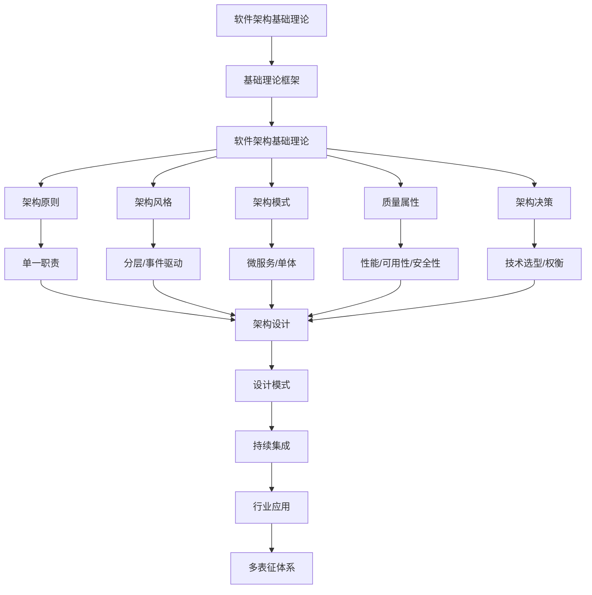

# 4.1-基础理论 分支导航

## 目录结构与本地跳转

- [4.1.1-软件架构基础理论](4.1.1-软件架构基础理论.md) - 预留分支

---

## 主题交叉引用

| 主题      | 基础理论 | 设计模式 | 微服务 | IOT | 工作流 | 组件化 | 云原生 | 行业案例 | 多表征 |
|-----------|----------|----------|--------|-----|--------|--------|--------|----------|--------|
| 软件架构基础理论| 预留 | 预留     | 预留   | 预留| 预留   | 预留   | 预留   | 预留     | 预留   |

- 交叉引用：[2.8-编程语言理论](../../../2-形式科学理论/2.8-编程语言理论/README.md)、[4.2-设计模式](../4.2-设计模式/README.md)、[7-持续集成与演进](../../../7-持续集成与演进/README.md)

---

## 全链路知识流（Mermaid流程图）

---

[返回软件架构与工程总导航](../README.md)
