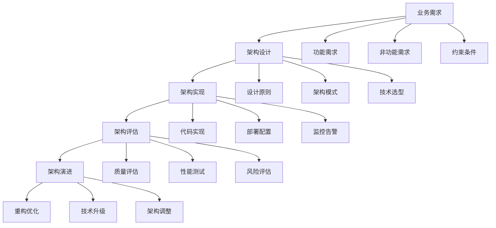

# 4.1-基础理论

## 📋 概述

软件架构基础理论是软件工程的核心支柱，它定义了如何设计、构建和维护复杂软件系统的理论基础和方法体系。本分支涵盖了从架构设计原则到质量属性评估，从架构模式到演进策略的完整理论体系。

## 🏗️ 目录结构

```text
4.1-基础理论/
├── 4.1.1-软件架构基础理论.md     # 架构设计原则、模式、评估方法
└── README.md                      # 本导航文档
```

## 🔗 主题交叉引用表

| 主题 | 相关文档 | 关联理论 | 应用场景 |
|------|----------|----------|----------|
| **架构设计原则** | 4.1.1 | SOLID原则、设计模式 | 系统设计、代码质量 |
| **架构质量属性** | 4.1.1 | 性能、可用性、安全性 | 系统评估、质量保证 |
| **架构模式** | 4.1.1 | 分层架构、微服务、事件驱动 | 架构选择、技术决策 |
| **架构评估** | 4.1.1 | ATAM、CBAM | 架构评审、风险评估 |
| **架构演进** | 4.1.1 | 重构、迁移、并行 | 系统升级、技术债务 |

## 🌊 全链路知识流



## 🎯 知识体系特色

### 1. 理论系统性

- **完整体系**：从基础概念到高级模式的完整理论体系
- **原则导向**：基于设计原则的架构决策方法
- **质量驱动**：以质量属性为核心的架构评估体系

### 2. 方法实用性

- **模式化设计**：提供可复用的架构模式
- **评估工具**：标准化的架构评估方法
- **演进策略**：系统化的架构演进指导

### 3. 技术前瞻性

- **云原生架构**：面向云环境的架构设计
- **微服务架构**：分布式系统的架构模式
- **事件驱动架构**：松耦合的架构设计

### 4. 实践导向性

- **案例驱动**：基于实际案例的理论讲解
- **工具支持**：提供具体的工具和方法
- **最佳实践**：总结行业最佳实践

## 📚 学习路径建议

### 🎯 入门路径

```text
1. 软件架构基础理论 (4.1.1)
   ├── 架构基本概念
   ├── 设计原则
   ├── 质量属性
   └── 架构模式
```

### 🔬 进阶路径

```text
1. 深度理论探索
   ├── 架构评估方法
   ├── 架构演进策略
   └── 新兴架构模式

2. 实践应用
   ├── 架构设计实践
   ├── 架构评估实践
   └── 架构演进实践

3. 技术深化
   ├── 云原生架构
   ├── 微服务架构
   └── 事件驱动架构
```

### 🚀 专家路径

```text
1. 理论创新
   ├── 新架构模式
   ├── 评估方法创新
   └── 演进策略创新

2. 行业标准制定
   ├── 架构标准
   ├── 评估标准
   └── 最佳实践

3. 技术平台建设
   ├── 架构设计平台
   ├── 评估工具平台
   └── 演进管理平台
```

## ⚡ 快速导航

### 📖 核心理论

- **[软件架构基础理论](4.1.1-软件架构基础理论.md)** - 架构设计原则、模式、评估方法

### 🛠️ 实用工具

- **设计工具**：UML工具、架构图工具、代码生成工具
- **评估工具**：ATAM、CBAM、性能测试工具
- **监控工具**：APM、基础设施监控、日志分析

### 📊 应用场景

- **系统设计**：架构设计、技术选型、质量保证
- **系统评估**：性能评估、风险评估、质量评估
- **系统演进**：重构优化、技术升级、架构调整

## 🔧 技术栈映射

| 技术领域 | 核心技术 | 相关工具 | 应用场景 |
|----------|----------|----------|----------|
| **架构设计** | UML、架构模式 | Enterprise Architect、Draw.io | 系统设计、文档管理 |
| **架构评估** | ATAM、CBAM | 评估工具、测试工具 | 架构评审、质量保证 |
| **架构监控** | APM、监控系统 | New Relic、Prometheus | 性能监控、故障诊断 |
| **架构演进** | 重构、迁移 | CI/CD、容器化 | 系统升级、技术债务 |

## 🎯 应用场景体系

### 1. 系统设计与开发

- **架构设计**：系统架构设计、技术选型
- **代码实现**：基于架构的代码实现
- **质量保证**：架构质量评估和保证

### 2. 系统评估与优化

- **性能评估**：系统性能测试和优化
- **风险评估**：架构风险识别和评估
- **质量评估**：架构质量属性评估

### 3. 系统运维与演进

- **系统监控**：架构层面的系统监控
- **故障诊断**：基于架构的故障诊断
- **系统演进**：架构演进策略和实施

### 4. 团队协作与治理

- **架构治理**：架构决策和治理流程
- **团队协作**：基于架构的团队协作
- **知识管理**：架构知识和经验管理

## 🔮 发展趋势与前沿

### 1. 技术发展趋势

- **云原生架构**：容器化、微服务、服务网格
- **AI集成架构**：智能运维、自动化决策
- **边缘计算架构**：分布式部署、低延迟处理
- **量子计算架构**：新型计算范式、算法优化

### 2. 架构模式趋势

- **无服务器架构**：按需计算、成本优化
- **事件驱动架构**：松耦合、高扩展性
- **数据驱动架构**：实时分析、智能决策
- **安全优先架构**：零信任、隐私保护

### 3. 方法论趋势

- **DevOps**：开发运维一体化
- **GitOps**：Git作为单一事实源
- **SRE**：站点可靠性工程
- **Platform Engineering**：平台工程

## 📈 学习资源推荐

### 📚 理论资源

- **架构理论**：软件架构设计、架构模式、质量属性
- **设计原则**：SOLID原则、设计模式、架构原则
- **评估方法**：ATAM、CBAM、架构评估方法

### 🛠️ 实践资源

- **设计工具**：UML工具、架构图工具、建模工具
- **评估工具**：性能测试工具、监控工具、分析工具
- **案例资源**：架构设计案例、评估案例、演进案例

### 🔬 研究资源

- **学术论文**：软件架构、架构评估、架构演进
- **技术报告**：架构标准、最佳实践、技术规范
- **开源项目**：架构框架、评估工具、监控系统

---

**📖 相关导航**:

- [返回上级目录](../README.md)
- [4.2-设计模式](../4.2-设计模式/README.md)
- [4.3-微服务架构](../4.3-微服务架构/README.md)
