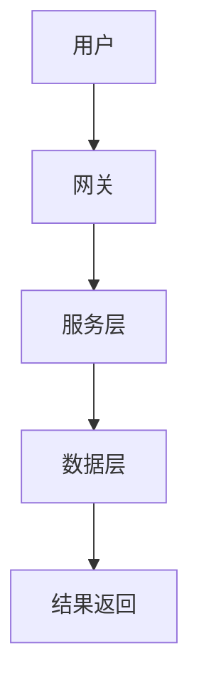

# 4.1 软件架构基础理论 主题导航与多表征案例

## 目录结构与本地跳转

- [4.1.1 软件架构基础理论](./4.1.1-软件架构基础理论.md)

---

## 行业案例与多表征

### 4.1.x 典型行业案例

- 金融行业：高可用分布式架构（详见1.1-PostgreSQL、3.3.3-并发控制算法、5.1-金融数据分析）
- 科学计算：高性能计算集群架构（详见5.2-科学计算）
- AI平台：AI微服务与弹性伸缩（详见3.4-AI与机器学习算法、4.3-微服务架构）

### 4.1.x 多表征示例

- 架构图、分层结构图、服务依赖图、Latex公式等

---

[返回数据分析与ETL](../../3-数据模型与算法/3.5-数据分析与ETL/README.md)
