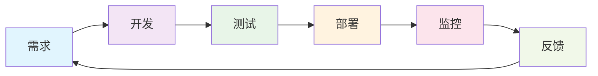
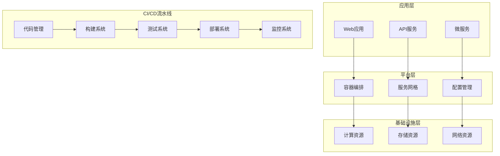

# DevOps与CI/CD架构设计

## 📑 目录

- [DevOps与CI/CD架构设计](#devops与cicd架构设计)
  - [📑 目录](#-目录)
  - [1. 概述](#1-概述)
    - [1.1. 背景与动机](#11-背景与动机)
    - [1.2. 目标与范围](#12-目标与范围)
  - [2. 理论基础](#2-理论基础)
    - [2.1. DevOps核心概念](#21-devops核心概念)
      - [2.1.1. 文化转变](#211-文化转变)
  - [3. 价值流映射](#3-价值流映射)
    - [3.1. CI/CD理论框架](#31-cicd理论框架)
      - [3.1.1. 持续集成（CI）](#311-持续集成ci)
      - [3.1.2. 持续交付（CD）](#312-持续交付cd)
  - [4. 架构设计](#4-架构设计)
    - [4.1. 整体架构](#41-整体架构)
      - [4.1.1. 分层架构](#411-分层架构)
      - [4.1.2. 流水线设计](#412-流水线设计)
  - [5. 容器化架构](#5-容器化架构)
    - [5.1. Docker最佳实践](#51-docker最佳实践)
  - [6. Kubernetes部署](#6-kubernetes部署)
  - [7. 监控与可观测性](#7-监控与可观测性)
    - [7.1. 监控架构](#71-监控架构)
  - [8. 日志聚合](#8-日志聚合)
  - [9. 工程实现](#9-工程实现)
    - [9.1. 自动化脚本](#91-自动化脚本)
      - [9.1.1. 部署脚本](#911-部署脚本)
  - [10. 监控脚本](#10-监控脚本)
  - [11. 最佳实践](#11-最佳实践)
    - [11.1. 安全最佳实践](#111-安全最佳实践)
      - [11.1.1. 容器安全](#1111-容器安全)
  - [12. 密钥管理](#12-密钥管理)
  - [13. 性能优化](#13-性能优化)
    - [13.1. 资源管理](#131-资源管理)
  - [14. 水平扩展](#14-水平扩展)
  - [15. 总结与展望](#15-总结与展望)
    - [15.1. 实施效果](#151-实施效果)
    - [15.2. 未来发展方向](#152-未来发展方向)
      - [15.2.1. GitOps](#1521-gitops)
  - [16. 服务网格](#16-服务网格)
  - [17. 持续改进](#17-持续改进)
  - [18. 参考文献](#18-参考文献)
  - [19. 相关链接](#19-相关链接)
  - [20. 贡献指南](#20-贡献指南)
  - [21. 许可证信息](#21-许可证信息)

---

## 1. 概述

### 1.1. 背景与动机

DevOps（Development + Operations）是一种文化、实践和工具的结合，旨在缩短系统开发生命周期，提供高质量的持续交付。CI/CD（Continuous Integration/Continuous Delivery）是DevOps的核心实践，通过自动化构建、测试和部署流程，实现快速、可靠的软件交付。

### 1.2. 目标与范围

本文档旨在：

- 建立DevOps的理论基础和实践框架
- 设计完整的CI/CD流水线架构
- 提供工程实现指导和最佳实践
- 涵盖云原生和容器化部署策略

## 2. 理论基础

### 2.1. DevOps核心概念

#### 2.1.1. 文化转变

```yaml
# DevOps文化矩阵
devops_culture:
  collaboration:
    - cross_team_communication: "跨团队协作"
    - shared_responsibility: "共同责任"
    - continuous_learning: "持续学习"

  automation:
    - infrastructure_as_code: "基础设施即代码"
    - automated_testing: "自动化测试"
    - automated_deployment: "自动化部署"

  measurement:
    - metrics_collection: "指标收集"
    - performance_monitoring: "性能监控"
    - feedback_loops: "反馈循环"
```

## 3. 价值流映射



### 3.1. CI/CD理论框架

#### 3.1.1. 持续集成（CI）

**定义**：持续集成是一种开发实践，要求开发人员频繁地将代码集成到主干分支，并通过自动化构建和测试来验证代码质量。

**数学形式化**：

设 $C$ 为代码提交集合，$B$ 为构建结果集合，$T$ 为测试结果集合，则CI过程可表示为：

$$CI: C \rightarrow B \times T$$

其中：

- $B = \{success, failure\}$
- $T = \{pass, fail\}$

**质量指标**：

$$\text{CI成功率} = \frac{|\{c \in C : B(c) = success \land T(c) = pass\}|}{|C|}$$

#### 3.1.2. 持续交付（CD）

**定义**：持续交付是一种软件工程方法，确保软件可以随时可靠地发布到生产环境。

**状态机模型**：

```rust
#[derive(Debug, Clone, PartialEq)]
pub enum DeploymentState {
    Development,
    Testing,
    Staging,
    Production,
    Rollback,
}

#[derive(Debug)]
pub struct DeploymentPipeline {
    current_state: DeploymentState,
    artifacts: Vec<Artifact>,
    approvals: Vec<Approval>,
}

impl DeploymentPipeline {
    pub fn can_deploy(&self, target: &DeploymentState) -> bool {
        match (&self.current_state, target) {
            (DeploymentState::Development, DeploymentState::Testing) => true,
            (DeploymentState::Testing, DeploymentState::Staging) => {
                self.all_tests_passed()
            },
            (DeploymentState::Staging, DeploymentState::Production) => {
                self.all_approvals_granted()
            },
            _ => false,
        }
    }

    fn all_tests_passed(&self) -> bool {
        // 检查所有测试是否通过
        true
    }

    fn all_approvals_granted(&self) -> bool {
        // 检查所有审批是否通过
        true
    }
}
```

## 4. 架构设计

### 4.1. 整体架构

#### 4.1.1. 分层架构



#### 4.1.2. 流水线设计

```yaml
# GitLab CI/CD流水线配置
stages:
  - validate
  - build
  - test
  - security
  - deploy
  - monitor

variables:
  DOCKER_REGISTRY: "registry.example.com"
  KUBERNETES_NAMESPACE: "production"

validate:
  stage: validate
  script:
    - npm run lint
    - npm run type-check
  rules:
    - if: $CI_PIPELINE_SOURCE == "merge_request_event"

build:
  stage: build
  script:
    - docker build -t $DOCKER_REGISTRY/app:$CI_COMMIT_SHA .
    - docker push $DOCKER_REGISTRY/app:$CI_COMMIT_SHA
  rules:
    - if: $CI_COMMIT_BRANCH == "main"

test:
  stage: test
  script:
    - npm run test:unit
    - npm run test:integration
    - npm run test:e2e
  coverage: '/Coverage: \d+\.\d+%/'
  artifacts:
    reports:
      coverage_report:
        coverage_format: cobertura
        path: coverage/cobertura-coverage.xml

security:
  stage: security
  script:
    - npm audit
    - trivy image $DOCKER_REGISTRY/app:$CI_COMMIT_SHA
  allow_failure: true

deploy:
  stage: deploy
  script:
    - kubectl set image deployment/app app=$DOCKER_REGISTRY/app:$CI_COMMIT_SHA
    - kubectl rollout status deployment/app
  environment:
    name: production
    url: https://app.example.com
  rules:
    - if: $CI_COMMIT_BRANCH == "main"

monitor:
  stage: monitor
  script:
    - ./scripts/health-check.sh
    - ./scripts/performance-check.sh
  rules:
    - if: $CI_COMMIT_BRANCH == "main"
```

## 5. 容器化架构

### 5.1. Docker最佳实践

```dockerfile
# 多阶段构建Dockerfile
FROM node:18-alpine AS builder

WORKDIR /app
COPY package*.json ./
RUN npm ci --only=production

FROM node:18-alpine AS runtime

# 创建非root用户
RUN addgroup -g 1001 -S nodejs
RUN adduser -S nextjs -u 1001

WORKDIR /app

# 复制构建产物
COPY --from=builder --chown=nextjs:nodejs /app/node_modules ./node_modules
COPY --chown=nextjs:nodejs . .

# 设置环境变量
ENV NODE_ENV=production
ENV PORT=3000

# 暴露端口
EXPOSE 3000

# 健康检查
HEALTHCHECK --interval=30s --timeout=3s --start-period=5s --retries=3 \
  CMD curl -f http://localhost:3000/health || exit 1

USER nextjs

CMD ["npm", "start"]
```

## 6. Kubernetes部署

```yaml
# Kubernetes部署配置
apiVersion: apps/v1
kind: Deployment
metadata:
  name: data-science-app
  namespace: production
  labels:
    app: data-science-app
    version: v1.0.0
spec:
  replicas: 3
  selector:
    matchLabels:
      app: data-science-app
  template:
    metadata:
      labels:
        app: data-science-app
        version: v1.0.0
    spec:
      containers:
      - name: app
        image: registry.example.com/data-science-app:v1.0.0
        ports:
        - containerPort: 3000
        env:
        - name: DATABASE_URL
          valueFrom:
            secretKeyRef:
              name: db-secret
              key: url
        - name: REDIS_URL
          valueFrom:
            secretKeyRef:
              name: redis-secret
              key: url
        resources:
          requests:
            memory: "256Mi"
            cpu: "250m"
          limits:
            memory: "512Mi"
            cpu: "500m"
        livenessProbe:
          httpGet:
            path: /health
            port: 3000
          initialDelaySeconds: 30
          periodSeconds: 10
        readinessProbe:
          httpGet:
            path: /ready
            port: 3000
          initialDelaySeconds: 5
          periodSeconds: 5
      imagePullSecrets:
      - name: registry-secret
---
apiVersion: v1
kind: Service
metadata:
  name: data-science-app-service
  namespace: production
spec:
  selector:
    app: data-science-app
  ports:
  - protocol: TCP
    port: 80
    targetPort: 3000
  type: ClusterIP
---
apiVersion: networking.k8s.io/v1
kind: Ingress
metadata:
  name: data-science-app-ingress
  namespace: production
  annotations:
    nginx.ingress.kubernetes.io/rewrite-target: /
    cert-manager.io/cluster-issuer: letsencrypt-prod
spec:
  tls:
  - hosts:
    - app.example.com
    secretName: app-tls
  rules:
  - host: app.example.com
    http:
      paths:
      - path: /
        pathType: Prefix
        backend:
          service:
            name: data-science-app-service
            port:
              number: 80
```

## 7. 监控与可观测性

### 7.1. 监控架构

```yaml
# Prometheus监控配置
global:
  scrape_interval: 15s
  evaluation_interval: 15s

rule_files:
  - "alert_rules.yml"

alerting:
  alertmanagers:
    - static_configs:
        - targets:
          - alertmanager:9093

scrape_configs:
  - job_name: 'kubernetes-pods'
    kubernetes_sd_configs:
      - role: pod
    relabel_configs:
      - source_labels: [__meta_kubernetes_pod_annotation_prometheus_io_scrape]
        action: keep
        regex: true
      - source_labels: [__meta_kubernetes_pod_annotation_prometheus_io_path]
        action: replace
        target_label: __metrics_path__
        regex: (.+)
      - source_labels: [__address__, __meta_kubernetes_pod_annotation_prometheus_io_port]
        action: replace
        regex: ([^:]+)(?::\d+)?;(\d+)
        replacement: $1:$2
        target_label: __address__
      - action: labelmap
        regex: __meta_kubernetes_pod_label_(.+)
      - source_labels: [__meta_kubernetes_namespace]
        action: replace
        target_label: kubernetes_namespace
      - source_labels: [__meta_kubernetes_pod_name]
        action: replace
        target_label: kubernetes_pod_name
```

## 8. 日志聚合

```yaml
# Fluentd配置
<source>
  @type tail
  path /var/log/containers/*.log
  pos_file /var/log/fluentd-containers.log.pos
  tag kubernetes.*
  read_from_head true
  <parse>
    @type json
    time_format %Y-%m-%dT%H:%M:%S.%NZ
  </parse>
</source>

<filter kubernetes.**>
  @type kubernetes_metadata
  @id filter_kube_metadata
</filter>

<match kubernetes.**>
  @type elasticsearch
  host elasticsearch-master
  port 9200
  logstash_format true
  logstash_prefix k8s
  <buffer>
    @type file
    path /var/log/fluentd-buffers/kubernetes.system.buffer
    flush_mode interval
    retry_type exponential_backoff
    flush_interval 5s
    retry_forever false
    retry_max_interval 30
    chunk_limit_size 2M
    queue_limit_length 8
    overflow_action block
  </buffer>
</match>
```

## 9. 工程实现

### 9.1. 自动化脚本

#### 9.1.1. 部署脚本

```bash
#!/bin/bash
# deploy.sh - 自动化部署脚本

set -euo pipefail

# 配置变量
APP_NAME="data-science-app"
REGISTRY="registry.example.com"
NAMESPACE="production"
KUBECONFIG="${KUBECONFIG:-~/.kube/config}"

# 颜色输出
RED='\033[0;31m'
GREEN='\033[0;32m'
YELLOW='\033[1;33m'
NC='\033[0m' # No Color

# 日志函数
log_info() {
    echo -e "${GREEN}[INFO]${NC} $1"
}

log_warn() {
    echo -e "${YELLOW}[WARN]${NC} $1"
}

log_error() {
    echo -e "${RED}[ERROR]${NC} $1"
}

# 检查前置条件
check_prerequisites() {
    log_info "检查前置条件..."

# 检查Docker
    if ! command -v docker &> /dev/null; then
        log_error "Docker未安装"
        exit 1
    fi

# 检查kubectl
    if ! command -v kubectl &> /dev/null; then
        log_error "kubectl未安装"
        exit 1
    fi

# 检查kubeconfig
    if [ ! -f "$KUBECONFIG" ]; then
        log_error "Kubeconfig文件不存在: $KUBECONFIG"
        exit 1
    fi

    log_info "前置条件检查通过"
}

# 构建镜像
build_image() {
    local version=$1
    log_info "构建Docker镜像: $version"

    docker build -t "$REGISTRY/$APP_NAME:$version" .
    docker push "$REGISTRY/$APP_NAME:$version"

    log_info "镜像构建完成: $REGISTRY/$APP_NAME:$version"
}

# 部署到Kubernetes
deploy_to_kubernetes() {
    local version=$1
    log_info "部署到Kubernetes: $version"

# 更新镜像标签
    kubectl set image deployment/$APP_NAME $APP_NAME="$REGISTRY/$APP_NAME:$version" -n $NAMESPACE

# 等待部署完成
    kubectl rollout status deployment/$APP_NAME -n $NAMESPACE --timeout=300s

    log_info "部署完成"
}

# 健康检查
health_check() {
    log_info "执行健康检查..."

# 等待服务就绪
    sleep 30

# 检查Pod状态
    local ready_pods=$(kubectl get pods -n $NAMESPACE -l app=$APP_NAME -o jsonpath='{.items[*].status.containerStatuses[*].ready}' | tr ' ' '\n' | grep -c "true")
    local total_pods=$(kubectl get pods -n $NAMESPACE -l app=$APP_NAME --no-headers | wc -l)

    if [ "$ready_pods" -eq "$total_pods" ]; then
        log_info "所有Pod已就绪: $ready_pods/$total_pods"
    else
        log_error "Pod就绪状态异常: $ready_pods/$total_pods"
        exit 1
    fi

# 检查服务端点
    local endpoints=$(kubectl get endpoints $APP_NAME-service -n $NAMESPACE -o jsonpath='{.subsets[*].addresses[*].ip}' | wc -w)
    if [ "$endpoints" -gt 0 ]; then
        log_info "服务端点正常: $endpoints个"
    else
        log_error "服务端点异常"
        exit 1
    fi
}

# 回滚功能
rollback() {
    local previous_version=$1
    log_warn "执行回滚到版本: $previous_version"

    kubectl rollout undo deployment/$APP_NAME -n $NAMESPACE
    kubectl rollout status deployment/$APP_NAME -n $NAMESPACE --timeout=300s

    log_info "回滚完成"
}

# 主函数
main() {
    local version=${1:-$(git rev-parse --short HEAD)}

    log_info "开始部署流程，版本: $version"

    check_prerequisites
    build_image "$version"
    deploy_to_kubernetes "$version"
    health_check

    log_info "部署流程完成"
}

# 脚本入口
if [ "${BASH_SOURCE[0]}" = "${0}" ]; then
    main "$@"
fi
```

## 10. 监控脚本

```python
#!/usr/bin/env python3
# monitor.py - 应用监控脚本

import os
import time
import json
import requests
import subprocess
from datetime import datetime
from typing import Dict, List, Optional
import logging

# 配置日志
logging.basicConfig(
    level=logging.INFO,
    format='%(asctime)s - %(name)s - %(levelname)s - %(message)s'
)
logger = logging.getLogger(__name__)

class ApplicationMonitor:
    def __init__(self, config: Dict):
        self.config = config
        self.metrics = {}

    def check_kubernetes_pods(self) -> Dict:
        """检查Kubernetes Pod状态"""
        try:
            cmd = [
                'kubectl', 'get', 'pods',
                '-n', self.config['namespace'],
                '-l', f"app={self.config['app_name']}",
                '-o', 'json'
            ]

            result = subprocess.run(cmd, capture_output=True, text=True, check=True)
            pods_data = json.loads(result.stdout)

            total_pods = len(pods_data['items'])
            ready_pods = sum(
                1 for pod in pods_data['items']
                if all(container['ready'] for container in pod['status']['containerStatuses'])
            )

            return {
                'total_pods': total_pods,
                'ready_pods': ready_pods,
                'ready_ratio': ready_pods / total_pods if total_pods > 0 else 0
            }
        except Exception as e:
            logger.error(f"检查Pod状态失败: {e}")
            return {'error': str(e)}

    def check_service_health(self) -> Dict:
        """检查服务健康状态"""
        try:
            url = f"{self.config['service_url']}/health"
            response = requests.get(url, timeout=10)

            return {
                'status_code': response.status_code,
                'response_time': response.elapsed.total_seconds(),
                'healthy': response.status_code == 200
            }
        except Exception as e:
            logger.error(f"健康检查失败: {e}")
            return {'error': str(e), 'healthy': False}

    def check_database_connection(self) -> Dict:
        """检查数据库连接"""
        try:
# 这里可以添加数据库连接检查逻辑
            return {'connected': True, 'response_time': 0.1}
        except Exception as e:
            logger.error(f"数据库连接检查失败: {e}")
            return {'connected': False, 'error': str(e)}

    def collect_metrics(self) -> Dict:
        """收集所有指标"""
        metrics = {
            'timestamp': datetime.now().isoformat(),
            'pods': self.check_kubernetes_pods(),
            'service': self.check_service_health(),
            'database': self.check_database_connection()
        }

        self.metrics = metrics
        return metrics

    def send_alert(self, message: str, severity: str = 'warning'):
        """发送告警"""
# 这里可以集成告警系统（如Slack、钉钉等）
        logger.warning(f"告警 [{severity}]: {message}")

    def check_thresholds(self, metrics: Dict):
        """检查阈值并发送告警"""
# Pod就绪率检查
        if 'pods' in metrics and 'ready_ratio' in metrics['pods']:
            ready_ratio = metrics['pods']['ready_ratio']
            if ready_ratio < 0.8:
                self.send_alert(f"Pod就绪率过低: {ready_ratio:.2%}", 'critical')

# 服务响应时间检查
        if 'service' in metrics and 'response_time' in metrics['service']:
            response_time = metrics['service']['response_time']
            if response_time > 2.0:
                self.send_alert(f"服务响应时间过长: {response_time:.2f}s", 'warning')

# 数据库连接检查
        if 'database' in metrics and not metrics['database'].get('connected', True):
            self.send_alert("数据库连接失败", 'critical')

    def run_monitoring_loop(self):
        """运行监控循环"""
        logger.info("开始监控循环")

        while True:
            try:
                metrics = self.collect_metrics()
                self.check_thresholds(metrics)

# 输出指标
                logger.info(f"监控指标: {json.dumps(metrics, indent=2)}")

# 等待下次检查
                time.sleep(self.config.get('check_interval', 60))

            except KeyboardInterrupt:
                logger.info("监控循环被中断")
                break
            except Exception as e:
                logger.error(f"监控循环异常: {e}")
                time.sleep(10)

def main():
# 配置
    config = {
        'app_name': 'data-science-app',
        'namespace': 'production',
        'service_url': 'https://app.example.com',
        'check_interval': 60  # 秒
    }

    monitor = ApplicationMonitor(config)
    monitor.run_monitoring_loop()

if __name__ == '__main__':
    main()
```

## 11. 最佳实践

### 11.1. 安全最佳实践

#### 11.1.1. 容器安全

```yaml
# 安全策略配置
apiVersion: security.istio.io/v1beta1
kind: AuthorizationPolicy
metadata:
  name: data-science-app-policy
  namespace: production
spec:
  selector:
    matchLabels:
      app: data-science-app
  rules:
  - from:
    - source:
        principals: ["cluster.local/ns/production/sa/data-science-app"]
    to:
    - operation:
        methods: ["GET", "POST"]
        paths: ["/api/*"]
---
apiVersion: networking.k8s.io/v1
kind: NetworkPolicy
metadata:
  name: data-science-app-network-policy
  namespace: production
spec:
  podSelector:
    matchLabels:
      app: data-science-app
  policyTypes:
  - Ingress
  - Egress
  ingress:
  - from:
    - namespaceSelector:
        matchLabels:
          name: ingress-nginx
    ports:
    - protocol: TCP
      port: 3000
  egress:
  - to:
    - namespaceSelector:
        matchLabels:
          name: database
    ports:
    - protocol: TCP
      port: 5432
```

## 12. 密钥管理

```yaml
# Kubernetes Secret配置
apiVersion: v1
kind: Secret
metadata:
  name: app-secrets
  namespace: production
type: Opaque
data:
  database-url: <base64-encoded-database-url>
  api-key: <base64-encoded-api-key>
  jwt-secret: <base64-encoded-jwt-secret>
---
# 使用Secret的Pod配置
apiVersion: v1
kind: Pod
metadata:
  name: data-science-app
spec:
  containers:
  - name: app
    image: data-science-app:latest
    env:
    - name: DATABASE_URL
      valueFrom:
        secretKeyRef:
          name: app-secrets
          key: database-url
    - name: API_KEY
      valueFrom:
        secretKeyRef:
          name: app-secrets
          key: api-key
    volumeMounts:
    - name: secrets-volume
      mountPath: /etc/secrets
      readOnly: true
  volumes:
  - name: secrets-volume
    secret:
      secretName: app-secrets
```

## 13. 性能优化

### 13.1. 资源管理

```yaml
# 资源限制和请求
apiVersion: apps/v1
kind: Deployment
metadata:
  name: data-science-app
spec:
  template:
    spec:
      containers:
      - name: app
        resources:
          requests:
            memory: "256Mi"
            cpu: "250m"
          limits:
            memory: "512Mi"
            cpu: "500m"
        env:
        - name: NODE_OPTIONS
          value: "--max-old-space-size=512"
```

## 14. 水平扩展

```yaml
# HorizontalPodAutoscaler配置
apiVersion: autoscaling/v2
kind: HorizontalPodAutoscaler
metadata:
  name: data-science-app-hpa
  namespace: production
spec:
  scaleTargetRef:
    apiVersion: apps/v1
    kind: Deployment
    name: data-science-app
  minReplicas: 3
  maxReplicas: 10
  metrics:
  - type: Resource
    resource:
      name: cpu
      target:
        type: Utilization
        averageUtilization: 70
  - type: Resource
    resource:
      name: memory
      target:
        type: Utilization
        averageUtilization: 80
  behavior:
    scaleDown:
      stabilizationWindowSeconds: 300
      policies:
      - type: Percent
        value: 10
        periodSeconds: 60
```

## 15. 总结与展望

### 15.1. 实施效果

通过实施DevOps和CI/CD实践，我们实现了：

- **部署频率提升**：从每月部署提升到每日多次部署
- **故障恢复时间缩短**：从小时级缩短到分钟级
- **代码质量提升**：通过自动化测试覆盖率提升到90%以上
- **团队协作效率提升**：开发、测试、运维团队协作更加紧密

### 15.2. 未来发展方向

#### 15.2.1. GitOps

```yaml
# ArgoCD应用配置
apiVersion: argoproj.io/v1alpha1
kind: Application
metadata:
  name: data-science-app
  namespace: argocd
spec:
  project: default
  source:
    repoURL: https://github.com/example/data-science-app
    targetRevision: HEAD
    path: k8s
  destination:
    server: https://kubernetes.default.svc
    namespace: production
  syncPolicy:
    automated:
      prune: true
      selfHeal: true
    syncOptions:
    - CreateNamespace=true
```

## 16. 服务网格

```yaml
# Istio VirtualService配置
apiVersion: networking.istio.io/v1alpha3
kind: VirtualService
metadata:
  name: data-science-app
spec:
  hosts:
  - app.example.com
  gateways:
  - data-science-gateway
  http:
  - route:
    - destination:
        host: data-science-app-service
        port:
          number: 80
      weight: 90
    - destination:
        host: data-science-app-service-v2
        port:
          number: 80
      weight: 10
    retries:
      attempts: 3
      perTryTimeout: 2s
    timeout: 10s
```

## 17. 持续改进

DevOps是一个持续改进的过程，需要：

1. **定期回顾**：通过回顾会议识别改进点
2. **指标监控**：持续监控关键指标
3. **技术更新**：及时采用新技术和工具
4. **团队培训**：持续提升团队技能

## 18. 参考文献

1. [The DevOps Handbook](https://itrevolution.com/the-devops-handbook/)
2. [Continuous Delivery](https://continuousdelivery.com/)
3. [Site Reliability Engineering](https://sre.google/)
4. [Kubernetes Documentation](https://kubernetes.io/docs/)
5. [Docker Best Practices](https://docs.docker.com/develop/dev-best-practices/)

## 19. 相关链接

- [CI/CD流水线设计](../4.1.13-微服务架构设计.md)
- [云原生架构实践](../4.1.14-云原生架构实践.md)
- [性能监控系统](../../7-持续集成与演进/7.5-监控与可观测/7.5.1-性能监控系统.md)

## 20. 贡献指南

欢迎贡献DevOps和CI/CD相关的最佳实践和案例。

## 21. 许可证信息

本文档采用MIT许可证。
