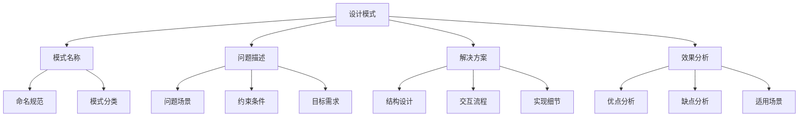
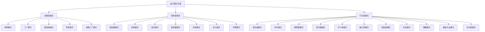
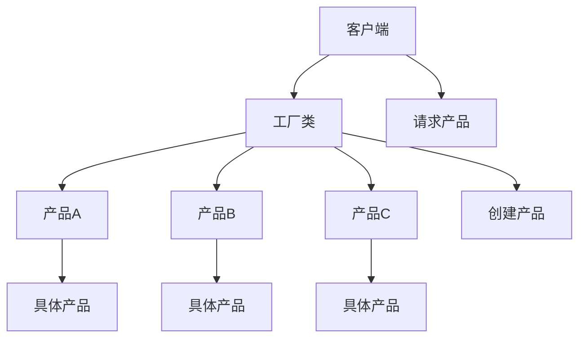
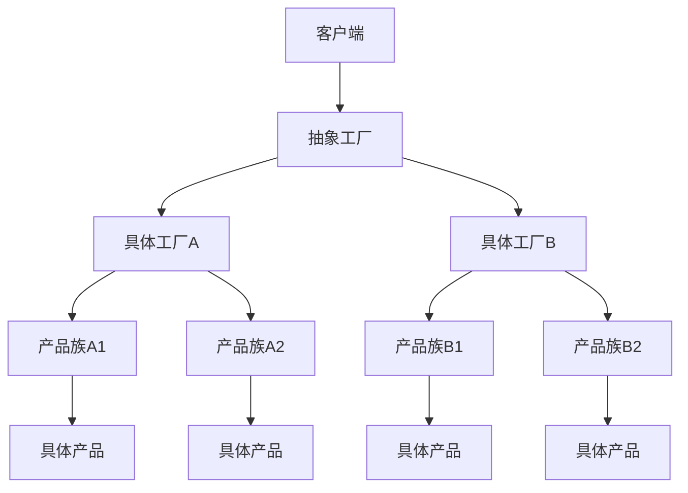
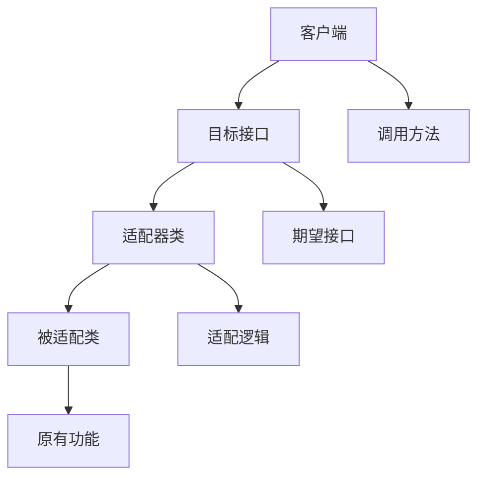
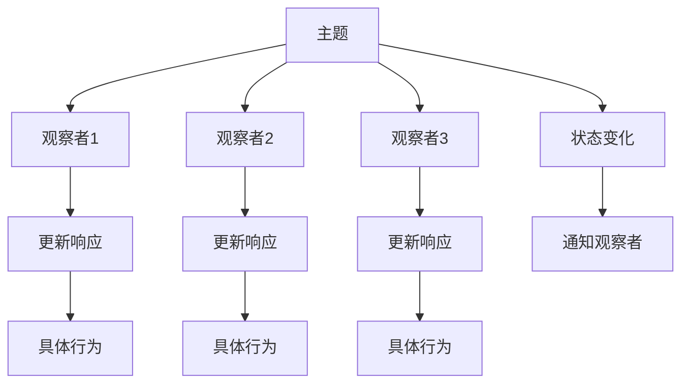
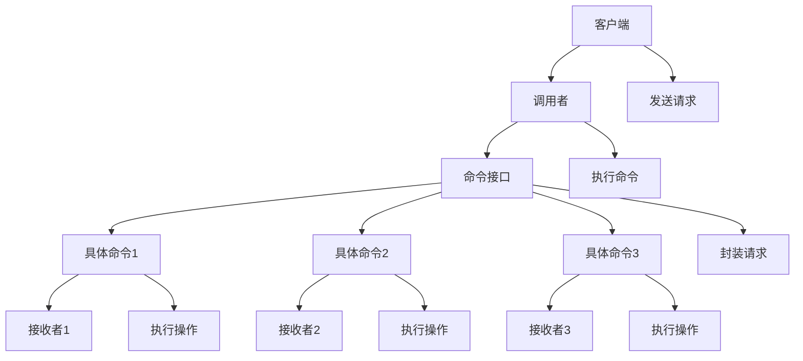
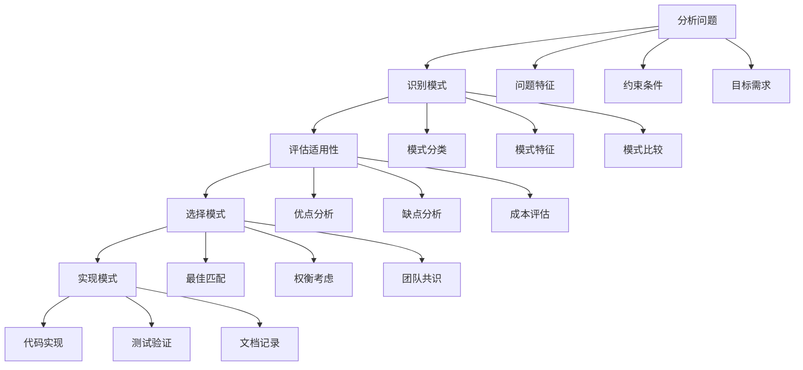
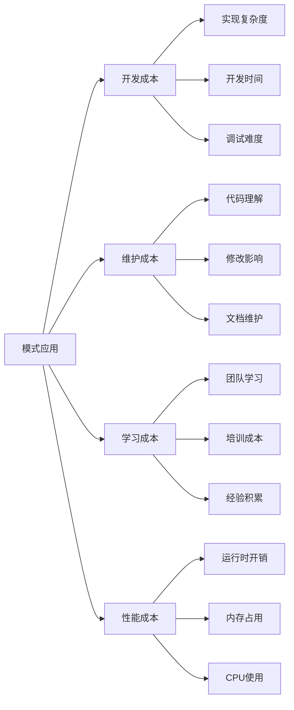

# 设计模式基础理论

## 📋 概述

设计模式是软件工程中解决常见设计问题的可复用解决方案，它们提供了经过验证的开发范式，能够提高代码的可维护性、可扩展性和可重用性。本文档系统性地阐述设计模式的基础理论、分类体系、应用原则和最佳实践。

## 🏗️ 设计模式基础概念

### 1. 设计模式定义

设计模式是对软件设计中常见问题的典型解决方案，它描述了在软件开发中重复发生的问题以及该问题的解决方案的核心。

#### 1.1 设计模式要素



#### 1.2 设计模式特征

| 特征 | 描述 | 重要性 | 体现方式 |
|------|------|--------|----------|
| **可重用性** | 可在不同项目中重复使用 | 提高开发效率 | 通用解决方案 |
| **可维护性** | 易于理解和修改 | 降低维护成本 | 清晰的结构 |
| **可扩展性** | 支持功能扩展 | 适应需求变化 | 灵活的接口 |
| **可测试性** | 便于单元测试 | 保证代码质量 | 松耦合设计 |

### 2. 设计模式分类体系

#### 2.1 按目的分类



#### 2.2 按范围分类

| 范围 | 定义 | 特点 | 典型模式 |
|------|------|------|----------|
| **类模式** | 处理类与子类之间的关系 | 静态关系、编译时确定 | 模板方法、适配器 |
| **对象模式** | 处理对象之间的关系 | 动态关系、运行时确定 | 策略、观察者、单例 |

## 🎯 创建型模式

### 1. 单例模式 (Singleton Pattern)

#### 1.1 模式定义

确保一个类只有一个实例，并提供一个全局访问点。

#### 1.2 实现方式

```java
public class Singleton {
    // 私有静态实例
    private static Singleton instance;
    
    // 私有构造函数
    private Singleton() {}
    
    // 公共静态访问方法
    public static Singleton getInstance() {
        if (instance == null) {
            instance = new Singleton();
        }
        return instance;
    }
}
```

#### 1.3 线程安全实现

```java
public class ThreadSafeSingleton {
    private static volatile ThreadSafeSingleton instance;
    
    private ThreadSafeSingleton() {}
    
    public static ThreadSafeSingleton getInstance() {
        if (instance == null) {
            synchronized (ThreadSafeSingleton.class) {
                if (instance == null) {
                    instance = new ThreadSafeSingleton();
                }
            }
        }
        return instance;
    }
}
```

#### 1.4 应用场景

- **配置管理**：全局配置对象
- **日志记录**：日志记录器
- **数据库连接**：数据库连接池
- **缓存管理**：缓存管理器

### 2. 工厂模式 (Factory Pattern)

#### 2.1 简单工厂模式



#### 2.2 工厂方法模式

```java
// 抽象产品
public interface Product {
    void operation();
}

// 具体产品
public class ConcreteProductA implements Product {
    public void operation() {
        System.out.println("Product A operation");
    }
}

// 抽象工厂
public interface Factory {
    Product createProduct();
}

// 具体工厂
public class ConcreteFactoryA implements Factory {
    public Product createProduct() {
        return new ConcreteProductA();
    }
}
```

#### 2.3 抽象工厂模式



### 3. 建造者模式 (Builder Pattern)

#### 3.1 模式结构

```java
public class Product {
    private String partA;
    private String partB;
    private String partC;
    
    // 构造函数、getter、setter
}

public interface Builder {
    void buildPartA();
    void buildPartB();
    void buildPartC();
    Product getResult();
}

public class ConcreteBuilder implements Builder {
    private Product product = new Product();
    
    public void buildPartA() {
        product.setPartA("Part A");
    }
    
    public void buildPartB() {
        product.setPartB("Part B");
    }
    
    public void buildPartC() {
        product.setPartC("Part C");
    }
    
    public Product getResult() {
        return product;
    }
}

public class Director {
    private Builder builder;
    
    public Director(Builder builder) {
        this.builder = builder;
    }
    
    public Product construct() {
        builder.buildPartA();
        builder.buildPartB();
        builder.buildPartC();
        return builder.getResult();
    }
}
```

## 🔗 结构型模式

### 1. 适配器模式 (Adapter Pattern)

#### 1.1 类适配器



#### 1.2 对象适配器

```java
// 目标接口
public interface Target {
    void request();
}

// 被适配类
public class Adaptee {
    public void specificRequest() {
        System.out.println("Specific request");
    }
}

// 适配器
public class Adapter implements Target {
    private Adaptee adaptee;
    
    public Adapter(Adaptee adaptee) {
        this.adaptee = adaptee;
    }
    
    public void request() {
        adaptee.specificRequest();
    }
}
```

### 2. 装饰器模式 (Decorator Pattern)

#### 2.1 模式结构

```java
// 抽象组件
public interface Component {
    void operation();
}

// 具体组件
public class ConcreteComponent implements Component {
    public void operation() {
        System.out.println("Basic operation");
    }
}

// 抽象装饰器
public abstract class Decorator implements Component {
    protected Component component;
    
    public Decorator(Component component) {
        this.component = component;
    }
    
    public void operation() {
        component.operation();
    }
}

// 具体装饰器
public class ConcreteDecoratorA extends Decorator {
    public ConcreteDecoratorA(Component component) {
        super(component);
    }
    
    public void operation() {
        super.operation();
        addedBehavior();
    }
    
    private void addedBehavior() {
        System.out.println("Added behavior A");
    }
}
```

#### 2.2 应用场景

- **I/O流**：Java中的InputStream、OutputStream装饰器
- **UI组件**：图形界面组件的装饰
- **日志记录**：日志功能的装饰
- **缓存功能**：为对象添加缓存功能

### 3. 代理模式 (Proxy Pattern)

#### 3.1 模式类型

| 类型 | 定义 | 应用场景 | 实现特点 |
|------|------|----------|----------|
| **虚拟代理** | 延迟加载大对象 | 图片加载、大文件处理 | 按需创建 |
| **保护代理** | 控制对象访问权限 | 权限控制、安全访问 | 访问控制 |
| **远程代理** | 远程对象本地代理 | RPC、分布式调用 | 网络通信 |
| **缓存代理** | 为操作结果提供缓存 | 数据库查询、API调用 | 结果缓存 |

#### 3.2 虚拟代理实现

```java
public interface Image {
    void display();
}

public class RealImage implements Image {
    private String filename;
    
    public RealImage(String filename) {
        this.filename = filename;
        loadFromDisk();
    }
    
    private void loadFromDisk() {
        System.out.println("Loading: " + filename);
    }
    
    public void display() {
        System.out.println("Displaying: " + filename);
    }
}

public class ProxyImage implements Image {
    private RealImage realImage;
    private String filename;
    
    public ProxyImage(String filename) {
        this.filename = filename;
    }
    
    public void display() {
        if (realImage == null) {
            realImage = new RealImage(filename);
        }
        realImage.display();
    }
}
```

## 🎭 行为型模式

### 1. 观察者模式 (Observer Pattern)

#### 1.1 模式结构



#### 1.2 实现示例

```java
// 抽象观察者
public interface Observer {
    void update(String message);
}

// 具体观察者
public class ConcreteObserver implements Observer {
    private String name;
    
    public ConcreteObserver(String name) {
        this.name = name;
    }
    
    public void update(String message) {
        System.out.println(name + " received: " + message);
    }
}

// 抽象主题
public interface Subject {
    void attach(Observer observer);
    void detach(Observer observer);
    void notifyObservers();
}

// 具体主题
public class ConcreteSubject implements Subject {
    private List<Observer> observers = new ArrayList<>();
    private String state;
    
    public void attach(Observer observer) {
        observers.add(observer);
    }
    
    public void detach(Observer observer) {
        observers.remove(observer);
    }
    
    public void notifyObservers() {
        for (Observer observer : observers) {
            observer.update(state);
        }
    }
    
    public void setState(String state) {
        this.state = state;
        notifyObservers();
    }
}
```

### 2. 策略模式 (Strategy Pattern)

#### 2.1 模式定义

定义一系列算法，将每一个算法封装起来，并使它们可以互换。

#### 2.2 实现示例

```java
// 抽象策略
public interface Strategy {
    int doOperation(int num1, int num2);
}

// 具体策略
public class OperationAdd implements Strategy {
    public int doOperation(int num1, int num2) {
        return num1 + num2;
    }
}

public class OperationSubtract implements Strategy {
    public int doOperation(int num1, int num2) {
        return num1 - num2;
    }
}

public class OperationMultiply implements Strategy {
    public int doOperation(int num1, int num2) {
        return num1 * num2;
    }
}

// 上下文
public class Context {
    private Strategy strategy;
    
    public Context(Strategy strategy) {
        this.strategy = strategy;
    }
    
    public int executeStrategy(int num1, int num2) {
        return strategy.doOperation(num1, num2);
    }
}
```

#### 2.3 应用场景

- **算法选择**：不同排序算法、搜索算法
- **支付方式**：不同支付策略
- **折扣计算**：不同折扣策略
- **数据格式**：不同数据格式处理

### 3. 命令模式 (Command Pattern)

#### 3.1 模式结构1



#### 3.2 实现示例

```java
// 命令接口
public interface Command {
    void execute();
}

// 具体命令
public class ConcreteCommand implements Command {
    private Receiver receiver;
    
    public ConcreteCommand(Receiver receiver) {
        this.receiver = receiver;
    }
    
    public void execute() {
        receiver.action();
    }
}

// 接收者
public class Receiver {
    public void action() {
        System.out.println("Receiver action");
    }
}

// 调用者
public class Invoker {
    private Command command;
    
    public void setCommand(Command command) {
        this.command = command;
    }
    
    public void executeCommand() {
        command.execute();
    }
}
```

## 🔧 设计模式应用原则

### 1. 选择原则

#### 1.1 问题匹配原则



#### 1.2 模式组合原则

- **单一职责**：每个模式只解决一个特定问题
- **开闭原则**：对扩展开放，对修改封闭
- **依赖倒置**：依赖抽象而非具体实现
- **接口隔离**：接口应该小而专注

### 2. 实现原则

#### 2.1 代码质量原则

| 原则 | 描述 | 实现方法 | 评估标准 |
|------|------|----------|----------|
| **可读性** | 代码易于理解 | 清晰命名、注释完整 | 代码审查通过 |
| **可维护性** | 易于修改和扩展 | 模块化设计、松耦合 | 修改影响范围小 |
| **可测试性** | 便于单元测试 | 依赖注入、接口抽象 | 测试覆盖率>80% |
| **性能** | 满足性能要求 | 算法优化、缓存策略 | 响应时间达标 |

#### 2.2 最佳实践

```java
// 好的实现示例
public class GoodSingleton {
    private static volatile GoodSingleton instance;
    private final String config;
    
    private GoodSingleton() {
        this.config = loadConfig();
    }
    
    public static GoodSingleton getInstance() {
        if (instance == null) {
            synchronized (GoodSingleton.class) {
                if (instance == null) {
                    instance = new GoodSingleton();
                }
            }
        }
        return instance;
    }
    
    private String loadConfig() {
        // 配置加载逻辑
        return "config";
    }
    
    public String getConfig() {
        return config;
    }
}
```

## 📊 设计模式评估

### 1. 评估维度

#### 1.1 质量属性评估

| 质量属性 | 评估指标 | 评估方法 | 改进策略 |
|----------|----------|----------|----------|
| **可维护性** | 代码复杂度、耦合度 | 静态分析工具 | 重构、模块化 |
| **可扩展性** | 扩展点数量、灵活性 | 需求变更测试 | 抽象、接口设计 |
| **可重用性** | 复用次数、通用性 | 代码复用统计 | 参数化、模板化 |
| **性能** | 执行时间、内存使用 | 性能测试 | 算法优化、缓存 |

#### 1.2 成本效益分析



### 2. 反模式识别

#### 2.1 常见反模式

| 反模式 | 特征 | 危害 | 解决方案 |
|--------|------|------|----------|
| **过度设计** | 使用不必要的复杂模式 | 增加复杂度、降低可读性 | 简单优先、按需设计 |
| **模式误用** | 在不适合的场景使用模式 | 增加开销、降低性能 | 正确理解、合理选择 |
| **模式滥用** | 过度使用设计模式 | 代码膨胀、维护困难 | 适度使用、平衡考虑 |
| **模式耦合** | 模式间过度依赖 | 修改影响范围大 | 松耦合、接口隔离 |

#### 2.2 避免策略

- **需求驱动**：根据实际需求选择模式
- **简单优先**：优先考虑简单解决方案
- **团队共识**：确保团队理解和支持
- **持续评估**：定期评估模式使用效果

## 🔮 发展趋势

### 1. 新兴模式

#### 1.1 函数式编程模式

- **高阶函数**：函数作为参数和返回值
- **不可变性**：避免状态变化
- **纯函数**：无副作用的函数
- **组合模式**：函数组合和管道

#### 1.2 响应式编程模式

- **观察者模式**：事件驱动的数据流
- **背压处理**：流量控制机制
- **错误处理**：响应式错误处理
- **并发控制**：异步和并发处理

### 2. 领域特定模式

#### 2.1 微服务模式

- **服务发现**：动态服务注册和发现
- **熔断器模式**：故障隔离和恢复
- **API网关**：统一入口和路由
- **事件溯源**：事件驱动的数据存储

#### 2.2 云原生模式

- **容器化**：应用容器化部署
- **服务网格**：服务间通信管理
- **无服务器**：按需计算资源
- **混沌工程**：系统韧性测试

### 3. 智能化趋势

#### 3.1 AI辅助设计

- **模式推荐**：基于场景的模式推荐
- **代码生成**：自动生成模式代码
- **质量评估**：自动评估代码质量
- **重构建议**：智能重构建议

#### 3.2 自适应模式

- **动态配置**：运行时配置调整
- **自适应算法**：根据环境调整策略
- **智能路由**：基于负载的路由选择
- **预测性维护**：基于数据的维护预测

---

**📖 相关导航**:

- [返回上级目录](../README.md)
- [4.1-基础理论](../4.1-基础理论/README.md)
- [4.3-微服务架构](../4.3-微服务架构/README.md)
