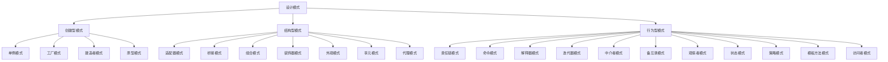
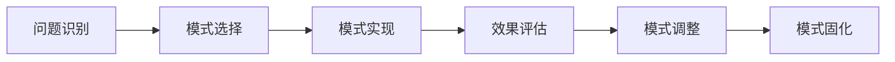

# 4.2.1 设计模式基础理论

## 摘要

本文件系统梳理软件设计模式的基础理论，涵盖创建型、结构型、行为型模式，以及模式的应用原则和最佳实践，为数据科学系统的设计提供模式指导。

## 目录

- [4.2.1 设计模式基础理论](#421-设计模式基础理论)
  - [摘要](#摘要)
  - [目录](#目录)
  - [1. 设计模式概述](#1-设计模式概述)
    - [1.1 设计模式的定义](#11-设计模式的定义)
    - [1.2 模式的基本要素](#12-模式的基本要素)
    - [1.3 模式的价值](#13-模式的价值)
  - [2. 模式分类体系](#2-模式分类体系)
    - [2.1 按目的分类](#21-按目的分类)
    - [2.2 按范围分类](#22-按范围分类)
    - [2.3 模式关系图](#23-模式关系图)
  - [3. 创建型模式](#3-创建型模式)
    - [3.1 单例模式 (Singleton)](#31-单例模式-singleton)
    - [3.2 工厂模式 (Factory)](#32-工厂模式-factory)
    - [3.3 建造者模式 (Builder)](#33-建造者模式-builder)
    - [3.4 原型模式 (Prototype)](#34-原型模式-prototype)
  - [4. 结构型模式](#4-结构型模式)
    - [4.1 适配器模式 (Adapter)](#41-适配器模式-adapter)
    - [4.2 桥接模式 (Bridge)](#42-桥接模式-bridge)
    - [4.3 组合模式 (Composite)](#43-组合模式-composite)
    - [4.4 装饰器模式 (Decorator)](#44-装饰器模式-decorator)
  - [5. 行为型模式](#5-行为型模式)
    - [5.1 观察者模式 (Observer)](#51-观察者模式-observer)
    - [5.2 策略模式 (Strategy)](#52-策略模式-strategy)
    - [5.3 命令模式 (Command)](#53-命令模式-command)
  - [6. 模式应用原则](#6-模式应用原则)
    - [6.1 模式选择原则](#61-模式选择原则)
    - [6.2 反模式识别](#62-反模式识别)
    - [6.3 模式演进](#63-模式演进)
  - [7. 本地跳转与交叉引用](#7-本地跳转与交叉引用)

---

## 1. 设计模式概述

### 1.1 设计模式的定义

设计模式是软件开发中常见问题的最佳实践解决方案，它描述了在软件开发过程中不断重复发生的问题，以及该问题的解决方案的核心。

### 1.2 模式的基本要素

- **模式名称**：描述设计问题及其解决方案
- **问题**：描述应该在何时使用模式
- **解决方案**：描述设计的组成部分及其相互关系
- **效果**：描述应用模式的结果和权衡

### 1.3 模式的价值

- **复用性**：提供可重用的设计解决方案
- **可维护性**：提高代码的可读性和可维护性
- **可扩展性**：支持系统的灵活扩展
- **标准化**：提供通用的设计语言

## 2. 模式分类体系

### 2.1 按目的分类

1. **创建型模式**：处理对象的创建
2. **结构型模式**：处理类和对象的组合
3. **行为型模式**：处理对象间的通信

### 2.2 按范围分类

1. **类模式**：处理类和子类之间的关系
2. **对象模式**：处理对象间的关系

### 2.3 模式关系图



## 3. 创建型模式

### 3.1 单例模式 (Singleton)

确保一个类只有一个实例，并提供全局访问点。

```rust
// Rust实现：线程安全的单例模式
use std::sync::{Arc, Mutex};
use std::sync::Once;

pub struct Database {
    connection_string: String,
}

impl Database {
    fn new(connection_string: String) -> Self {
        Database { connection_string }
    }
    
    pub fn query(&self, sql: &str) -> Result<String, String> {
        // 执行查询逻辑
        Ok(format!("Executed: {}", sql))
    }
}

pub struct DatabaseManager {
    instance: Arc<Mutex<Option<Database>>>,
    init: Once,
}

impl DatabaseManager {
    pub fn new() -> Self {
        DatabaseManager {
            instance: Arc::new(Mutex::new(None)),
            init: Once::new(),
        }
    }
    
    pub fn get_instance(&self) -> Arc<Mutex<Option<Database>>> {
        self.init.call_once(|| {
            let mut instance = self.instance.lock().unwrap();
            *instance = Some(Database::new("postgresql://localhost:5432/mydb".to_string()));
        });
        Arc::clone(&self.instance)
    }
}
```

### 3.2 工厂模式 (Factory)

定义一个创建对象的接口，让子类决定实例化哪个类。

```go
// Go实现：工厂模式
type DataProcessor interface {
    Process(data []byte) ([]byte, error)
}

type CSVProcessor struct{}

func (c *CSVProcessor) Process(data []byte) ([]byte, error) {
    // CSV处理逻辑
    return data, nil
}

type JSONProcessor struct{}

func (j *JSONProcessor) Process(data []byte) ([]byte, error) {
    // JSON处理逻辑
    return data, nil
}

type DataProcessorFactory struct{}

func (f *DataProcessorFactory) CreateProcessor(dataType string) (DataProcessor, error) {
    switch dataType {
    case "csv":
        return &CSVProcessor{}, nil
    case "json":
        return &JSONProcessor{}, nil
    default:
        return nil, fmt.Errorf("unsupported data type: %s", dataType)
    }
}
```

### 3.3 建造者模式 (Builder)

将一个复杂对象的构建与它的表示分离。

### 3.4 原型模式 (Prototype)

用原型实例指定创建对象的种类，通过复制这些原型创建新对象。

## 4. 结构型模式

### 4.1 适配器模式 (Adapter)

将一个类的接口转换成客户希望的另一个接口。

```python
# Python实现：适配器模式
class LegacyDatabase:
    def execute_query(self, query_string):
        # 旧数据库接口
        return f"Legacy result: {query_string}"

class ModernDatabase:
    def query(self, sql, params=None):
        # 现代数据库接口
        return f"Modern result: {sql}"

class DatabaseAdapter:
    def __init__(self, legacy_db):
        self.legacy_db = legacy_db
    
    def query(self, sql, params=None):
        # 适配旧接口到新接口
        return self.legacy_db.execute_query(sql)

# 使用示例
legacy_db = LegacyDatabase()
adapter = DatabaseAdapter(legacy_db)
result = adapter.query("SELECT * FROM users")
```

### 4.2 桥接模式 (Bridge)

将抽象部分与实现部分分离，使它们都可以独立地变化。

### 4.3 组合模式 (Composite)

将对象组合成树形结构以表示"部分-整体"的层次结构。

### 4.4 装饰器模式 (Decorator)

动态地给对象添加额外的职责。

```rust
// Rust实现：装饰器模式
trait DataProcessor {
    fn process(&self, data: &str) -> String;
}

struct BasicProcessor;

impl DataProcessor for BasicProcessor {
    fn process(&self, data: &str) -> String {
        data.to_string()
    }
}

struct LoggingDecorator<T: DataProcessor> {
    processor: T,
}

impl<T: DataProcessor> LoggingDecorator<T> {
    fn new(processor: T) -> Self {
        LoggingDecorator { processor }
    }
}

impl<T: DataProcessor> DataProcessor for LoggingDecorator<T> {
    fn process(&self, data: &str) -> String {
        println!("Processing data: {}", data);
        let result = self.processor.process(data);
        println!("Processed result: {}", result);
        result
    }
}
```

## 5. 行为型模式

### 5.1 观察者模式 (Observer)

定义对象间的一对多依赖关系，当一个对象状态改变时，所有依赖者都得到通知。

```go
// Go实现：观察者模式
type Observer interface {
    Update(data interface{})
}

type Subject interface {
    Attach(observer Observer)
    Detach(observer Observer)
    Notify()
}

type DataSubject struct {
    observers []Observer
    data      interface{}
}

func (s *DataSubject) Attach(observer Observer) {
    s.observers = append(s.observers, observer)
}

func (s *DataSubject) Detach(observer Observer) {
    // 移除观察者的逻辑
}

func (s *DataSubject) Notify() {
    for _, observer := range s.observers {
        observer.Update(s.data)
    }
}

func (s *DataSubject) SetData(data interface{}) {
    s.data = data
    s.Notify()
}

type DataLogger struct{}

func (l *DataLogger) Update(data interface{}) {
    fmt.Printf("Logger: Data updated to %v\n", data)
}

type DataVisualizer struct{}

func (v *DataVisualizer) Update(data interface{}) {
    fmt.Printf("Visualizer: Updating visualization with %v\n", data)
}
```

### 5.2 策略模式 (Strategy)

定义一系列算法，使它们可以互相替换，算法的变化不会影响使用算法的客户。

```python
# Python实现：策略模式
from abc import ABC, abstractmethod

class SortingStrategy(ABC):
    @abstractmethod
    def sort(self, data):
        pass

class QuickSortStrategy(SortingStrategy):
    def sort(self, data):
        return sorted(data)

class MergeSortStrategy(SortingStrategy):
    def sort(self, data):
        # 归并排序实现
        return sorted(data)

class DataProcessor:
    def __init__(self, strategy: SortingStrategy):
        self.strategy = strategy
    
    def set_strategy(self, strategy: SortingStrategy):
        self.strategy = strategy
    
    def process_data(self, data):
        return self.strategy.sort(data)

# 使用示例
processor = DataProcessor(QuickSortStrategy())
result = processor.process_data([3, 1, 4, 1, 5, 9, 2, 6])

processor.set_strategy(MergeSortStrategy())
result = processor.process_data([3, 1, 4, 1, 5, 9, 2, 6])
```

### 5.3 命令模式 (Command)

将一个请求封装为一个对象，从而可以用不同的请求对客户进行参数化。

## 6. 模式应用原则

### 6.1 模式选择原则

1. **简单性原则**：优先使用简单直接的解决方案
2. **可读性原则**：选择使代码更易理解的模式
3. **可维护性原则**：考虑长期维护成本
4. **性能原则**：评估模式对性能的影响

### 6.2 反模式识别

1. **过度设计**：使用不必要的复杂模式
2. **模式误用**：在不合适的场景使用模式
3. **模式组合错误**：模式间的冲突使用

### 6.3 模式演进



## 7. 本地跳转与交叉引用

- [返回软件架构基础理论](../4.1-基础理论/4.1.1-软件架构基础理论.md)
- [跳转到微服务架构](../4.3-微服务架构/)
- [跳转到数据科学基础理论](../../3-数据模型与算法/3.1-基础理论/3.1.1-数据科学基础理论框架.md)
- [跳转到PostgreSQL系统架构](../../1-数据库系统/1.1-PostgreSQL/1.1.2-系统架构.md)

---

**最后更新**: 2024年12月
**版本**: v1.0
**状态**: 进行中
