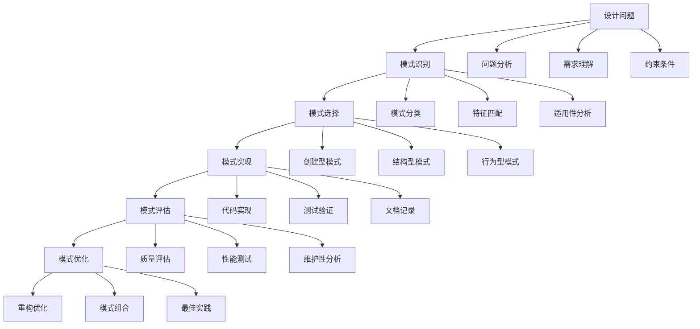

# 4.2-设计模式

## 1. 📋 概述

设计模式是软件工程中解决常见设计问题的可复用解决方案，它们提供了经过验证的开发范式，能够提高代码的可维护性、可扩展性和可重用性。本分支涵盖了从基础理论到具体模式实现，从创建型到行为型的完整设计模式体系。

## 2. ️ 目录结构

```text
4.2-设计模式/
├── 4.2.1-设计模式基础理论.md     # 设计模式基础理论、分类、原则
└── README.md                      # 本导航文档
```

## 3. 🔗 主题交叉引用表

| 主题 | 相关文档 | 关联理论 | 应用场景 |
|------|----------|----------|----------|
| **设计模式基础** | 4.2.1 | SOLID原则、架构模式 | 代码设计、系统架构 |
| **创建型模式** | 4.2.1 | 对象创建、实例化 | 对象管理、资源控制 |
| **结构型模式** | 4.2.1 | 类结构、对象组合 | 接口适配、功能扩展 |
| **行为型模式** | 4.2.1 | 对象交互、算法封装 | 算法选择、状态管理 |
| **模式评估** | 4.2.1 | 质量属性、成本效益 | 模式选择、优化决策 |

## 4. 🌊 全链路知识流



## 5. 知识体系特色

### 5.1. 理论系统性

- **完整分类**：创建型、结构型、行为型三大类模式
- **原则导向**：基于SOLID原则的模式设计
- **实践验证**：经过大量实践验证的解决方案

### 5.2. 方法实用性

- **问题驱动**：针对具体设计问题的解决方案
- **代码示例**：提供完整的代码实现示例
- **应用场景**：明确的使用场景和注意事项

### 5.3. 技术前瞻性

- **函数式模式**：结合现代编程范式
- **响应式模式**：适应异步编程需求
- **云原生模式**：面向云环境的模式设计

### 5.4. 评估科学性

- **质量评估**：多维度的模式评估方法
- **成本分析**：权衡模式使用的成本效益
- **反模式识别**：避免常见的设计陷阱

## 6. 学习路径建议

### 6.1. 入门路径

```text
1. 设计模式基础理论 (4.2.1)
   ├── 设计模式概念
   ├── 模式分类体系
   ├── 创建型模式
   ├── 结构型模式
   └── 行为型模式
```

### 6.2. 进阶路径

```text
1. 深度模式研究
   ├── 模式组合应用
   ├── 模式变体设计
   ├── 领域特定模式
   └── 新兴编程模式

2. 实践应用
   ├── 实际项目应用
   ├── 代码重构实践
   ├── 性能优化实践
   └── 质量改进实践

3. 评估与优化
   ├── 模式评估方法
   ├── 成本效益分析
   ├── 反模式识别
   └── 最佳实践总结
```

### 6.3. 专家路径

```text
1. 模式创新
   ├── 新模式设计
   ├── 模式改进优化
   ├── 领域模式创新
   └── 跨领域模式融合

2. 工具平台建设
   ├── 模式识别工具
   ├── 代码生成工具
   ├── 质量评估工具
   └── 重构辅助工具

3. 标准制定
   ├── 模式标准规范
   ├── 评估标准制定
   ├── 最佳实践推广
   └── 培训体系建立
```

## 7. ⚡ 快速导航

### 7.1. 核心理论

- **[设计模式基础理论](4.2.1-设计模式基础理论.md)** - 设计模式基础理论、分类、原则

### 7.2. 🛠️ 实用工具

- **设计工具**：UML工具、代码生成工具、重构工具
- **评估工具**：代码质量分析、性能测试、复杂度分析
- **学习资源**：模式库、示例代码、最佳实践

### 7.3. 应用场景

- **系统设计**：架构设计、接口设计、模块设计
- **代码重构**：代码优化、结构改进、质量提升
- **问题解决**：常见设计问题的标准化解决方案

## 8. 技术栈映射

| 技术领域 | 核心技术 | 相关工具 | 应用场景 |
|----------|----------|----------|----------|
| **创建型模式** | 单例、工厂、建造者 | 依赖注入框架、对象池 | 对象管理、资源控制 |
| **结构型模式** | 适配器、装饰器、代理 | 接口设计工具、代理框架 | 接口适配、功能扩展 |
| **行为型模式** | 观察者、策略、命令 | 事件框架、状态机 | 算法封装、状态管理 |
| **模式评估** | 质量分析、性能测试 | 静态分析工具、性能监控 | 模式选择、优化决策 |

## 9. 应用场景体系

### 9.1. 系统设计与架构

- **架构设计**：使用模式构建系统架构
- **模块设计**：应用模式设计模块结构
- **接口设计**：使用模式设计接口规范
- **数据设计**：应用模式设计数据模型

### 9.2. 代码开发与重构

- **新功能开发**：使用模式开发新功能
- **代码重构**：应用模式改进现有代码
- **性能优化**：使用模式优化系统性能
- **质量改进**：应用模式提升代码质量

### 9.3. 问题解决与优化

- **设计问题**：解决常见的设计问题
- **性能问题**：优化系统性能瓶颈
- **维护问题**：改善代码可维护性
- **扩展问题**：增强系统可扩展性

### 9.4. 团队协作与治理

- **代码规范**：建立统一的代码规范
- **设计标准**：制定设计模式和标准
- **知识共享**：团队设计模式知识管理
- **质量保证**：基于模式的代码质量保证

## 10. 🔮 发展趋势与前沿

### 10.1. 技术发展趋势

- **函数式编程模式**：结合现代编程范式
- **响应式编程模式**：适应异步编程需求
- **云原生模式**：面向云环境的模式设计
- **AI辅助设计**：智能化的模式推荐和生成

### 10.2. 应用发展趋势

- **领域特定模式**：针对特定领域的模式设计
- **微服务模式**：分布式系统的模式应用
- **事件驱动模式**：事件驱动的架构模式
- **无服务器模式**：云原生应用的模式设计

### 10.3. 方法论趋势

- **模式驱动开发**：以模式为核心的开发方法
- **模式评估体系**：标准化的模式评估方法
- **模式库建设**：系统化的模式知识库
- **模式教育体系**：专业化的模式培训体系

## 11. 学习资源推荐

### 11.1. 理论资源

- **设计模式理论**：GoF设计模式、SOLID原则
- **架构模式**：企业应用架构模式、云原生模式
- **编程范式**：函数式编程、响应式编程

### 11.2. 🛠️ 实践资源

- **代码示例**：各种模式的完整代码实现
- **项目案例**：实际项目中的模式应用案例
- **工具框架**：支持模式实现的框架和工具

### 11.3. 研究资源

- **学术论文**：设计模式研究、模式评估方法
- **技术报告**：模式最佳实践、行业标准
- **开源项目**：模式实现库、评估工具

---

**📖 相关导航**:

- [返回上级目录](../README.md)
- [4.1-基础理论](../4.1-基础理论/README.md)
- [4.3-微服务架构](../4.3-微服务架构/README.md)
