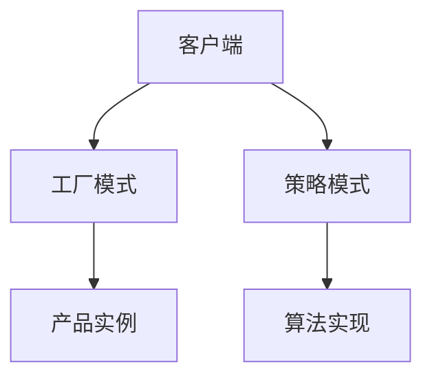

# 4.2 设计模式 主题导航与多表征案例

## 目录结构与本地跳转

- [4.2.1 设计模式基础理论](./4.2.1-设计模式基础理论.md)

---

## 行业案例与多表征

### 4.2.x 典型行业案例

- 金融系统：责任链、观察者、工厂等模式在风控、交易、报表等场景的应用（详见5.1-金融数据分析、3.3-算法实现）
- AI平台：策略模式、单例模式在模型管理与服务编排中的应用（详见3.4-AI与机器学习算法）

### 4.2.x 多表征示例

- UML类图、时序图、模式结构图、代码片段等

---

[返回数据分析与ETL](../../3-数据模型与算法/3.5-数据分析与ETL/README.md)
