# 4.3.1-微服务架构基础理论

## 1. 📋 概述

微服务架构是一种将应用程序构建为一组小型自治服务的软件架构风格，每个服务运行在自己的进程中，通过轻量级机制进行通信。本文档系统性地阐述微服务架构的基础理论、设计原则、架构模式、实施策略和最佳实践。

## 2. ️ 微服务架构基础概念

### 2.1. 微服务定义

微服务是一种软件架构风格，它将应用程序构建为一组小型自治服务，每个服务实现业务能力，运行在自己的进程中，通过HTTP/REST API等轻量级机制进行通信。

#### 2.1.1. 微服务特征

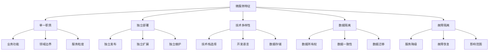

#### 2.1.2. 微服务 vs 单体架构

| 维度 | 单体架构 | 微服务架构 |
|------|----------|------------|
| **开发复杂度** | 简单 | 复杂 |
| **部署复杂度** | 简单 | 复杂 |
| **扩展性** | 整体扩展 | 服务独立扩展 |
| **技术选型** | 统一技术栈 | 技术多样性 |
| **数据一致性** | 强一致性 | 最终一致性 |
| **故障隔离** | 影响整体 | 局部影响 |
| **团队协作** | 集中式 | 分布式 |

### 2.2. 微服务设计原则

#### 2.2.1. 基础设计原则

**单一职责原则**:

- 每个服务只负责一个业务功能
- 服务边界清晰，职责明确
- 避免服务间的功能重叠

**独立部署原则**:

- 服务可独立开发、测试、部署
- 不影响其他服务的运行
- 支持快速迭代和发布

**技术多样性原则**:

- 不同服务可使用不同技术栈
- 根据服务特点选择合适技术
- 支持技术演进和升级

**数据隔离原则**:

- 每个服务拥有自己的数据存储
- 服务间不直接共享数据库
- 通过API进行数据交互

#### 2.2.2. 高级设计原则

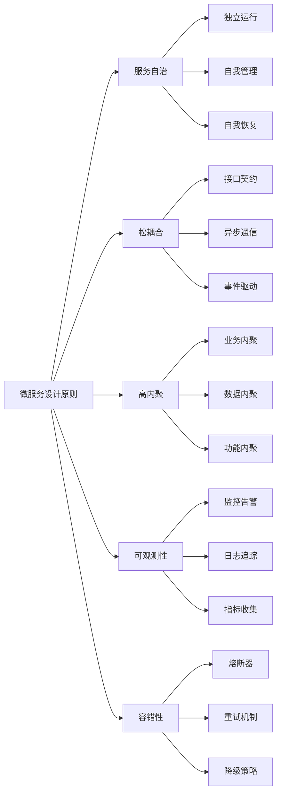

## 3. 微服务架构模式

### 3.1. 服务拆分模式

#### 3.1.1. 按业务功能拆分

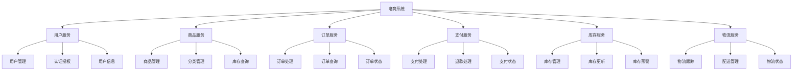

#### 3.1.2. 按领域驱动设计拆分

| 领域 | 服务 | 职责 | 边界 |
|------|------|------|------|
| **用户域** | 用户服务、认证服务 | 用户管理、身份认证 | 用户相关业务 |
| **商品域** | 商品服务、分类服务 | 商品管理、分类管理 | 商品相关业务 |
| **订单域** | 订单服务、购物车服务 | 订单处理、购物车 | 订单相关业务 |
| **支付域** | 支付服务、账户服务 | 支付处理、账户管理 | 支付相关业务 |
| **物流域** | 物流服务、仓库服务 | 物流跟踪、仓库管理 | 物流相关业务 |

### 3.2. 服务通信模式

#### 3.2.1. 同步通信

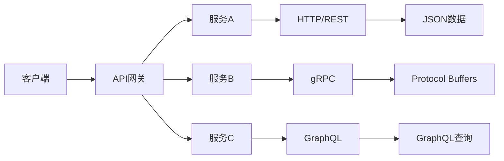

#### 3.2.2. 异步通信

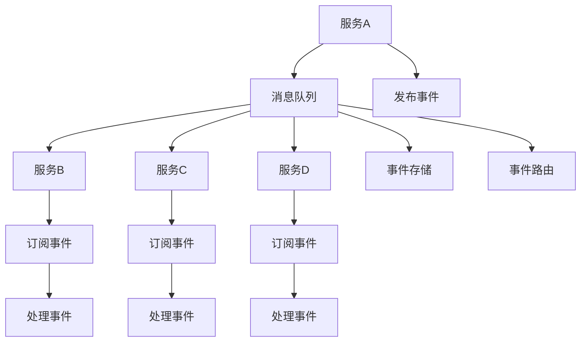

#### 3.2.3. 通信模式对比

| 模式 | 优势 | 劣势 | 适用场景 |
|------|------|------|----------|
| **同步通信** | 简单直接、实时响应 | 耦合度高、可用性依赖 | 简单查询、实时交互 |
| **异步通信** | 松耦合、高可用性 | 复杂性高、一致性难保证 | 复杂流程、事件驱动 |
| **混合通信** | 灵活性高、适应性强 | 复杂度高、维护困难 | 复杂系统、多样化需求 |

### 3.3. 数据管理模式

#### 3.3.1. 数据库 per 服务

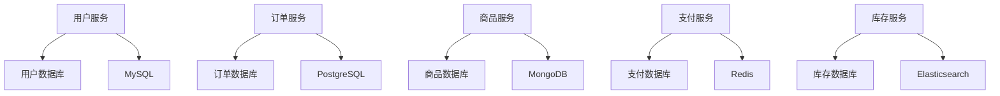

#### 3.3.2. 数据一致性模式

| 模式 | 描述 | 优势 | 劣势 |
|------|------|------|------|
| **强一致性** | 事务性保证 | 数据准确性高 | 性能影响大 |
| **最终一致性** | 异步同步 | 性能好、可用性高 | 数据可能不一致 |
| **因果一致性** | 因果关系保证 | 平衡性能和一致性 | 实现复杂 |

#### 3.3.3. Saga模式

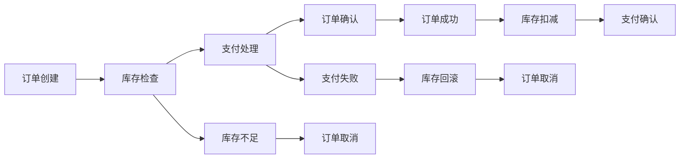

## 4. 微服务基础设施

### 4.1. 服务发现

#### 4.1.1. 服务注册

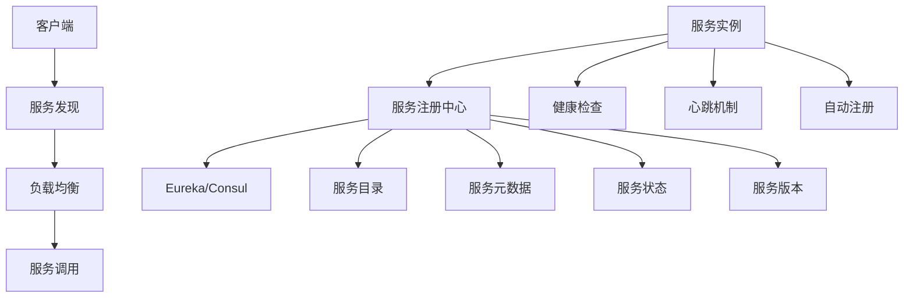

#### 4.1.2. 服务发现模式

| 模式 | 描述 | 优势 | 劣势 |
|------|------|------|------|
| **客户端发现** | 客户端查询服务注册中心 | 简单直接 | 客户端复杂 |
| **服务端发现** | 通过负载均衡器发现 | 客户端简单 | 基础设施复杂 |
| **DNS发现** | 通过DNS解析服务 | 标准化 | 功能有限 |

### 4.2. API网关

#### 4.2.1. 网关功能

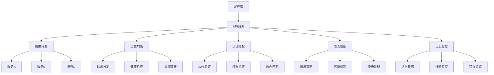

#### 4.2.2. 网关模式

| 模式 | 描述 | 适用场景 | 实现方式 |
|------|------|----------|----------|
| **统一网关** | 所有请求通过单一网关 | 简单系统 | Kong、Zuul |
| **专用网关** | 不同服务使用专用网关 | 复杂系统 | 自研网关 |
| **边缘网关** | 边缘节点网关 | 分布式系统 | Envoy、Istio |

### 4.3. 配置管理

#### 4.3.1. 配置中心

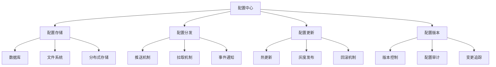

#### 4.3.2. 配置管理策略

| 策略 | 描述 | 优势 | 劣势 |
|------|------|------|------|
| **集中配置** | 统一配置管理 | 管理简单 | 单点故障 |
| **分布式配置** | 配置分散存储 | 高可用性 | 管理复杂 |
| **分层配置** | 全局+局部配置 | 灵活性高 | 复杂度高 |

## 5. 🛡️ 微服务可靠性

### 5.1. 容错模式

#### 5.1.1. 熔断器模式

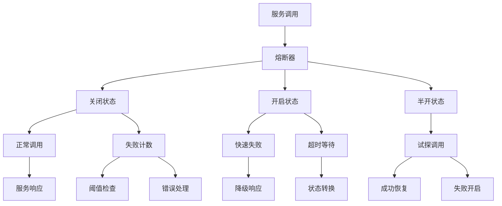

#### 5.1.2. 重试模式

| 模式 | 描述 | 适用场景 | 实现方式 |
|------|------|----------|----------|
| **简单重试** | 固定次数重试 | 临时故障 | 指数退避 |
| **指数退避** | 递增延迟重试 | 网络故障 | 随机抖动 |
| **熔断重试** | 结合熔断器 | 复杂故障 | 状态机 |

### 5.2. 监控与可观测性

#### 5.2.1. 监控体系

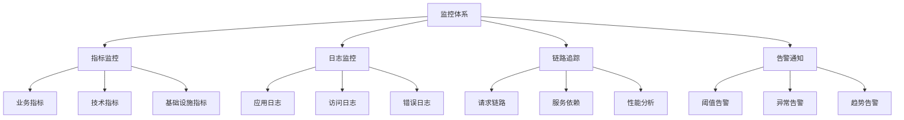

#### 5.2.2. 可观测性三大支柱

| 支柱 | 描述 | 工具 | 应用场景 |
|------|------|------|----------|
| **指标** | 数值化监控数据 | Prometheus、Grafana | 性能监控、容量规划 |
| **日志** | 结构化事件记录 | ELK Stack、Fluentd | 问题排查、审计追踪 |
| **链路** | 请求调用链路 | Jaeger、Zipkin | 性能分析、故障定位 |

## 6. 微服务部署策略

### 6.1. 部署模式

#### 6.1.1. 容器化部署

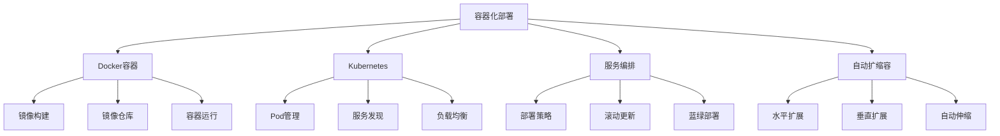

#### 6.1.2. 部署策略对比

| 策略 | 描述 | 优势 | 劣势 |
|------|------|------|------|
| **滚动部署** | 逐步替换实例 | 零停机时间 | 部署时间长 |
| **蓝绿部署** | 新旧版本切换 | 快速回滚 | 资源消耗大 |
| **金丝雀部署** | 灰度发布 | 风险可控 | 复杂度高 |

### 6.2. CI/CD流水线

#### 6.2.1. 流水线设计

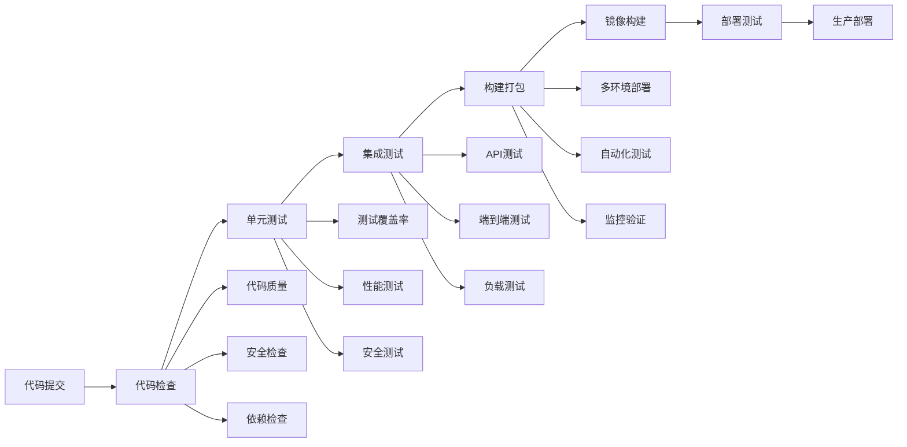

## 7. 微服务评估与优化

### 7.1. 性能评估

#### 7.1.1. 关键指标

| 指标类别 | 具体指标 | 目标值 | 监控方法 |
|----------|----------|--------|----------|
| **响应时间** | 平均响应时间、P95、P99 | <200ms | APM监控 |
| **吞吐量** | QPS、TPS | 根据业务需求 | 压力测试 |
| **可用性** | 服务可用率 | >99.9% | 健康检查 |
| **错误率** | 错误率、异常率 | <0.1% | 日志分析 |

#### 7.1.2. 性能优化策略

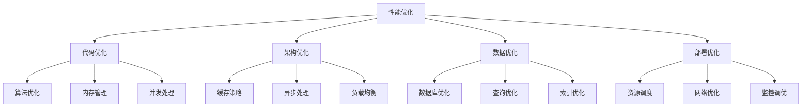

### 7.2. 成本优化

#### 7.2.1. 成本构成

| 成本类别 | 成本项目 | 优化策略 | 预期效果 |
|----------|----------|----------|----------|
| **基础设施** | 服务器、网络、存储 | 云原生、弹性伸缩 | 30-50%节省 |
| **开发成本** | 人力、工具、培训 | 标准化、自动化 | 20-30%提升 |
| **运维成本** | 监控、维护、故障 | 自动化运维 | 40-60%降低 |
| **数据成本** | 存储、传输、处理 | 数据优化、缓存 | 25-40%节省 |

## 8. 🔮 发展趋势

### 8.1. 技术发展趋势

- **服务网格**：Istio、Linkerd等服务网格技术
- **无服务器**：Serverless架构和FaaS平台
- **事件驱动**：事件溯源和CQRS模式
- **云原生**：Kubernetes和云原生技术栈

### 8.2. 架构发展趋势

- **微前端**：前端微服务化架构
- **边缘计算**：边缘节点微服务部署
- **AI集成**：智能化的微服务管理
- **安全优先**：零信任微服务安全架构

### 8.3. 方法论趋势

- **DevOps**：开发运维一体化
- **GitOps**：Git作为单一事实源
- **SRE**：站点可靠性工程
- **Platform Engineering**：平台工程

---

**📖 相关导航**:

- [返回上级目录](../README.md)
- [4.1-基础理论](../4.1-基础理论/README.md)
- [4.2-设计模式](../4.2-设计模式/README.md)
