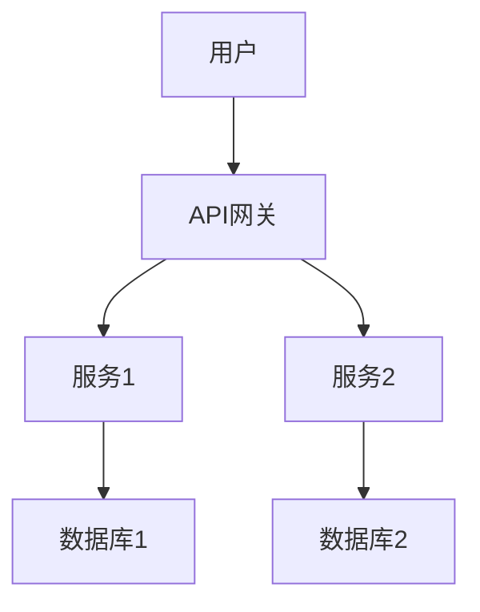

# 4.3 微服务架构 主题导航与多表征案例

## 目录结构与本地跳转

- [4.3.1 微服务架构基础理论](./4.3.1-微服务架构基础理论.md)

---

## 行业案例与多表征

### 4.3.x 典型行业案例

- 金融行业：微服务拆分与高可用（详见1.1-PostgreSQL、5.1-金融数据分析）
- AI平台：模型服务化与弹性伸缩（详见3.4-AI与机器学习算法）
- 科学计算：分布式任务调度与资源管理（详见5.2-科学计算）

### 4.3.x 多表征示例

- 微服务架构图、服务依赖图、API网关流程图、容器编排图等

---

[返回数据分析与ETL](../../3-数据模型与算法/3.5-数据分析与ETL/README.md)
