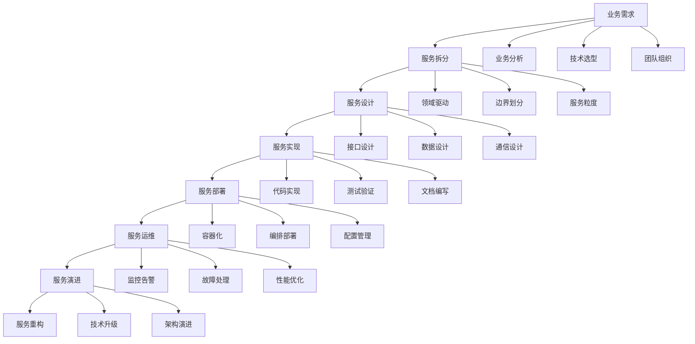

# 4.3-微服务架构

## 1. 📋 概述

微服务架构是一种将应用程序构建为一组小型自治服务的软件架构风格，每个服务运行在自己的进程中，通过轻量级机制进行通信。本分支涵盖了从基础理论到实施策略，从设计原则到最佳实践的完整微服务架构体系。

## 2. ️ 目录结构

```text
4.3-微服务架构/
├── 4.3.1-微服务架构基础理论.md     # 微服务基础理论、设计原则、架构模式
└── README.md                        # 本导航文档
```

## 3. 🔗 主题交叉引用表

| 主题 | 相关文档 | 关联理论 | 应用场景 |
|------|----------|----------|----------|
| **微服务基础** | 4.3.1 | 分布式系统、服务治理 | 系统架构、服务拆分 |
| **服务设计** | 4.3.1 | DDD、服务边界 | 业务建模、服务设计 |
| **服务通信** | 4.3.1 | 网络通信、协议设计 | 服务间通信、API设计 |
| **数据管理** | 4.3.1 | 分布式数据、一致性 | 数据建模、数据一致性 |
| **可靠性保障** | 4.3.1 | 容错机制、监控告警 | 系统稳定性、故障处理 |

## 4. 🌊 全链路知识流



## 5. 知识体系特色

### 5.1. 理论系统性

- **完整体系**：从基础概念到高级模式的完整理论体系
- **原则导向**：基于微服务设计原则的架构决策
- **实践验证**：经过大量实践验证的解决方案

### 5.2. 方法实用性

- **问题驱动**：针对分布式系统常见问题的解决方案
- **工具支持**：提供具体的工具和方法
- **最佳实践**：总结行业最佳实践和经验

### 5.3. 技术前瞻性

- **云原生架构**：面向云环境的微服务设计
- **服务网格**：新一代微服务通信和管理
- **无服务器架构**：Serverless微服务模式

### 5.4. 评估科学性

- **性能评估**：多维度的性能评估方法
- **成本分析**：权衡微服务的成本效益
- **风险控制**：识别和控制微服务风险

## 6. 学习路径建议

### 6.1. 入门路径

```text
1. 微服务架构基础理论 (4.3.1)
   ├── 微服务基本概念
   ├── 设计原则和模式
   ├── 服务拆分策略
   ├── 服务通信模式
   └── 数据管理策略
```

### 6.2. 进阶路径

```text
1. 深度技术研究
   ├── 服务网格技术
   ├── 分布式数据管理
   ├── 微服务安全
   └── 性能优化技术

2. 实践应用
   ├── 微服务架构设计
   ├── 服务拆分实践
   ├── 部署运维实践
   └── 监控告警实践

3. 评估与优化
   ├── 性能评估方法
   ├── 成本效益分析
   ├── 风险评估方法
   └── 最佳实践总结
```

### 6.3. 专家路径

```text
1. 架构创新
   ├── 新架构模式设计
   ├── 技术栈创新
   ├── 工具平台建设
   └── 标准规范制定

2. 平台建设
   ├── 微服务平台
   ├── 服务治理平台
   ├── 监控运维平台
   └── 开发工具平台

3. 生态建设
   ├── 开源项目贡献
   ├── 技术社区建设
   ├── 培训体系建设
   └── 最佳实践推广
```

## 7. ⚡ 快速导航

### 7.1. 核心理论

- **[微服务架构基础理论](4.3.1-微服务架构基础理论.md)** - 微服务基础理论、设计原则、架构模式

### 7.2. 🛠️ 实用工具

- **开发工具**：Spring Boot、Spring Cloud、Docker、Kubernetes
- **监控工具**：Prometheus、Grafana、Jaeger、ELK Stack
- **治理工具**：Istio、Consul、Eureka、Zuul

### 7.3. 应用场景

- **系统重构**：单体应用向微服务迁移
- **新系统设计**：基于微服务的新系统设计
- **云原生应用**：云环境下的微服务应用

## 8. 技术栈映射

| 技术领域 | 核心技术 | 相关工具 | 应用场景 |
|----------|----------|----------|----------|
| **服务开发** | Spring Boot、Node.js、Go | IDE、构建工具 | 微服务开发、API开发 |
| **服务通信** | REST、gRPC、消息队列 | API网关、服务网格 | 服务间通信、异步处理 |
| **服务治理** | 服务发现、配置管理 | Consul、Eureka、Config | 服务注册、配置管理 |
| **容器化部署** | Docker、Kubernetes | 容器编排、CI/CD | 服务部署、自动扩缩容 |
| **监控运维** | 链路追踪、指标监控 | Jaeger、Prometheus | 性能监控、故障诊断 |

## 9. 应用场景体系

### 9.1. 系统架构设计

- **新系统设计**：基于微服务的新系统架构设计
- **系统重构**：单体应用向微服务架构迁移
- **系统扩展**：现有系统的微服务化扩展
- **技术选型**：微服务技术栈的选择和评估

### 9.2. 服务开发与治理

- **服务拆分**：业务系统的微服务拆分策略
- **服务设计**：微服务的接口设计和数据设计
- **服务治理**：微服务的注册、发现、配置管理
- **服务安全**：微服务的安全认证和授权

### 9.3. 部署与运维

- **容器化部署**：微服务的容器化部署策略
- **服务编排**：Kubernetes等编排工具的使用
- **监控告警**：微服务的监控体系和告警机制
- **故障处理**：微服务的故障诊断和恢复

### 9.4. 性能与优化

- **性能测试**：微服务的性能测试和评估
- **性能优化**：微服务的性能瓶颈识别和优化
- **容量规划**：微服务的容量规划和资源管理
- **成本优化**：微服务的成本控制和优化

## 10. 🔮 发展趋势与前沿

### 10.1. 技术发展趋势

- **服务网格**：Istio、Linkerd等服务网格技术
- **无服务器架构**：Serverless和FaaS平台
- **事件驱动架构**：事件溯源和CQRS模式
- **云原生技术**：Kubernetes和云原生生态

### 10.2. 架构发展趋势

- **微前端**：前端微服务化架构
- **边缘计算**：边缘节点的微服务部署
- **AI集成**：智能化的微服务管理
- **安全优先**：零信任微服务安全架构

### 10.3. 方法论趋势

- **DevOps**：开发运维一体化
- **GitOps**：Git作为单一事实源
- **SRE**：站点可靠性工程
- **Platform Engineering**：平台工程

## 11. 学习资源推荐

### 11.1. 理论资源

- **微服务理论**：微服务架构设计、分布式系统理论
- **设计模式**：微服务设计模式、架构模式
- **最佳实践**：微服务最佳实践、反模式

### 11.2. 🛠️ 实践资源

- **技术栈**：Spring Cloud、Docker、Kubernetes
- **工具平台**：服务网格、监控工具、CI/CD工具
- **案例研究**：微服务迁移案例、架构设计案例

### 11.3. 研究资源

- **学术论文**：微服务架构研究、分布式系统研究
- **技术报告**：微服务标准、行业最佳实践
- **开源项目**：微服务框架、工具和平台

---

## 12. 核心概念详解

### 12.1. 微服务定义

**定义 12.1.1** (微服务)：

微服务是一种架构风格，将单一应用程序开发为一组小型服务，每个服务运行在自己的进程中，并通过轻量级机制（通常是HTTP RESTful API）进行通信。

**特点**：

- **服务独立**：每个服务独立部署和扩展
- **技术多样性**：不同服务可以使用不同技术栈
- **去中心化**：没有统一的数据库或技术栈
- **故障隔离**：单个服务故障不影响整体系统

### 12.2. 微服务架构模式

**API网关模式**：

- 统一入口
- 路由转发
- 认证授权
- 限流熔断

**服务发现模式**：

- 服务注册
- 服务发现
- 健康检查
- 负载均衡

**配置中心模式**：

- 集中配置
- 动态更新
- 版本管理
- 环境隔离

**分布式追踪模式**：

- 请求追踪
- 性能分析
- 故障诊断
- 依赖分析

### 12.3. 微服务设计原则

**单一职责**：每个服务只负责一个业务功能

**自治性**：服务独立开发、部署、运行

**去中心化**：数据管理、治理去中心化

**故障隔离**：服务故障不影响其他服务

**可观测性**：日志、监控、追踪

---

## 13. 微服务技术栈

### 13.1. 服务框架

**Spring Cloud**：

- 服务注册发现：Eureka、Consul
- 配置中心：Config Server
- 网关：Gateway、Zuul
- 负载均衡：Ribbon、LoadBalancer

**Dubbo**：

- 服务注册发现：Zookeeper、Nacos
- RPC通信：Dubbo Protocol
- 负载均衡：多种策略
- 容错机制：多种容错策略

### 13.2. 容器化与编排

**Docker**：

- 容器化应用
- 镜像管理
- 容器编排

**Kubernetes**：

- 容器编排
- 服务发现
- 负载均衡
- 自动扩缩容

### 13.3. 服务网格

**Istio**：

- 流量管理
- 安全策略
- 可观测性
- 策略控制

**Linkerd**：

- 轻量级服务网格
- 自动mTLS
- 指标收集
- 负载均衡

---

## 14. 微服务数据管理

### 14.1. 数据库模式

**数据库 per 服务**：

- 每个服务独立数据库
- 数据隔离
- 技术多样性

**挑战**：

- 数据一致性
- 跨服务查询
- 事务管理

### 14.2. 数据一致性

**最终一致性**：

- 接受短暂不一致
- 通过补偿保证最终一致

**Saga模式**：

- 分布式事务管理
- 补偿事务
- 编排或编排

### 14.3. CQRS模式

**命令查询职责分离**：

- 读写分离
- 独立扩展
- 优化查询

---

## 15. 微服务通信

### 15.1. 同步通信

**REST API**：

- HTTP协议
- JSON格式
- 简单易用

**gRPC**：

- 高性能
- 类型安全
- 流式处理

### 15.2. 异步通信

**消息队列**：

- RabbitMQ
- Kafka
- RocketMQ

**事件驱动**：

- 发布订阅
- 事件溯源
- CQRS

---

## 16. 实际应用案例

### 16.1. Netflix微服务架构

**架构特点**：

- 大规模微服务
- 服务网格
- 混沌工程
- 持续交付

**技术栈**：

- Spring Cloud
- Eureka
- Hystrix
- Zuul

### 16.2. 阿里巴巴微服务架构

**架构特点**：

- 服务化改造
- 分布式事务
- 服务治理
- 中间件体系

**技术栈**：

- Dubbo
- Nacos
- Seata
- Sentinel

### 16.3. 微服务迁移案例

**迁移策略**：

- 渐进式迁移
- 并行运行
- 灰度发布
- 回滚机制

---

## 17. 微服务挑战与解决方案

### 17.1. 分布式系统复杂性

**挑战**：网络延迟、部分故障、数据一致性

**解决方案**：超时机制、重试策略、熔断器、降级

### 17.2. 服务治理

**挑战**：服务发现、配置管理、监控追踪

**解决方案**：服务注册中心、配置中心、分布式追踪

### 17.3. 数据管理

**挑战**：数据一致性、跨服务查询、事务管理

**解决方案**：Saga模式、CQRS、事件溯源

---

## 18. 工具与框架

### 18.1. 开发工具

**IDE插件**：微服务开发插件

**API工具**：Swagger、Postman

**测试工具**：服务测试框架

### 18.2. 监控工具

**APM**：New Relic、Datadog

**日志**：ELK Stack、Loki

**追踪**：Jaeger、Zipkin

### 18.3. CI/CD工具

**Jenkins**：持续集成

**GitLab CI**：CI/CD流水线

**ArgoCD**：GitOps部署

---

## 19. 最佳实践

### 19.1. 服务拆分实践

**拆分原则**：业务边界、数据边界、团队边界

**拆分策略**：领域驱动设计、数据库拆分、API拆分

### 19.2. 服务设计实践

**设计原则**：单一职责、高内聚低耦合、接口设计

**设计模式**：API网关、服务发现、配置中心

### 19.3. 运维实践

**部署策略**：蓝绿部署、金丝雀发布、滚动更新

**监控策略**：健康检查、指标收集、告警机制

---

## 20. 多表征

本分支支持多种表征方式，包括：符号表征（服务定义、接口、协议等）、图结构（服务架构图、依赖图、调用链图等）、向量/张量（服务特征向量、性能指标）、自然语言（定义、注释、描述）、图像/可视化（架构图、流程图、监控图等）。这些表征可互映，提升微服务架构理论表达力。

---

## 21. 形式化语义

- 语义域：$D$，如服务对象集、接口空间、协议模型、消息集合
- 解释函数：$I: S \to D$，将符号/结构映射到具体语义对象
- 语义一致性：每个服务/接口/协议在$D$中有明确定义

---

## 22. 形式化语法与证明

- 语法规则：如服务定义、接口规则、协议规则、约束条件
- **定理**：本分支的语法系统具一致性与可扩展性。
- **证明**：由服务定义、接口规则与协议规则递归定义，保证系统一致与可扩展。

---

**📖 相关导航**:

- [返回上级目录](../README.md)
- [4.1-基础理论](../4.1-基础理论/README.md)
- [4.2-设计模式](../4.2-设计模式/README.md)
