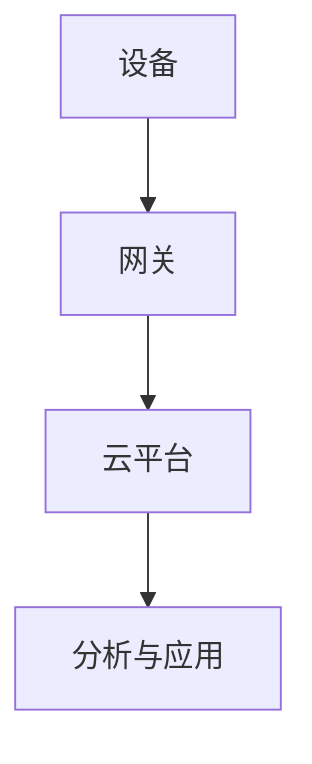

# 4.4 IOT 主题导航与多表征案例

## 目录结构与本地跳转

- [4.4.1 IOT基础理论](./4.4.1-IOT基础理论.md)

---

## 行业案例与多表征

### 4.4.x 典型行业案例

- 智慧城市：物联网数据采集与实时分析（详见3.5-数据分析与ETL、5.2-科学计算）
- 工业互联网：设备监控与预测性维护（详见3.5.5-数据流处理与架构、3.5.7-数据存储与访问）

### 4.4.x 多表征示例

- IOT架构图、数据流图、设备通信流程图、时序数据可视化等

---

[返回数据分析与ETL](../../3-数据模型与算法/3.5-数据分析与ETL/README.md)
