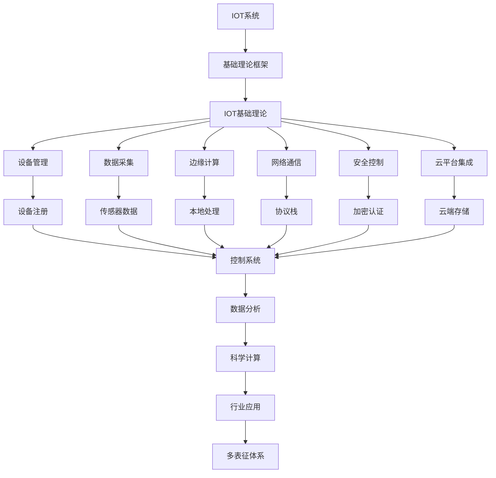

# 4.4-IOT 分支导航

## 目录结构与本地跳转

- [4.4.1-IOT基础理论](4.4.1-IOT基础理论.md) - 预留分支

---

## 主题交叉引用

| 主题      | 基础理论 | 设计模式 | 微服务 | IOT | 工作流 | 组件化 | 云原生 | 行业案例 | 多表征 |
|-----------|----------|----------|--------|-----|--------|--------|--------|----------|--------|
| IOT基础理论| 预留   | 预留     | 预留   | 预留| 预留   | 预留   | 预留   | 预留     | 预留   |

- 交叉引用：[2.6-控制理论](../../../2-形式科学理论/2.6-控制理论/README.md)、[3.5-数据分析与ETL](../../../3-数据模型与算法/3.5-数据分析与ETL/README.md)、[5.2-科学计算](../../../5-行业应用与场景/5.2-科学计算/README.md)

---

## 全链路知识流（Mermaid流程图）

---

[返回软件架构与工程总导航](../README.md)
