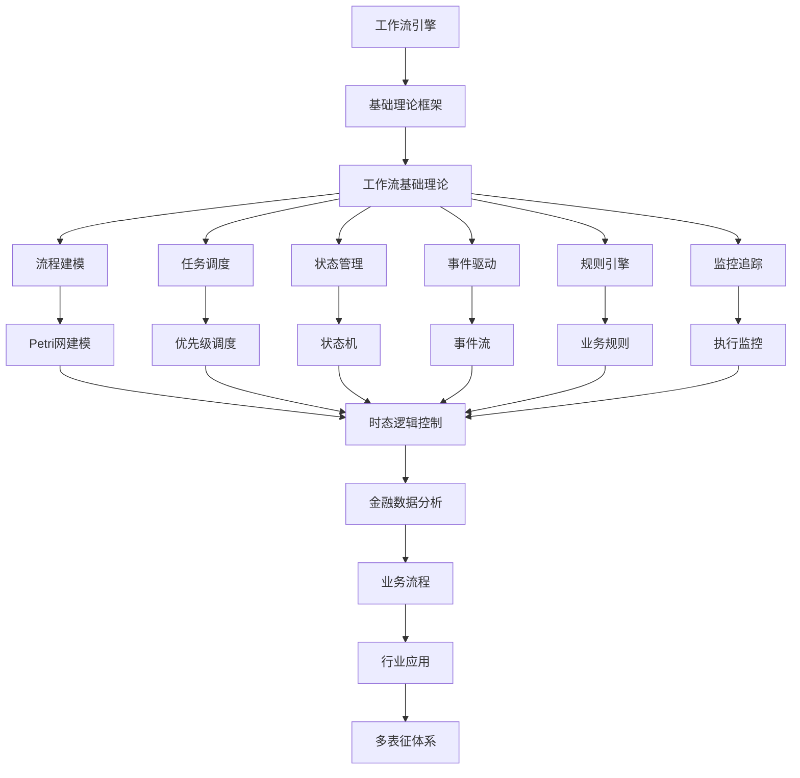

# 4.5-WorkflowDomain 分支导航

## 目录结构与本地跳转

- [4.5.1-工作流基础理论](4.5.1-工作流基础理论.md) - 预留分支

---

## 主题交叉引用

| 主题      | 基础理论 | 设计模式 | 微服务 | IOT | 工作流 | 组件化 | 云原生 | 行业案例 | 多表征 |
|-----------|----------|----------|--------|-----|--------|--------|--------|----------|--------|
| 工作流基础理论| 预留 | 预留     | 预留   | 预留| 预留   | 预留   | 预留   | 预留     | 预留   |

- 交叉引用：[2.3-Petri网理论](../../../2-形式科学理论/2.3-Petri网理论/README.md)、[2.4-时态逻辑控制理论](../../../2-形式科学理论/2.4-时态逻辑控制理论/README.md)、[5.1-金融数据分析](../../../5-行业应用与场景/5.1-金融数据分析/README.md)

---

## 全链路知识流（Mermaid流程图）

---

[返回软件架构与工程总导航](../README.md)
