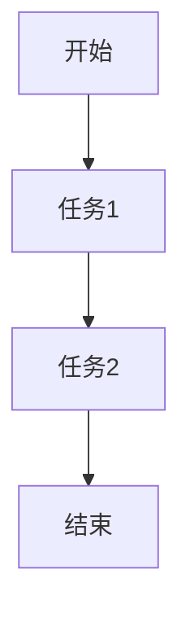

# 4.5 WorkflowDomain 主题导航与多表征案例

## 目录结构与本地跳转

- [4.5.1 工作流基础理论](./4.5.1-工作流基础理论.md)

---

## 行业案例与多表征

### 4.5.x 典型行业案例

- 金融行业：自动化审批与合规流程（详见5.1-金融数据分析、3.5.2-ETL理论与实践）
- 科学计算：大规模仿真任务编排（详见5.2-科学计算）
- AI平台：模型训练与部署自动化（详见3.4-AI与机器学习算法）

### 4.5.x 多表征示例

- 工作流编排图、任务依赖图、自动化流程图、代码片段等

---

[返回数据分析与ETL](../../3-数据模型与算法/3.5-数据分析与ETL/README.md)
