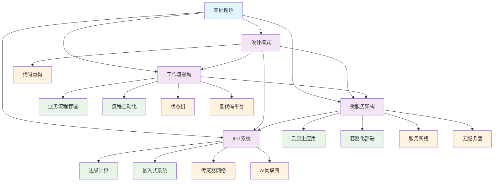

# 4-软件架构与工程 - 知识导航索引

## 📚 目录结构

```
4-软件架构与工程/
├── README.md                           # 本导航文件
├── 4.1-基础理论/                       # 软件架构基础理论
│   ├── 4.1.1-软件架构基础理论.md
│   └── README.md
├── 4.2-设计模式/                       # 软件设计模式
│   ├── 4.2.1-设计模式基础理论.md
│   └── README.md
├── 4.3-微服务架构/                     # 微服务架构设计
│   ├── 4.3.1-微服务架构基础理论.md
│   └── README.md
├── 4.4-IOT/                           # 物联网系统架构
│   ├── 4.4.1-IOT基础理论.md
│   └── README.md
└── 4.5-WorkflowDomain/                # 工作流领域架构
    ├── 4.5.1-工作流基础理论.md
    └── README.md
```

## 🔗 主题交叉引用表

| 架构分支 | 核心概念 | 关联理论 | 应用领域 |
|---------|---------|---------|---------|
| **基础理论** | 架构原则、设计理念 | 形式科学理论、控制理论 | 系统设计、架构评估 |
| **设计模式** | 模式语言、最佳实践 | 软件工程、编程语言理论 | 代码重构、系统维护 |
| **微服务架构** | 服务拆分、分布式 | 分布式系统理论、控制理论 | 云原生、容器化 |
| **IOT系统** | 嵌入式、传感器网络 | 控制理论、分布式系统 | 智能设备、边缘计算 |
| **工作流领域** | 流程建模、状态管理 | Petri网理论、时态逻辑 | 业务流程、自动化 |

## 🌊 全链路知识流图



## 🎯 知识体系特色

### 🏗️ **架构驱动设计**

- 基于理论指导的架构设计
- 模式语言的系统化应用
- 可扩展的架构演进策略

### 🔧 **工程化实践**

- 从理论到实践的完整链路
- 设计模式的最佳实践
- 微服务的工程化部署

### 🌐 **跨领域融合**

- 传统架构与现代技术的结合
- 物联网与云计算的融合
- 工作流与AI的集成

### 🔄 **持续演进**

- 架构模式的持续优化
- 新技术的快速集成
- 业务需求的动态适配

## 📖 学习路径建议

### 🥇 **入门路径**

1. **基础理论** → 建立架构思维
2. **设计模式** → 掌握设计原则
3. **微服务架构** → 理解分布式系统

### 🥈 **进阶路径**

1. **IOT系统** → 嵌入式与物联网
2. **工作流领域** → 业务流程建模
3. **云原生架构** → 现代化部署

### 🥉 **专家路径**

1. **服务网格** → 微服务治理
2. **边缘计算** → 分布式AI
3. **低代码平台** → 快速开发

## 🔍 快速导航

- **[基础理论](./4.1-基础理论/)** - 软件架构基础理论
- **[设计模式](./4.2-设计模式/)** - 软件设计模式
- **[微服务架构](./4.3-微服务架构/)** - 微服务架构设计
- **[IOT系统](./4.4-IOT/)** - 物联网系统架构
- **[工作流领域](./4.5-WorkflowDomain/)** - 工作流领域架构

## 🚀 技术栈映射

### 🏗️ **架构模式**

- 分层架构、微内核、事件驱动
- MVC、MVP、MVVM模式
- CQRS、事件溯源、领域驱动设计

### 🔧 **设计模式**

- 创建型：工厂、单例、建造者
- 结构型：适配器、装饰器、代理
- 行为型：观察者、策略、命令

### ☁️ **微服务技术**

- 服务发现：Consul、Eureka
- 配置管理：Config Server、Apollo
- 服务网关：Zuul、Gateway
- 熔断器：Hystrix、Sentinel

### 🌐 **IOT技术**

- 通信协议：MQTT、CoAP、HTTP
- 边缘计算：Kubernetes、Docker
- 传感器网络：LoRa、NB-IoT
- 数据分析：时序数据库、流处理

### 🔄 **工作流技术**

- 流程引擎：Activiti、Camunda
- 状态机：Spring Statemachine
- 规则引擎：Drools、Easy Rules
- 低代码：Camunda Modeler、Flowable

---

*本导航为软件架构与工程体系提供系统化的知识组织框架，支持从基础理论到工程实践的完整学习路径。*
