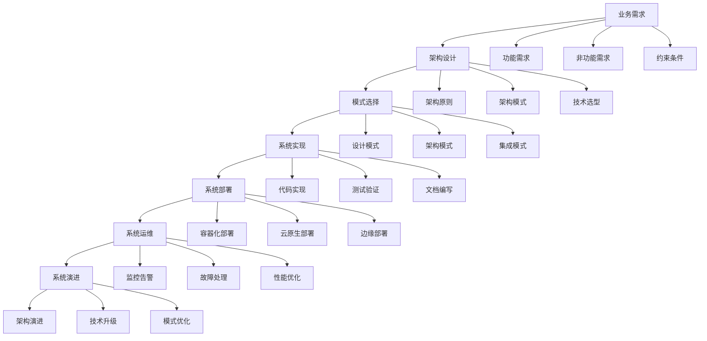

# 4-软件架构与工程

## 1. 📋 概述

软件架构与工程是软件系统的设计、构建、部署和维护的完整工程体系。本分支涵盖了从基础理论到具体实践，从设计模式到微服务架构，从IoT系统到工作流域的完整软件工程知识体系。

## 2. ️ 目录结构

```text
4-软件架构与工程/
├── 4.1-基础理论/
│   ├── 4.1.1-软件架构基础理论.md     # 架构设计原则、模式、评估方法
│   └── README.md                      # 基础理论导航
├── 4.2-设计模式/
│   ├── 4.2.1-设计模式基础理论.md     # 设计模式基础理论、分类、原则
│   └── README.md                      # 设计模式导航
├── 4.3-微服务架构/
│   ├── 4.3.1-微服务架构基础理论.md   # 微服务基础理论、设计原则、架构模式
│   └── README.md                      # 微服务架构导航
├── 4.4-IOT/
│   └── README.md                      # IoT系统导航
├── 4.5-WorkflowDomain/
│   └── README.md                      # 工作流域导航
└── README.md                          # 本导航文档
```

## 3. 🔗 主题交叉引用表

| 主题 | 基础理论 | 设计模式 | 微服务 | IoT | 工作流 | 应用场景 |
|------|----------|----------|--------|-----|--------|----------|
| **架构设计** | 4.1.1 | 架构模式 | 微服务架构 | IoT架构 | 工作流架构 | 系统设计 |
| **设计原则** | 4.1.1 | SOLID原则 | 微服务原则 | IoT原则 | 工作流原则 | 代码质量 |
| **模式应用** | 架构模式 | 4.2.1 | 微服务模式 | IoT模式 | 工作流模式 | 问题解决 |
| **系统集成** | 系统架构 | 集成模式 | 服务集成 | 设备集成 | 流程集成 | 系统集成 |
| **质量保证** | 架构评估 | 模式评估 | 服务质量 | IoT质量 | 工作流质量 | 质量保证 |

## 4. 🌊 全链路知识流



## 5. 知识体系特色

### 5.1. 理论系统性

- **完整体系**：从基础理论到高级实践的完整知识体系
- **原则导向**：基于设计原则的架构决策方法
- **模式驱动**：以设计模式为核心的解决方案

### 5.2. 方法实用性

- **问题驱动**：针对实际问题的解决方案
- **工具支持**：提供具体的工具和方法
- **最佳实践**：总结行业最佳实践和经验

### 5.3. 技术前瞻性

- **云原生架构**：面向云环境的架构设计
- **微服务架构**：分布式系统的架构模式
- **IoT架构**：物联网系统的架构设计
- **工作流架构**：业务流程的架构设计

### 5.4. 评估科学性

- **质量评估**：多维度的系统评估方法
- **性能评估**：系统性能的评估和优化
- **成本分析**：权衡技术选择的成本效益

## 6. 学习路径建议

### 6.1. 入门路径

```text
1. 软件架构基础理论 (4.1.1)
   ├── 架构设计原则
   ├── 架构质量属性
   ├── 架构评估方法
   └── 架构演进策略

2. 设计模式基础理论 (4.2.1)
   ├── 设计模式分类
   ├── 创建型模式
   ├── 结构型模式
   └── 行为型模式

3. 微服务架构基础理论 (4.3.1)
   ├── 微服务设计原则
   ├── 服务拆分策略
   ├── 服务通信模式
   └── 数据管理策略
```

### 6.2. 进阶路径

```text
1. 深度技术研究
   ├── 高级架构模式
   ├── 分布式系统设计
   ├── 云原生架构
   └── 边缘计算架构

2. 实践应用
   ├── 系统架构设计
   ├── 微服务实施
   ├── IoT系统设计
   └── 工作流系统设计

3. 评估与优化
   ├── 架构评估方法
   ├── 性能优化技术
   ├── 成本效益分析
   └── 最佳实践总结
```

### 6.3. 专家路径

```text
1. 架构创新
   ├── 新架构模式设计
   ├── 技术栈创新
   ├── 工具平台建设
   └── 标准规范制定

2. 平台建设
   ├── 架构设计平台
   ├── 微服务平台
   ├── IoT平台
   └── 工作流平台

3. 生态建设
   ├── 开源项目贡献
   ├── 技术社区建设
   ├── 培训体系建设
   └── 最佳实践推广
```

## 7. ⚡ 快速导航

### 7.1. 核心理论

- **[软件架构基础理论](4.1-基础理论/4.1.1-软件架构基础理论.md)** - 架构设计原则、模式、评估方法
- **[设计模式基础理论](4.2-设计模式/4.2.1-设计模式基础理论.md)** - 设计模式基础理论、分类、原则
- **[微服务架构基础理论](4.3-微服务架构/4.3.1-微服务架构基础理论.md)** - 微服务基础理论、设计原则、架构模式

### 7.2. 🛠️ 实用工具

- **架构设计工具**：UML工具、架构图工具、建模工具
- **开发工具**：IDE、构建工具、测试工具
- **部署工具**：Docker、Kubernetes、CI/CD工具
- **监控工具**：APM、日志分析、性能监控

### 7.3. 应用场景

- **系统设计**：新系统架构设计、系统重构
- **技术选型**：技术栈选择、架构模式选择
- **质量保证**：架构评估、性能优化、质量改进

## 8. 技术栈映射

| 技术领域 | 核心技术 | 相关工具 | 应用场景 |
|----------|----------|----------|----------|
| **架构设计** | UML、架构模式 | Enterprise Architect、Draw.io | 系统设计、文档管理 |
| **设计模式** | GoF模式、SOLID原则 | 设计工具、代码生成 | 代码设计、重构优化 |
| **微服务** | Spring Cloud、Docker | Kubernetes、Istio | 分布式系统、云原生 |
| **IoT系统** | 传感器、通信协议 | 边缘计算、数据分析 | 物联网、智能设备 |
| **工作流** | BPMN、状态机 | 工作流引擎、规则引擎 | 业务流程、自动化 |

## 9. 应用场景体系

### 9.1. 系统设计与开发

- **新系统设计**：基于架构理论的新系统设计
- **系统重构**：现有系统的架构重构和优化
- **技术选型**：根据需求选择合适的技术栈
- **质量保证**：确保系统质量和性能

### 9.2. 分布式系统

- **微服务架构**：分布式系统的微服务化设计
- **服务治理**：微服务的注册、发现、配置管理
- **数据一致性**：分布式数据的一致性保证
- **容错机制**：分布式系统的容错和恢复

### 9.3. 云原生应用

- **容器化部署**：应用的容器化部署策略
- **服务网格**：微服务通信和治理
- **无服务器架构**：Serverless应用设计
- **边缘计算**：边缘节点的应用部署

### 9.4. 物联网系统

- **设备管理**：IoT设备的管理和监控
- **数据采集**：传感器数据的采集和处理
- **边缘计算**：边缘节点的数据处理
- **云端集成**：IoT与云平台的集成

### 9.5. 工作流系统

- **流程设计**：业务流程的设计和建模
- **流程执行**：工作流引擎的执行和管理
- **规则引擎**：业务规则的配置和执行
- **流程监控**：工作流的监控和优化

## 10. 🔮 发展趋势与前沿

### 10.1. 技术发展趋势

- **云原生架构**：容器化、微服务、服务网格
- **AI集成架构**：智能化的系统架构设计
- **边缘计算架构**：分布式边缘节点架构
- **量子计算架构**：量子计算的应用架构

### 10.2. 架构模式趋势

- **事件驱动架构**：事件驱动的系统设计
- **数据驱动架构**：以数据为核心的架构设计
- **安全优先架构**：零信任的安全架构设计
- **绿色架构**：节能环保的架构设计

### 10.3. 方法论趋势

- **DevOps**：开发运维一体化
- **GitOps**：Git作为单一事实源
- **SRE**：站点可靠性工程
- **Platform Engineering**：平台工程

## 11. 学习资源推荐

### 11.1. 理论资源

- **架构理论**：软件架构设计、分布式系统理论
- **设计模式**：GoF设计模式、架构模式
- **最佳实践**：行业最佳实践、反模式

### 11.2. 🛠️ 实践资源

- **技术栈**：Spring Cloud、Docker、Kubernetes
- **工具平台**：架构设计工具、监控工具、CI/CD工具
- **案例研究**：架构设计案例、系统重构案例

### 11.3. 研究资源

- **学术论文**：软件架构研究、分布式系统研究
- **技术报告**：架构标准、行业最佳实践
- **开源项目**：架构框架、工具和平台

---

-**📖 相关导航**

- [返回上级目录](../README.md)
- [3-数据模型与算法](../3-数据模型与算法/README.md)
- [5-行业应用与场景](../5-行业应用与场景/README.md)

## 12. 多表征

本分支支持多种表征方式，包括：

- 符号表征（架构元素、设计模式、流程、接口等）
- 图结构（架构图、流程图、组件图、依赖图等）
- 向量/张量（架构特征向量、性能指标）
- 自然语言（定义、注释、描述）
- 图像/可视化（架构图、流程图、交互图等）
这些表征可互映，提升架构与工程理论表达力。

## 13. 形式化语义

- 语义域：$D$，如架构元素集、组件空间、流程模型、接口集合
- 解释函数：$I: S \to D$，将符号/结构映射到具体语义对象
- 语义一致性：每个结构/流程/接口在$D$中有明确定义

## 14. 形式化语法与证明

- 语法规则：如架构定义、设计模式伪代码、流程规则、约束条件
- **定理**：本分支的语法系统具一致性与可扩展性。
- **证明**：由架构定义、设计模式与流程规则递归定义，保证系统一致与可扩展。
