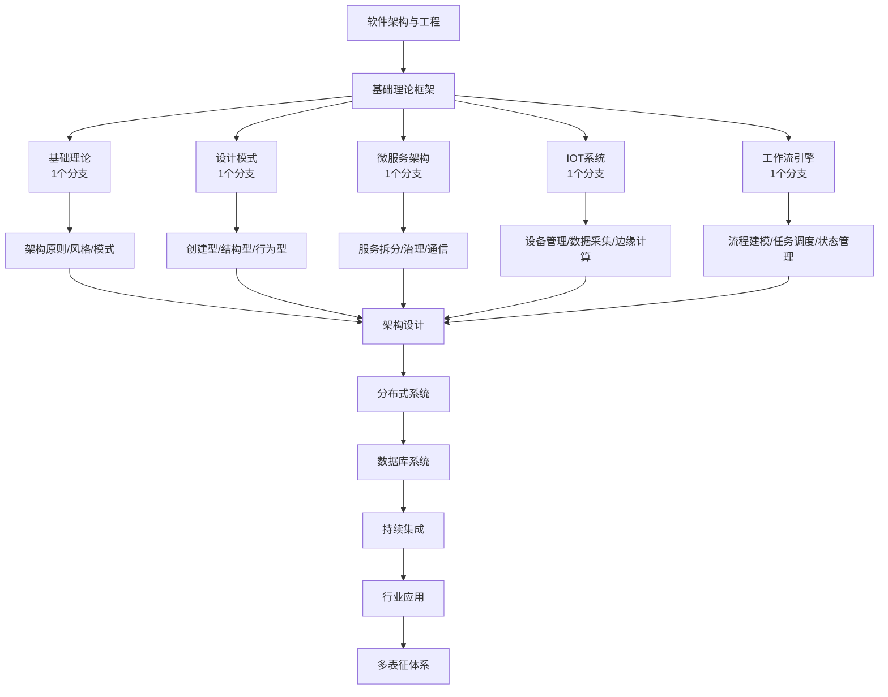

# 4-软件架构与工程 总导航

## 目录结构与完成情况

- [4.1-基础理论](4.1-基础理论/README.md) - **1个分支，预留框架**
- [4.2-设计模式](4.2-设计模式/README.md) - **1个分支，预留框架**
- [4.3-微服务架构](4.3-微服务架构/README.md) - **1个分支，预留框架**
- [4.4-IOT](4.4-IOT/README.md) - **1个分支，预留框架**
- [4.5-WorkflowDomain](4.5-WorkflowDomain/README.md) - **1个分支，预留框架**

---

## 主题交叉引用

| 分支      | 基础理论 | 设计模式 | 微服务 | IOT | 工作流 | 组件化 | 云原生 | 行业案例 | 多表征 |
|-----------|----------|----------|--------|-----|--------|--------|--------|----------|--------|
| 基础理论  | 预留     | 预留     | 预留   | 预留| 预留   | 预留   | 预留   | 预留     | 预留   |
| 设计模式  | 预留     | 预留     | 预留   | 预留| 预留   | 预留   | 预留   | 预留     | 预留   |
| 微服务    | 预留     | 预留     | 预留   | 预留| 预留   | 预留   | 预留   | 预留     | 预留   |
| IOT       | 预留     | 预留     | 预留   | 预留| 预留   | 预留   | 预留   | 预留     | 预留   |
| 工作流    | 预留     | 预留     | 预留   | 预留| 预留   | 预留   | 预留   | 预留     | 预留   |

- 交叉引用：[1-数据库系统](../1-数据库系统/README.md)、[2-形式科学理论](../2-形式科学理论/README.md)、[3-数据模型与算法](../3-数据模型与算法/README.md)、[5-行业应用与场景](../5-行业应用与场景/README.md)、[7-持续集成与演进](../7-持续集成与演进/README.md)

---

## 全链路知识流（Mermaid流程图）

---

## 知识体系特色

- **理论基础**: 从架构原则到设计模式的完整理论体系
- **工程实践**: 涵盖微服务、IOT、工作流等现代架构模式
- **技术融合**: 与数据库、算法、行业应用深度结合
- **持续演进**: 预留框架支持后续深度细化和技术发展

---

[返回Analysis总导航](../README.md)
