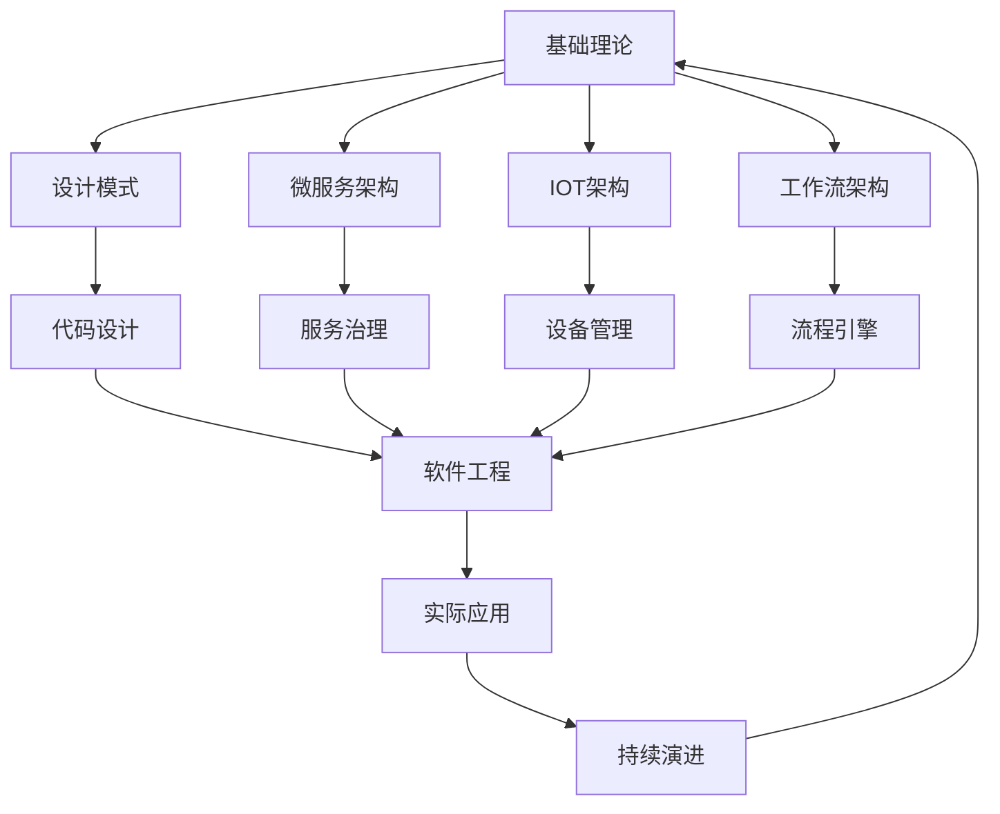

# 4-软件架构与工程

## 📁 目录结构

```
4-软件架构与工程/
├── 4.1-基础理论/
│   ├── 4.1.1-软件架构基础理论.md
│   └── README.md
├── 4.2-设计模式/
│   ├── 4.2.1-设计模式基础理论.md
│   └── README.md
├── 4.3-微服务架构/
│   ├── 4.3.1-微服务架构基础理论.md
│   └── README.md
├── 4.4-IOT/
│   ├── 4.4.1-IOT基础理论.md
│   └── README.md
├── 4.5-WorkflowDomain/
│   ├── 4.5.1-工作流基础理论.md
│   └── README.md
└── README.md
```

## 🔗 主题交叉引用表

| 架构分支 | 关联理论 | 技术应用 | 实践场景 |
|---------|---------|---------|---------|
| **基础理论** | 形式科学理论、系统理论 | 架构设计、系统建模 | 企业级应用、大型系统 |
| **设计模式** | 面向对象理论、SOLID原则 | 代码重构、模式应用 | 软件开发、代码维护 |
| **微服务架构** | 分布式系统理论、服务治理 | 服务拆分、API设计 | 云原生应用、互联网平台 |
| **IOT架构** | 嵌入式系统、传感器网络 | 设备管理、数据采集 | 智能家居、工业物联网 |
| **工作流架构** | 业务流程、状态机理论 | 流程引擎、任务调度 | 企业流程、自动化系统 |

## 🔄 全链路知识流图



## 🎯 知识体系特色

### 理论严谨性
- **架构原则**：基于成熟的软件工程理论
- **设计模式**：经过验证的设计解决方案
- **最佳实践**：行业标准的最佳实践指南

### 技术创新性
- **云原生架构**：适应云计算环境的新架构模式
- **微服务演进**：从单体到微服务的架构演进
- **IOT融合**：传统软件与物联网的深度融合

### 实践导向
- **工程实现**：可直接应用于实际项目
- **可扩展性**：支持系统规模扩展
- **可维护性**：注重长期维护和演进

### 持续演进
- **技术更新**：跟随技术发展趋势
- **架构演进**：适应业务需求变化
- **最佳实践**：持续优化和改进

## 📚 学习路径建议

### 🚀 入门路径
1. **基础理论** → 建立软件架构思维
2. **设计模式** → 掌握常用设计模式
3. **微服务架构** → 理解分布式系统设计
4. **工作流架构** → 学习业务流程建模

### 🔄 进阶路径
1. **IOT架构** → 深入物联网系统设计
2. **服务治理** → 掌握微服务治理技术
3. **云原生架构** → 学习云环境下的架构设计
4. **DevOps集成** → 理解持续交付和部署

### 🎯 专家路径
1. **大规模架构** → 设计高并发、高可用系统
2. **架构演进** → 指导系统架构升级和重构
3. **技术选型** → 为项目选择最适合的技术栈
4. **架构治理** → 建立企业级架构治理体系

## 🚀 快速导航

### 基础理论
- [软件架构基础理论](4.1-基础理论/4.1.1-软件架构基础理论.md)
- [设计模式基础理论](4.2-设计模式/4.2.1-设计模式基础理论.md)

### 架构模式
- [微服务架构基础理论](4.3-微服务架构/4.3.1-微服务架构基础理论.md)
- [IOT基础理论](4.4-IOT/4.4.1-IOT基础理论.md)
- [工作流基础理论](4.5-WorkflowDomain/4.5.1-工作流基础理论.md)

## 🛠️ 技术栈映射

### 架构模式
- **单体架构**：传统企业应用
- **微服务架构**：Spring Cloud、Kubernetes
- **事件驱动架构**：Apache Kafka、RabbitMQ
- **CQRS架构**：命令查询职责分离
- **六边形架构**：端口适配器模式

### 设计模式
- **创建型模式**：单例、工厂、建造者
- **结构型模式**：适配器、装饰器、代理
- **行为型模式**：观察者、策略、命令
- **并发模式**：生产者消费者、读写锁
- **分布式模式**：一致性哈希、分片

### 微服务技术
- **服务框架**：Spring Boot、Node.js、Go
- **服务发现**：Consul、Eureka、Zookeeper
- **API网关**：Kong、Zuul、Nginx
- **配置管理**：Config Server、Apollo
- **链路追踪**：Zipkin、Jaeger、SkyWalking

### IOT技术
- **设备管理**：Azure IoT Hub、AWS IoT
- **消息协议**：MQTT、CoAP、HTTP
- **边缘计算**：Azure IoT Edge、AWS Greengrass
- **数据分析**：时序数据库、流处理
- **安全机制**：设备认证、数据加密

### 工作流技术
- **流程引擎**：Activiti、Camunda、Flowable
- **任务调度**：Quartz、XXL-Job、Elastic-Job
- **规则引擎**：Drools、Easy Rules
- **状态机**：Spring Statemachine
- **BPMN**：业务流程建模与标记

## 🎯 应用场景体系

### 企业级应用
- **ERP系统**：企业资源规划
- **CRM系统**：客户关系管理
- **OA系统**：办公自动化
- **财务系统**：财务管理、会计核算

### 互联网平台
- **电商平台**：商品管理、订单处理
- **社交网络**：用户关系、内容分发
- **内容平台**：媒体管理、推荐系统
- **支付系统**：交易处理、风控系统

### 云原生应用
- **容器化部署**：Docker、Kubernetes
- **服务网格**：Istio、Linkerd
- **无服务器**：AWS Lambda、Azure Functions
- **多云管理**：Terraform、CloudFormation

### 物联网应用
- **智能家居**：设备控制、场景联动
- **工业物联网**：设备监控、预测维护
- **智慧城市**：交通管理、环境监测
- **农业物联网**：精准农业、环境控制

### 金融科技
- **核心银行系统**：账户管理、交易处理
- **支付清算**：实时清算、跨境支付
- **风控系统**：反欺诈、信用评估
- **区块链应用**：数字货币、智能合约

---

**📖 相关导航**
- [返回总导航](../README.md)
- [3-数据模型与算法](../3-数据模型与算法/README.md)
- [5-行业应用与场景](../5-行业应用与场景/README.md)
- [9-软件工程深化](../9-软件工程深化/README.md)
- [Matter/Software](../Matter/Software/)
