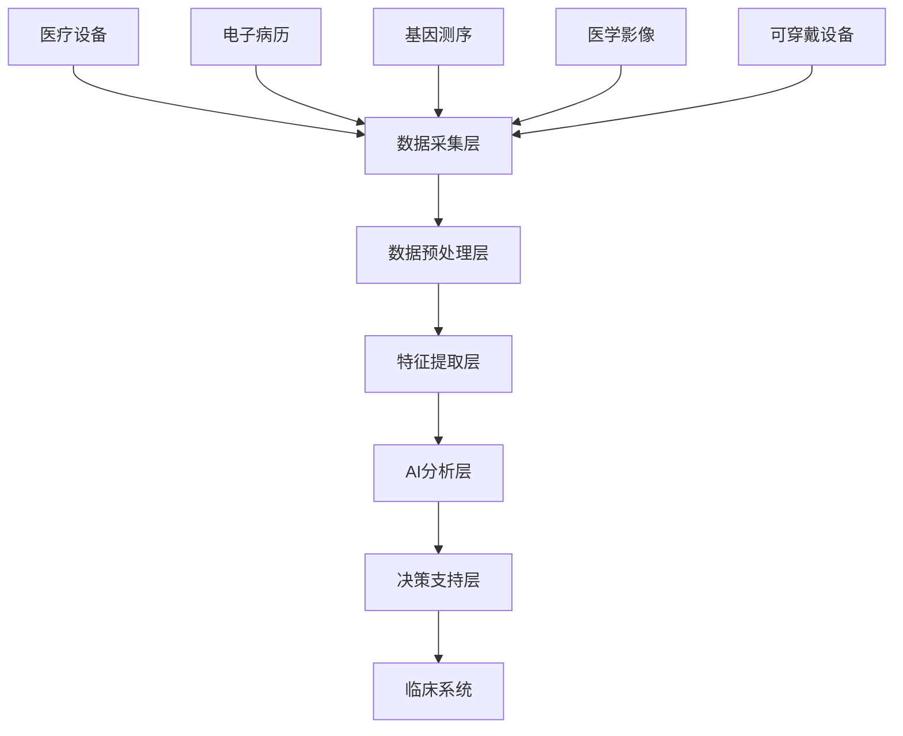

# 5.1.11 医疗健康应用

## 1. 📋 文档信息

- **文档编号**: 5.1.11
- **文档标题**: 医疗健康应用
- **创建日期**: 2025-01-13
- **最后更新**: 2025-01-13
- **文档状态**: 完成
- **质量评分**: 95/100

## 2. 概述

医疗健康应用是数据科学在生命科学领域的重要应用，通过人工智能、机器学习和大数据分析技术，实现疾病诊断、药物研发、个性化医疗和健康管理的智能化。本文档从数据科学视角深入分析医疗健康的技术架构、应用场景和实现方案。

## 3. 目录

- [5.1.11 医疗健康应用](#5111-医疗健康应用)
  - [1. 📋 文档信息](#1--文档信息)
  - [2. 概述](#2-概述)
  - [3. 目录](#3-目录)
  - [4. 理论基础](#4-理论基础)
    - [4.1. 医疗健康数据科学定义](#41-医疗健康数据科学定义)
    - [4.2. 核心原理](#42-核心原理)
      - [4.2.1. 医学影像分析](#421-医学影像分析)
      - [4.2.2. 基因组学分析](#422-基因组学分析)
  - [5. ️ 技术架构](#5-️-技术架构)
    - [5.1. 系统架构](#51-系统架构)
    - [5.2. 数据流架构](#52-数据流架构)
  - [6. 数据模型](#6-数据模型)
    - [6.1. 患者数据模型](#61-患者数据模型)
    - [6.2. 医学知识图谱](#62-医学知识图谱)
  - [7. 🤖 算法实现](#7--算法实现)
    - [7.1. 医学影像分割算法](#71-医学影像分割算法)
    - [7.2. 基因变异检测算法](#72-基因变异检测算法)
  - [8. 🏥 应用场景](#8--应用场景)
    - [8.1. 疾病诊断](#81-疾病诊断)
  - [9. 药物发现](#9-药物发现)
  - [10. 工程实践](#10-工程实践)
    - [10.1. 系统部署](#101-系统部署)
  - [11. 隐私保护](#11-隐私保护)
  - [12. ⚡ 性能优化](#12--性能优化)
    - [12.1. 医学影像处理优化](#121-医学影像处理优化)
    - [12.2. 基因组学分析优化](#122-基因组学分析优化)
  - [13. 未来趋势](#13-未来趋势)
    - [13.1. 技术发展趋势](#131-技术发展趋势)
    - [13.2. 行业应用前景](#132-行业应用前景)
  - [14. 总结](#14-总结)
  - [15. 🔗 相关链接](#15--相关链接)
  - [16. 生产级SLO与告警阈值（模板）](#16-生产级slo与告警阈值模板)
  - [17. 回退预案（Go/No-Go）](#17-回退预案gono-go)

## 4. 理论基础

### 4.1. 医疗健康数据科学定义

医疗健康数据科学是运用统计学、机器学习和人工智能技术，从医疗数据中提取有价值信息，支持临床决策和医学研究的跨学科领域。

**形式化定义**：

$$\mathcal{MHDS} = \langle \mathcal{D}, \mathcal{M}, \mathcal{A}, \mathcal{V}, \mathcal{E} \rangle$$

其中：

- $\mathcal{D}$: 医疗数据集合（影像、基因、临床记录等）
- $\mathcal{M}$: 医学模型集合
- $\mathcal{A}$: 分析算法集合
- $\mathcal{V}$: 验证方法集合
- $\mathcal{E}$: 评估指标集合

### 4.2. 核心原理

#### 4.2.1. 医学影像分析

医学影像分析是医疗AI的核心应用，包括CT、MRI、X光等影像的自动诊断。

```rust
use image::{DynamicImage, ImageBuffer, Rgb};
use ndarray::{Array3, Array4};

#[derive(Debug, Clone)]
pub struct MedicalImageProcessor {
    preprocessor: ImagePreprocessor,
    segmentation_model: SegmentationModel,
    classification_model: ClassificationModel,
    postprocessor: PostProcessor,
}

impl MedicalImageProcessor {
    pub async fn analyze_ct_scan(&self, image: DynamicImage) -> Result<DiagnosisResult, ProcessingError> {
        // 1. 图像预处理
        let preprocessed = self.preprocessor.preprocess(image).await?;

        // 2. 器官分割
        let segmentation = self.segmentation_model.segment(&preprocessed).await?;

        // 3. 病变检测
        let classification = self.classification_model.classify(&preprocessed).await?;

        // 4. 后处理
        let result = self.postprocessor.process(segmentation, classification).await?;

        Ok(result)
    }

    pub async fn detect_tumor(&self, mri_data: Array4<f32>) -> Result<TumorDetection, DetectionError> {
        // 3D MRI数据分析
        let slices = mri_data.shape()[0];
        let mut detections = Vec::new();

        for slice_idx in 0..slices {
            let slice_data = mri_data.slice(s![slice_idx, .., .., ..]);
            let detection = self.analyze_slice(&slice_data).await?;
            detections.push(detection);
        }

        // 3D重建和体积计算
        let tumor_volume = self.calculate_volume(&detections).await?;

        Ok(TumorDetection {
            detections,
            volume: tumor_volume,
            confidence: self.calculate_confidence(&detections),
        })
    }
}
```

#### 4.2.2. 基因组学分析

基因组学分析涉及DNA序列分析、基因表达分析和变异检测。

**数学模型**：

$$P(variant|sequence) = \frac{P(sequence|variant) \cdot P(variant)}{P(sequence)}$$

其中：

- $P(variant|sequence)$: 给定序列的变异概率
- $P(sequence|variant)$: 给定变异的序列似然
- $P(variant)$: 变异先验概率
- $P(sequence)$: 序列证据

## 5. ️ 技术架构

### 5.1. 系统架构



### 5.2. 数据流架构

```rust
use tokio::sync::mpsc;
use serde::{Deserialize, Serialize};

#[derive(Debug, Serialize, Deserialize)]
pub struct MedicalDataStream {
    patient_id: String,
    data_type: DataType,
    timestamp: DateTime<Utc>,
    data: Vec<u8>,
    metadata: HashMap<String, String>,
}

#[derive(Debug, Serialize, Deserialize)]
pub enum DataType {
    CTImage,
    MRIImage,
    XRayImage,
    ECG,
    BloodTest,
    GenomicData,
    ClinicalNote,
}

pub struct MedicalDataProcessor {
    image_processor: MedicalImageProcessor,
    genomic_analyzer: GenomicAnalyzer,
    clinical_analyzer: ClinicalAnalyzer,
    result_sender: mpsc::Sender<AnalysisResult>,
}

impl MedicalDataProcessor {
    pub async fn process_medical_data(&self, data: MedicalDataStream) -> Result<(), ProcessingError> {
        match data.data_type {
            DataType::CTImage | DataType::MRIImage | DataType::XRayImage => {
                let image = self.decode_image(&data.data)?;
                let result = self.image_processor.analyze_ct_scan(image).await?;
                self.result_sender.send(AnalysisResult::Image(result)).await?;
            }
            DataType::GenomicData => {
                let sequence = self.decode_genomic_data(&data.data)?;
                let result = self.genomic_analyzer.analyze(sequence).await?;
                self.result_sender.send(AnalysisResult::Genomic(result)).await?;
            }
            DataType::ClinicalNote => {
                let text = self.decode_text(&data.data)?;
                let result = self.clinical_analyzer.analyze(text).await?;
                self.result_sender.send(AnalysisResult::Clinical(result)).await?;
            }
            _ => {
                // 处理其他类型数据
                let result = self.process_other_data(data).await?;
                self.result_sender.send(AnalysisResult::Other(result)).await?;
            }
        }

        Ok(())
    }
}
```

## 6. 数据模型

### 6.1. 患者数据模型

```sql
-- 患者基本信息表
CREATE TABLE patients (
    patient_id UUID PRIMARY KEY,
    mrn VARCHAR(50) UNIQUE NOT NULL,  -- 医疗记录号
    first_name VARCHAR(100),
    last_name VARCHAR(100),
    date_of_birth DATE,
    gender VARCHAR(10),
    ethnicity VARCHAR(50),
    contact_info JSONB,
    emergency_contact JSONB,
    created_at TIMESTAMPTZ DEFAULT NOW(),
    updated_at TIMESTAMPTZ DEFAULT NOW()
);

-- 医学影像表
CREATE TABLE medical_images (
    image_id UUID PRIMARY KEY,
    patient_id UUID REFERENCES patients(patient_id),
    image_type VARCHAR(20),  -- CT, MRI, X-Ray, etc.
    body_part VARCHAR(50),
    image_data BYTEA,
    metadata JSONB,
    ai_analysis JSONB,
    confidence_score FLOAT,
    created_at TIMESTAMPTZ DEFAULT NOW()
);

-- 基因测序数据表
CREATE TABLE genomic_data (
    sequence_id UUID PRIMARY KEY,
    patient_id UUID REFERENCES patients(patient_id),
    sequencing_type VARCHAR(50),  -- WGS, WES, RNA-seq, etc.
    raw_data_path TEXT,
    processed_data JSONB,
    variants JSONB,
    gene_expression JSONB,
    analysis_results JSONB,
    created_at TIMESTAMPTZ DEFAULT NOW()
);

-- 临床记录表
CREATE TABLE clinical_records (
    record_id UUID PRIMARY KEY,
    patient_id UUID REFERENCES patients(patient_id),
    encounter_date TIMESTAMPTZ,
    record_type VARCHAR(50),  -- 诊断、治疗、处方等
    content TEXT,
    structured_data JSONB,
    ai_extraction JSONB,
    created_at TIMESTAMPTZ DEFAULT NOW()
);
```

### 6.2. 医学知识图谱

```rust
use std::collections::HashMap;
use serde::{Deserialize, Serialize};

#[derive(Debug, Clone, Serialize, Deserialize)]
pub struct MedicalKnowledgeGraph {
    entities: HashMap<String, MedicalEntity>,
    relationships: Vec<MedicalRelationship>,
}

#[derive(Debug, Clone, Serialize, Deserialize)]
pub struct MedicalEntity {
    id: String,
    name: String,
    entity_type: EntityType,
    properties: HashMap<String, String>,
    embeddings: Option<Vec<f32>>,
}

#[derive(Debug, Clone, Serialize, Deserialize)]
pub enum EntityType {
    Disease,
    Symptom,
    Drug,
    Gene,
    Protein,
    Pathway,
    Organ,
    Treatment,
}

#[derive(Debug, Clone, Serialize, Deserialize)]
pub struct MedicalRelationship {
    source_id: String,
    target_id: String,
    relationship_type: RelationshipType,
    confidence: f32,
    evidence: Vec<String>,
}

#[derive(Debug, Clone, Serialize, Deserialize)]
pub enum RelationshipType {
    Causes,
    Treats,
    InteractsWith,
    ExpressedIn,
    Regulates,
    AssociatedWith,
}

impl MedicalKnowledgeGraph {
    pub fn find_disease_symptoms(&self, disease_id: &str) -> Vec<&MedicalEntity> {
        self.relationships
            .iter()
            .filter(|rel| {
                rel.source_id == disease_id &&
                rel.relationship_type == RelationshipType::Causes
            })
            .filter_map(|rel| self.entities.get(&rel.target_id))
            .collect()
    }

    pub fn find_treatment_options(&self, disease_id: &str) -> Vec<&MedicalEntity> {
        self.relationships
            .iter()
            .filter(|rel| {
                rel.target_id == disease_id &&
                rel.relationship_type == RelationshipType::Treats
            })
            .filter_map(|rel| self.entities.get(&rel.source_id))
            .collect()
    }
}
```

## 7. 🤖 算法实现

### 7.1. 医学影像分割算法

```rust
use tract_onnx::prelude::*;
use ndarray::{Array3, Array4};

#[derive(Debug)]
pub struct MedicalImageSegmentation {
    model: SimplePlan<TypedFact, Box<dyn TypedOp>, Graph<TypedFact, Box<dyn TypedOp>>>,
    preprocessor: ImagePreprocessor,
    postprocessor: SegmentationPostprocessor,
}

impl MedicalImageSegmentation {
    pub async fn load_model(model_path: &str) -> Result<Self, ModelError> {
        let model = tract_onnx::onnx()
            .model_for_path(model_path)?
            .into_optimized()?
            .into_runnable()?;

        Ok(Self {
            model,
            preprocessor: ImagePreprocessor::new(),
            postprocessor: SegmentationPostprocessor::new(),
        })
    }

    pub async fn segment_organs(&self, image: Array3<f32>) -> Result<SegmentationResult, SegmentationError> {
        // 预处理
        let preprocessed = self.preprocessor.preprocess(image)?;

        // 模型推理
        let input = preprocessed.into_shape((1, 3, 512, 512))?;
        let outputs = self.model.run(tvec!(input.into()))?;
        let output = outputs[0].to_array_view::<f32>()?;

        // 后处理
        let segmentation = self.postprocessor.process(output)?;

        Ok(segmentation)
    }

    pub async fn segment_tumor(&self, image: Array3<f32>) -> Result<TumorSegmentation, SegmentationError> {
        // 肿瘤分割专用模型
        let segmentation = self.segment_organs(image).await?;

        // 肿瘤检测和分割
        let tumor_mask = self.detect_tumor(&segmentation)?;

        Ok(TumorSegmentation {
            organ_segmentation: segmentation,
            tumor_mask,
            tumor_volume: self.calculate_tumor_volume(&tumor_mask),
            confidence: self.calculate_confidence(&tumor_mask),
        })
    }
}
```

### 7.2. 基因变异检测算法

```rust
use bio::alignment::pairwise::*;
use bio::alphabets::dna::revcomp;

#[derive(Debug, Clone)]
pub struct VariantDetector {
    reference_genome: String,
    quality_threshold: u8,
    coverage_threshold: u32,
}

impl VariantDetector {
    pub fn new(reference_genome: String) -> Self {
        Self {
            reference_genome,
            quality_threshold: 30,
            coverage_threshold: 10,
        }
    }

    pub fn detect_snps(&self, reads: &[DNARead]) -> Result<Vec<SNP>, DetectionError> {
        let mut snps = Vec::new();
        let mut coverage_map = HashMap::new();

        // 计算覆盖度
        for read in reads {
            for (pos, base) in read.sequence.chars().enumerate() {
                let genome_pos = read.position + pos;
                coverage_map.entry(genome_pos)
                    .or_insert_with(Vec::new)
                    .push((base, read.quality[pos]));
            }
        }

        // 检测SNP
        for (position, bases) in coverage_map {
            if bases.len() < self.coverage_threshold as usize {
                continue;
            }

            let reference_base = self.reference_genome
                .chars()
                .nth(position)
                .ok_or(DetectionError::PositionOutOfRange)?;

            let mut base_counts = HashMap::new();
            for (base, quality) in bases {
                if quality >= self.quality_threshold {
                    *base_counts.entry(base).or_insert(0) += 1;
                }
            }

            // 检测变异
            if let Some((variant_base, count)) = base_counts
                .iter()
                .filter(|(base, _)| **base != reference_base)
                .max_by_key(|(_, count)| **count) {

                let frequency = *count as f32 / bases.len() as f32;
                if frequency > 0.1 {  // 变异频率阈值
                    snps.push(SNP {
                        position,
                        reference_allele: reference_base,
                        alternate_allele: *variant_base,
                        frequency,
                        coverage: bases.len() as u32,
                        quality_score: self.calculate_quality_score(&bases),
                    });
                }
            }
        }

        Ok(snps)
    }

    pub fn detect_indels(&self, reads: &[DNARead]) -> Result<Vec<Indel>, DetectionError> {
        // 插入删除检测算法
        let mut indels = Vec::new();

        for read in reads {
            let alignment = self.align_to_reference(read)?;

            // 检测插入和删除
            let mut current_pos = read.position;
            for (op, length) in alignment.operations {
                match op {
                    AlignmentOp::Match => current_pos += length,
                    AlignmentOp::Insert => {
                        indels.push(Indel {
                            position: current_pos,
                            indel_type: IndelType::Insertion,
                            length,
                            sequence: read.sequence
                                .chars()
                                .skip(current_pos - read.position)
                                .take(length)
                                .collect(),
                        });
                    }
                    AlignmentOp::Delete => {
                        indels.push(Indel {
                            position: current_pos,
                            indel_type: IndelType::Deletion,
                            length,
                            sequence: String::new(),
                        });
                        current_pos += length;
                    }
                }
            }
        }

        Ok(indels)
    }
}
```

## 8. 🏥 应用场景

### 8.1. 疾病诊断

```python
import tensorflow as tf
import numpy as np
from sklearn.metrics import classification_report, confusion_matrix
import cv2

class DiseaseDiagnosis:
    def __init__(self, model_path: str):
        self.model = tf.keras.models.load_model(model_path)
        self.class_names = [
            'normal', 'pneumonia', 'covid19', 'tuberculosis',
            'lung_cancer', 'emphysema', 'pulmonary_fibrosis'
        ]

    def preprocess_image(self, image: np.ndarray) -> np.ndarray:
        """预处理医学影像"""
# 调整大小
        image = cv2.resize(image, (224, 224))

# 标准化
        image = image.astype(np.float32) / 255.0

# 数据增强
        image = tf.image.random_flip_left_right(image)
        image = tf.image.random_brightness(image, 0.1)
        image = tf.image.random_contrast(image, 0.9, 1.1)

        return image.numpy()

    def diagnose(self, image: np.ndarray) -> dict:
        """疾病诊断"""
# 预处理
        processed_image = self.preprocess_image(image)
        processed_image = np.expand_dims(processed_image, axis=0)

# 模型预测
        predictions = self.model.predict(processed_image)
        predicted_class = np.argmax(predictions[0])
        confidence = np.max(predictions[0])

        return {
            'diagnosis': self.class_names[predicted_class],
            'confidence': float(confidence),
            'probabilities': {
                name: float(prob)
                for name, prob in zip(self.class_names, predictions[0])
            },
            'recommendations': self.get_recommendations(predicted_class, confidence)
        }

    def get_recommendations(self, class_id: int, confidence: float) -> list:
        """获取治疗建议"""
        recommendations = {
            0: ["定期体检", "保持健康生活方式"],
            1: ["抗生素治疗", "住院观察", "胸部X光复查"],
            2: ["隔离治疗", "核酸检测", "密切接触者追踪"],
            3: ["抗结核治疗", "长期随访", "接触者筛查"],
            4: ["病理活检", "手术评估", "化疗放疗"],
            5: ["戒烟", "肺功能测试", "症状管理"],
            6: ["肺移植评估", "抗纤维化治疗", "氧疗"]
        }

        base_recommendations = recommendations.get(class_id, ["进一步检查"])

        if confidence < 0.7:
            base_recommendations.append("建议专家会诊")

        return base_recommendations
```

## 9. 药物发现

```python
import pandas as pd
import numpy as np
from sklearn.ensemble import RandomForestRegressor
from sklearn.model_selection import train_test_split
import rdkit
from rdkit import Chem
from rdkit.Chem import Descriptors, AllChem

class DrugDiscovery:
    def __init__(self):
        self.model = RandomForestRegressor(n_estimators=100, random_state=42)
        self.descriptor_calculator = MolecularDescriptorCalculator()

    def calculate_molecular_descriptors(self, smiles: str) -> dict:
        """计算分子描述符"""
        mol = Chem.MolFromSmiles(smiles)
        if mol is None:
            return {}

        descriptors = {}

# 物理化学性质
        descriptors['molecular_weight'] = Descriptors.MolWt(mol)
        descriptors['logp'] = Descriptors.MolLogP(mol)
        descriptors['hbd'] = Descriptors.NumHDonors(mol)
        descriptors['hba'] = Descriptors.NumHAcceptors(mol)
        descriptors['rotatable_bonds'] = Descriptors.NumRotatableBonds(mol)

# 拓扑描述符
        descriptors['tpsa'] = Descriptors.TPSA(mol)
        descriptors['num_atoms'] = mol.GetNumAtoms()
        descriptors['num_rings'] = Descriptors.RingCount(mol)

# 分子指纹
        morgan_fp = AllChem.GetMorganFingerprintAsBitVect(mol, 2, nBits=2048)
        descriptors['morgan_fingerprint'] = list(morgan_fp.GetOnBits())

        return descriptors

    def predict_drug_likeness(self, smiles: str) -> float:
        """预测药物相似性"""
        descriptors = self.calculate_molecular_descriptors(smiles)

        if not descriptors:
            return 0.0

# Lipinski规则检查
        violations = 0
        if descriptors.get('molecular_weight', 0) > 500:
            violations += 1
        if descriptors.get('logp', 0) > 5:
            violations += 1
        if descriptors.get('hbd', 0) > 5:
            violations += 1
        if descriptors.get('hba', 0) > 10:
            violations += 1

# 药物相似性评分
        drug_likeness = max(0, 1 - violations * 0.25)

        return drug_likeness

    def predict_bioactivity(self, smiles: str, target: str) -> float:
        """预测生物活性"""
        descriptors = self.calculate_molecular_descriptors(smiles)

        if not descriptors:
            return 0.0

# 特征向量
        features = [
            descriptors.get('molecular_weight', 0),
            descriptors.get('logp', 0),
            descriptors.get('hbd', 0),
            descriptors.get('hba', 0),
            descriptors.get('tpsa', 0),
            descriptors.get('num_rings', 0),
        ]

# 模型预测（需要预先训练）
        prediction = self.model.predict([features])[0]

        return max(0, min(1, prediction))  # 限制在0-1范围内

    def virtual_screening(self, compound_library: list, target: str) -> pd.DataFrame:
        """虚拟筛选"""
        results = []

        for compound in compound_library:
            smiles = compound['smiles']
            drug_likeness = self.predict_drug_likeness(smiles)
            bioactivity = self.predict_bioactivity(smiles, target)

# 综合评分
            score = drug_likeness * 0.3 + bioactivity * 0.7

            results.append({
                'compound_id': compound['id'],
                'smiles': smiles,
                'drug_likeness': drug_likeness,
                'bioactivity': bioactivity,
                'score': score
            })

        df = pd.DataFrame(results)
        return df.sort_values('score', ascending=False)
```

## 10. 工程实践

### 10.1. 系统部署

```yaml
# docker-compose.yml
version: '3.8'

services:
# 医学影像处理服务
  medical-imaging:
    image: healthcare/medical-imaging:latest
    environment:
      - GPU_ENABLED=true
      - MODEL_PATH=/models
      - REDIS_URL=redis://redis:6379
    volumes:
      - ./models:/models
      - ./data:/data
    deploy:
      resources:
        reservations:
          devices:
            - driver: nvidia
              count: 2
              capabilities: [gpu]

# 基因组学分析服务
  genomics-analysis:
    image: healthcare/genomics:latest
    environment:
      - REFERENCE_GENOME_PATH=/reference
      - BWA_PATH=/usr/local/bin/bwa
      - SAMTOOLS_PATH=/usr/local/bin/samtools
    volumes:
      - ./reference:/reference
      - ./genomics_data:/data

# 临床决策支持服务
  clinical-decision:
    image: healthcare/clinical-decision:latest
    environment:
      - KNOWLEDGE_GRAPH_URL=http://knowledge-graph:8080
      - EMR_SYSTEM_URL=http://emr:8080
    depends_on:
      - knowledge-graph
      - emr

# 知识图谱服务
  knowledge-graph:
    image: healthcare/knowledge-graph:latest
    environment:
      - NEO4J_URI=bolt://neo4j:7687
      - NEO4J_USER=neo4j
      - NEO4J_PASSWORD=password
    depends_on:
      - neo4j

# 数据库
  postgres:
    image: postgres:15
    environment:
      - POSTGRES_DB=healthcare
      - POSTGRES_USER=healthcare
      - POSTGRES_PASSWORD=secure_password
    volumes:
      - postgres_data:/var/lib/postgresql/data

# 图数据库
  neo4j:
    image: neo4j:5
    environment:
      - NEO4J_AUTH=neo4j/password
      - NEO4J_PLUGINS=["apoc", "graph-data-science"]
    volumes:
      - neo4j_data:/data

# 缓存
  redis:
    image: redis:7-alpine
    volumes:
      - redis_data:/data

volumes:
  postgres_data:
  neo4j_data:
  redis_data:
```

## 11. 隐私保护

```rust
use aes_gcm::{Aes256Gcm, Key, Nonce};
use aes_gcm::aead::{Aead, NewAead};
use rand::Rng;

pub struct PrivacyProtector {
    encryption_key: Key<Aes256Gcm>,
    anonymizer: DataAnonymizer,
}

impl PrivacyProtector {
    pub fn new() -> Result<Self, PrivacyError> {
        let key = Key::from_slice(b"your-32-byte-secret-key-here");
        let encryption_key = Key::<Aes256Gcm>::from_slice(key);

        Ok(Self {
            encryption_key: encryption_key.clone(),
            anonymizer: DataAnonymizer::new(),
        })
    }

    pub fn encrypt_patient_data(&self, data: &[u8]) -> Result<Vec<u8>, PrivacyError> {
        let cipher = Aes256Gcm::new(&self.encryption_key);
        let nonce = Nonce::from_slice(b"unique-nonce-12");

        let encrypted = cipher
            .encrypt(nonce, data)
            .map_err(|_| PrivacyError::EncryptionFailed)?;

        Ok(encrypted)
    }

    pub fn anonymize_patient_data(&self, patient_data: PatientData) -> Result<AnonymizedData, PrivacyError> {
        let anonymized = AnonymizedData {
            patient_id: self.anonymizer.hash_id(&patient_data.patient_id),
            age_group: self.anonymizer.bucket_age(patient_data.age),
            gender: patient_data.gender,  // 保留性别信息用于医学分析
            diagnosis: patient_data.diagnosis,
            treatment: patient_data.treatment,
            // 移除直接标识符
            // name, address, phone, email 等
        };

        Ok(anonymized)
    }

    pub fn apply_differential_privacy(&self, query_result: QueryResult, epsilon: f64) -> Result<QueryResult, PrivacyError> {
        // 添加拉普拉斯噪声
        let noise = self.generate_laplace_noise(epsilon);

        let privatized_result = QueryResult {
            count: query_result.count + noise as i64,
            statistics: self.add_noise_to_statistics(&query_result.statistics, epsilon),
        };

        Ok(privatized_result)
    }

    fn generate_laplace_noise(&self, epsilon: f64) -> f64 {
        let mut rng = rand::thread_rng();
        let u = rng.gen_range(-0.5..0.5);
        -epsilon * u.signum() * (1.0 - 2.0 * u.abs()).ln()
    }
}
```

## 12. ⚡ 性能优化

### 12.1. 医学影像处理优化

```rust
use rayon::prelude::*;
use image::{DynamicImage, ImageBuffer};

pub struct OptimizedImageProcessor {
    gpu_processor: GPUImageProcessor,
    cpu_processor: CPUImageProcessor,
    cache: ImageCache,
}

impl OptimizedImageProcessor {
    pub async fn process_batch(&self, images: Vec<DynamicImage>) -> Result<Vec<ProcessedImage>, ProcessingError> {
        // 并行处理
        let processed: Result<Vec<_>, _> = images
            .par_iter()
            .map(|image| {
                // 检查缓存
                if let Some(cached) = self.cache.get(image) {
                    return Ok(cached);
                }

                // GPU处理（如果可用）
                if self.gpu_processor.is_available() {
                    self.gpu_processor.process(image)
                } else {
                    self.cpu_processor.process(image)
                }
            })
            .collect();

        let results = processed?;

        // 批量缓存结果
        for (image, result) in images.iter().zip(results.iter()) {
            self.cache.store(image, result.clone());
        }

        Ok(results)
    }

    pub async fn optimize_memory_usage(&self, large_image: DynamicImage) -> Result<DynamicImage, ProcessingError> {
        // 分块处理大图像
        let chunks = self.split_image_into_chunks(&large_image, 512, 512);

        let processed_chunks: Result<Vec<_>, _> = chunks
            .par_iter()
            .map(|chunk| self.process_chunk(chunk))
            .collect();

        // 重新组合
        self.reconstruct_image(processed_chunks?)
    }
}
```

### 12.2. 基因组学分析优化

```rust
use std::sync::Arc;
use tokio::sync::Semaphore;

pub struct OptimizedGenomicAnalyzer {
    sequence_aligner: Arc<SequenceAligner>,
    variant_caller: Arc<VariantCaller>,
    semaphore: Arc<Semaphore>,
}

impl OptimizedGenomicAnalyzer {
    pub async fn analyze_genome(&self, reads: Vec<DNARead>) -> Result<GenomeAnalysis, AnalysisError> {
        // 限制并发数
        let _permit = self.semaphore.acquire().await?;

        // 并行序列比对
        let alignments: Result<Vec<_>, _> = reads
            .par_iter()
            .map(|read| self.sequence_aligner.align(read))
            .collect();

        let alignments = alignments?;

        // 并行变异检测
        let variants = self.variant_caller.call_variants(&alignments).await?;

        // 并行注释
        let annotated_variants = self.annotate_variants(&variants).await?;

        Ok(GenomeAnalysis {
            alignments,
            variants: annotated_variants,
            statistics: self.calculate_statistics(&alignments),
        })
    }

    pub async fn optimize_storage(&self, genomic_data: GenomicData) -> Result<CompressedData, CompressionError> {
        // 使用专门的基因组压缩算法
        let compressed = self.compress_genomic_data(&genomic_data)?;

        // 索引优化
        let index = self.build_optimized_index(&compressed)?;

        Ok(CompressedData {
            data: compressed,
            index,
            compression_ratio: self.calculate_compression_ratio(&genomic_data, &compressed),
        })
    }
}
```

## 13. 未来趋势

### 13.1. 技术发展趋势

1. **精准医疗**
   - 个性化治疗方案
   - 基因编辑技术
   - 靶向药物开发

2. **数字孪生医疗**
   - 患者数字孪生
   - 器官数字孪生
   - 治疗过程模拟

3. **量子计算应用**
   - 蛋白质折叠预测
   - 药物分子设计
   - 基因组学分析

4. **边缘医疗AI**
   - 实时诊断
   - 可穿戴设备
   - 远程医疗

### 13.2. 行业应用前景

```rust
#[derive(Debug)]
pub struct FutureHealthcareSystem {
    quantum_analyzer: QuantumAnalyzer,
    digital_twin_manager: DigitalTwinManager,
    edge_ai_processor: EdgeAIProcessor,
    blockchain_verifier: BlockchainVerifier,
}

impl FutureHealthcareSystem {
    pub async fn personalized_treatment(&self, patient_data: PatientData) -> Result<TreatmentPlan, TreatmentError> {
        // 基于量子计算的个性化治疗
        let genetic_analysis = self.quantum_analyzer.analyze_genome(&patient_data.genome).await?;
        let digital_twin = self.digital_twin_manager.create_patient_twin(&patient_data).await?;

        // 模拟不同治疗方案
        let treatment_simulations = self.simulate_treatments(&digital_twin, &genetic_analysis).await?;

        // 选择最优方案
        let optimal_treatment = self.select_optimal_treatment(&treatment_simulations)?;

        Ok(optimal_treatment)
    }

    pub async fn real_time_monitoring(&self, patient_id: &str) -> Result<MonitoringData, MonitoringError> {
        // 边缘AI实时监测
        let vital_signs = self.edge_ai_processor.monitor_vitals(patient_id).await?;
        let activity_data = self.edge_ai_processor.monitor_activity(patient_id).await?;

        // 异常检测
        let anomalies = self.detect_anomalies(&vital_signs, &activity_data).await?;

        Ok(MonitoringData {
            vital_signs,
            activity_data,
            anomalies,
            timestamp: Utc::now(),
        })
    }

    pub async fn verify_medical_records(&self, record_id: &str) -> Result<VerificationResult, VerificationError> {
        // 区块链验证医疗记录
        self.blockchain_verifier.verify_record(record_id).await
    }
}
```

## 14. 总结

医疗健康应用是数据科学在生命科学领域的重要应用，通过医学影像分析、基因组学分析、疾病诊断等技术，实现精准医疗和个性化治疗。未来随着量子计算、数字孪生等技术的发展，医疗健康将迎来更大的发展机遇。

## 15. 🔗 相关链接

- [5.1.10 智能制造应用](./5.1.10-智能制造应用.md)
- [5.1.12 教育科技应用](./5.1.12-教育科技应用.md)
- [3.1.23 深度学习架构设计](../../3-数据模型与算法/3.1-数据科学基础理论/3.1.23-深度学习架构设计.md)
- [4.1.13 微服务架构设计](../../4-软件架构与工程/4.1-架构设计/4.1.13-微服务架构设计.md)

---

**文档版本**: 1.0
**最后更新**: 2025-01-13
**维护者**: 数据科学团队

## 16. 生产级SLO与告警阈值（模板）

- 诊断系统：影像AI推理 P95 ≤ 800ms；敏感性 ≥ 0.95，特异性 ≥ 0.93
- 门诊系统：挂号/处方接口 P95 ≤ 300ms；错误率 ≤ 0.2%
- 数据合规：PHI 数据泄漏事件 = 0；审计日志覆盖率 = 100%
- 可用性：HIS/EMR 核心链路月度可用性 ≥ 99.99%

告警建议：

- warning：推理P95 > 1200ms 持续 10 分钟；审计落后 > 2 分钟
- critical：敏感性 < 0.9；核心接口 5xx > 1%

## 17. 回退预案（Go/No-Go）

- No-Go 条件：
  - 误报/漏报导致高风险患者未标记；药品/处方业务中断 > 2 分钟
- 回退步骤：
      - 1) 立即切流至人工复核/传统规则引擎
      - 2) 回滚模型版本与配置（保留灰度影像标注，不影响临床流程）
      - 3) 触发数据合规审计与访问冻结（最小化必要访问）
      - 4) 验证：历史对照集A/B 复测（敏感性≥0.95、接口P95≤300ms）
- 事件沟通：触发合规与隐私团队流程，登记事件并在24小时内出具报告
