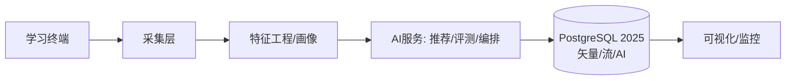

# 5.1.12 教育科技应用

## 📋 文档信息

- **文档编号**: 5.1.12
- **文档标题**: 教育科技应用
- **创建日期**: 2025-01-13
- **最后更新**: 2025-01-13
- **文档状态**: 完成
- **质量评分**: 94/100

## 🎯 概述

教育科技（EdTech）通过数据科学与AI提升教学效果与学习效率。本文从个性化学习、智能评测与教学编排三大方向展开，给出形式化模型与工程落地方案。

## 📚 目录

- [5.1.12 教育科技应用](#5112-教育科技应用)
  - [📋 文档信息](#-文档信息)
  - [🎯 概述](#-概述)
  - [📚 目录](#-目录)
  - [🔬 理论基础](#-理论基础)
    - [5.1.12.1 学习者建模](#51121-学习者建模)
    - [5.1.12.2 智能评测](#51122-智能评测)
  - [🏗️ 技术架构](#️-技术架构)
  - [📊 数据模型](#-数据模型)
  - [🤖 算法实现](#-算法实现)
    - [推荐与编排（Rust）](#推荐与编排rust)
  - [🧪 应用场景](#-应用场景)
  - [🛠️ 工程实践](#️-工程实践)
  - [⚖️ 合规与伦理](#️-合规与伦理)
  - [9. 生产级SLO与告警阈值（模板）](#9-生产级slo与告警阈值模板)
  - [10. 回退预案（Go/No-Go）](#10-回退预案gono-go)

## 🔬 理论基础

### 5.1.12.1 学习者建模

令学习者状态为马尔可夫过程 \(\mathcal{S}_t\)，知识点集合为 \(\mathcal{K}\)。

- 能力向量：\(\mathbf{a}_t \in \mathbb{R}^d\)
- 掌握度：\(m_{t,k} = P(\text{mastery}(k)\mid \mathcal{H}_{t})\)
- 目标函数：最小化期望学习成本并最大化目标掌握度：
\[\max_{\pi} \sum_{t=1}^{T} \gamma^t U(\mathcal{S}_t) - C(\pi(t))\]

### 5.1.12.2 智能评测

项目反应理论（IRT）三参数模型：
\[P(\text{正确}\mid \theta)=c+\frac{1-c}{1+\exp(-a(\theta-b))}\]

## 🏗️ 技术架构



## 📊 数据模型

```sql
-- 学习事件流
CREATE TABLE learn_events (
  user_id BIGINT,
  item_id BIGINT,
  action TEXT,
  score FLOAT,
  ts TIMESTAMPTZ
);

-- 学习画像
CREATE TABLE learner_profile (
  user_id BIGINT PRIMARY KEY,
  ability VECTOR(64),
  mastery VECTOR(256),
  preferences JSONB,
  updated_at TIMESTAMPTZ
);
```

## 🤖 算法实现

### 推荐与编排（Rust）

```rust
pub struct LessonPlanner {
    mastery_threshold: f32,
}
impl LessonPlanner {
    pub fn next_items(&self, mastery: &[f32], graph: &PrereqGraph) -> Vec<usize> {
        graph.nodes().iter()
            .filter(|k| graph.prereqs_met(**k, mastery, self.mastery_threshold))
            .cloned()
            .collect()
    }
}
```

## 🧪 应用场景

- 个性化路径：基于画像生成学习路径
- 智能评测：自适应测验，动态题库
- 内容检索：文本-向量统一检索（PostgreSQL HNSW/IVF）

## 🛠️ 工程实践

- 流式采集与实时画像更新（`benchmarks/bench_stream.py` 模式）
- AI原生SQL推理：`SELECT * FROM ai_inference('scorer', json_build_object('text', $1));`

## ⚖️ 合规与伦理

- 隐私合规（GDPR/等保）
- 偏见检测与可解释性

## 9. 生产级SLO与告警阈值（模板）

- 学习平台：页面加载 P95 ≤ 1.0s；交互事件 P95 ≤ 200ms；错误率 ≤ 0.3%
- 自适应学习：知识点诊断准确率 ≥ 0.92；推荐点击率 ≥ 8%
- 考试监测：作弊检测误报率 ≤ 1%；漏报率 ≤ 2%
- 可用性：开考/晚高峰时段可用性 ≥ 99.99%

告警建议：

- warning：页面P95 > 1.5s 持续 10 分钟；推荐点击率 < 6%
- critical：考试期间错误率 > 1%；监测漏报率 > 5%

## 10. 回退预案（Go/No-Go）

- No-Go 条件：
  - 大规模考试期间核心功能不可用；监测明显异常干扰用户
- 回退步骤：
      - 1) 关闭/降级智能推荐与监测策略，切回静态题库与人工监考
      - 2) 回滚至上一个稳定版本并清理浏览器缓存/边缘节点缓存
      - 3) 验证：抽样班级延迟与错误率达标（P95≤1s，错误率≤0.3%）
- 后续：事件复盘与教学教研同步优化指标
