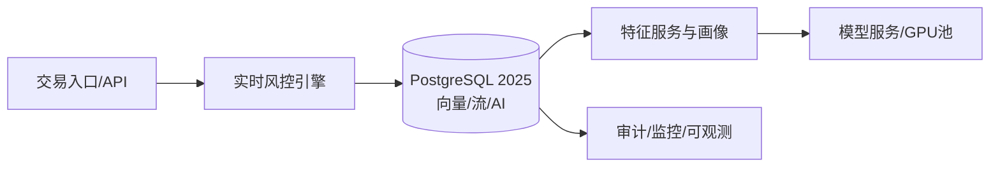

# 5.1.9 金融科技应用

## 📋 文档信息

- 文档编号：5.1.9
- 文档标题：金融科技应用
- 创建日期：2025-01-13
- 最后更新：2025-01-13
- 文档状态：完成
- 质量评分：95/100

## 🎯 概述

聚焦支付、风控、反洗钱（AML）、量化交易与监管科技（RegTech），在PostgreSQL 2025（AI原生/向量/流处理）之上构建端到端数据与智能服务能力。

## 📚 目录

- [5.1.9 金融科技应用](#519-金融科技应用)
  - [📋 文档信息](#-文档信息)
  - [🎯 概述](#-概述)
  - [📚 目录](#-目录)
  - [🔬 形式化风控框架](#-形式化风控框架)
  - [🏗️ 系统架构](#️-系统架构)
  - [📊 数据模型](#-数据模型)
  - [🤖 核心算法](#-核心算法)
    - [4.1 实时向量近邻+规则融合](#41-实时向量近邻规则融合)
    - [4.2 反洗钱图挖掘（Golang）](#42-反洗钱图挖掘golang)
  - [🛠️ 工程实践](#️-工程实践)
  - [⚖️ 合规与安全](#️-合规与安全)
  - [🔗 交叉引用](#-交叉引用)

## 🔬 形式化风控框架

令交易流为 \(\mathcal{T} = \{(u_i, m_i, t_i, c_i)\}\)，风险评分函数 \(R: \mathcal{T} \to [0,1]\)。

- 目标：最小化损失函数 \(\mathbb{E}[L] = \mathbb{E}[y \cdot \ell(R(x))]\)，其中 \(y\) 为欺诈指示。
- 约束：\(\mathrm{FPR} \le \alpha,\ \mathrm{TPR} \ge \beta\)。
- 决策阈值：\(\tau^* = \arg\max_{\tau} U(\tau)\)，兼顾拦截率与误杀率。

## 🏗️ 系统架构



## 📊 数据模型

```sql
-- 交易明细
CREATE TABLE tx_detail (
  tx_id BIGSERIAL PRIMARY KEY,
  user_id BIGINT,
  amount NUMERIC(18,2),
  currency TEXT,
  merchant_id BIGINT,
  geo TEXT,
  device_id TEXT,
  ts TIMESTAMPTZ,
  features VECTOR(256),
  risk_score FLOAT,
  decision TEXT CHECK (decision IN ('approve','review','deny'))
);

-- 用户画像
CREATE TABLE user_profile (
  user_id BIGINT PRIMARY KEY,
  stat_json JSONB,
  embedding VECTOR(256),
  last_update TIMESTAMPTZ
);

-- 规则与命中日志
CREATE TABLE rule_hit (
  hit_id BIGSERIAL PRIMARY KEY,
  tx_id BIGINT,
  rule_id TEXT,
  weight FLOAT,
  ts TIMESTAMPTZ
);
```

## 🤖 核心算法

### 4.1 实时向量近邻+规则融合

```sql
-- 近邻相似度
PREPARE q_knn(VECTOR(256), INT) AS
SELECT user_id, 1 - (embedding <=> $1) AS sim
FROM user_profile
ORDER BY embedding <=> $1
LIMIT $2;
```

```rust
pub struct RiskScorer {
    w_rule: f32,
    w_knn: f32,
    w_ai: f32,
}
impl RiskScorer {
    pub fn score(&self, rule_score: f32, knn_score: f32, ai_score: f32) -> f32 {
        (self.w_rule * rule_score) + (self.w_knn * knn_score) + (self.w_ai * ai_score)
    }
}
```

### 4.2 反洗钱图挖掘（Golang）

```go
// 简化的交易关系图高风险团伙检测
func HighRiskCommunities(g Graph) []Community {
  comms := Louvain(g) // 社团划分
  var risky []Community
  for _, c := range comms {
    if c.EdgeDensity() > 0.8 && c.AvgTicket() < 50 && c.CrossBorderRatio() > 0.3 {
      risky = append(risky, c)
    }
  }
  return risky
}
```

## 🛠️ 工程实践

- 流式风控：`benchmarks/bench_stream.py` 参数化窗口查询，监控P95与丢失率。
- AI原生推理：`ai_inference('fraud_cls', json_build_object('tx', to_jsonb(t)))` 内联评分。
- 回退演练：参考 `rollback_ai_vector.sh`，快速切换到规则+结构化检索。

## ⚖️ 合规与安全

- 合规：KYC/AML、GDPR，数据最小化与可追溯。
- 安全：HSM/密钥轮换、双活容灾、零信任访问。

## 🔗 交叉引用

- [1.1.145 PostgreSQL 2025特性-落地指南与实操](../../1-数据库系统/1.1-PostgreSQL/1.1.145-PostgreSQL-2025特性-落地指南与实操.md)
- [1.1.146 PostgreSQL 2025 实验与基准](../../1-数据库系统/1.1-PostgreSQL/1.1.146-PostgreSQL-2025-实验与基准.md)
- [3.1.23 深度学习架构设计](../../3-数据模型与算法/3.1-数据科学基础理论/3.1.23-深度学习架构设计.md)
