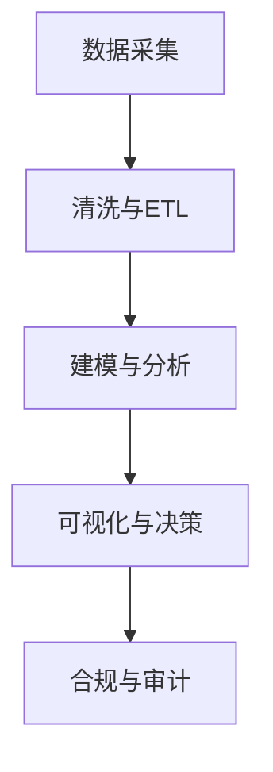

# 5.1 金融数据分析 主题导航与多表征案例

## 目录结构与本地跳转

- [5.1.1 金融数据科学基础理论](./5.1.1-金融数据科学基础理论.md)

---

## 行业案例与多表征

### 5.1.x 典型行业案例

- 风险建模与量化交易（详见3.5-数据分析与ETL、3.4-AI与机器学习算法）
- 反洗钱与合规分析（详见6-知识图谱与可视化、7-持续集成与演进）
- 金融知识图谱与可视化（详见6-知识图谱与可视化）

### 5.1.x 多表征示例

- 金融数据流图、风险建模流程、知识图谱结构、合规审计流程、Latex公式等

---

[返回行业应用与场景导航](../README.md)
