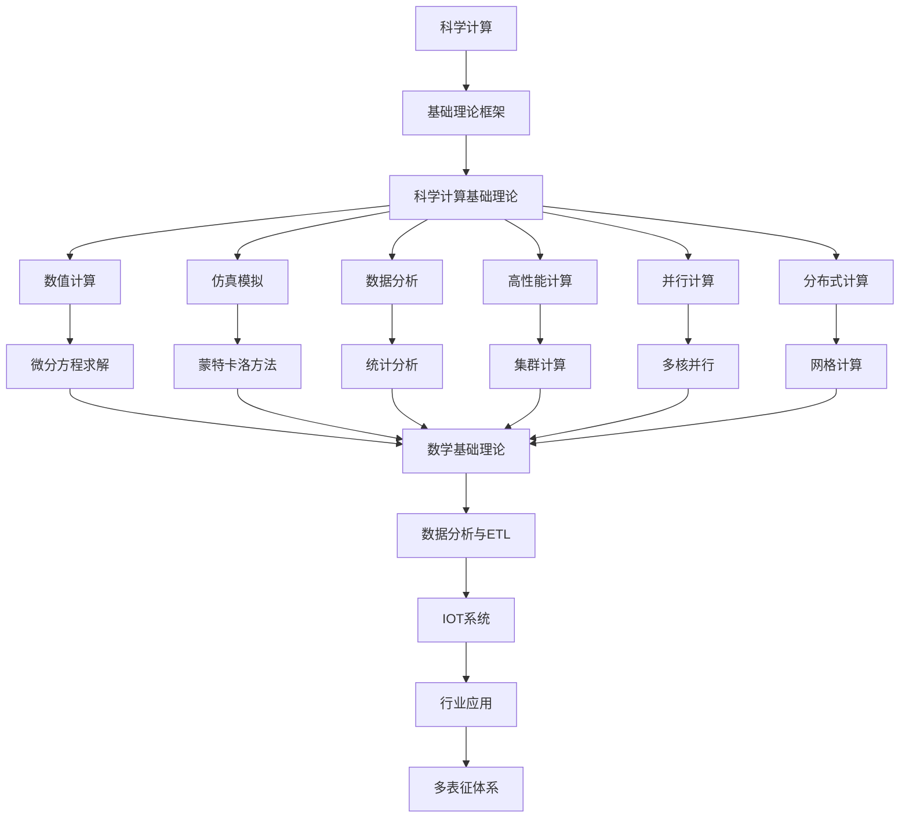

# 5.2-科学计算 分支导航

## 目录结构与本地跳转

- [5.2.1-科学计算基础理论](5.2.1-科学计算基础理论.md) - 预留分支

---

## 主题交叉引用

| 主题      | 基础理论 | 数据模型 | 算法实现 | 系统架构 | 行业案例 | 多表征 | 性能优化 | 安全合规 |
|-----------|----------|----------|----------|----------|----------|--------|----------|----------|
| 科学计算基础理论| 预留 | 预留     | 预留     | 预留     | 预留     | 预留   | 预留     | 预留     |

- 交叉引用：[2.7-数学基础理论](../../../2-形式科学理论/2.7-数学基础理论/README.md)、[3.5-数据分析与ETL](../../../3-数据模型与算法/3.5-数据分析与ETL/README.md)、[4.4-IOT](../../../4-软件架构与工程/4.4-IOT/README.md)

---

## 全链路知识流（Mermaid流程图）

---

[返回行业应用与场景总导航](../README.md)
