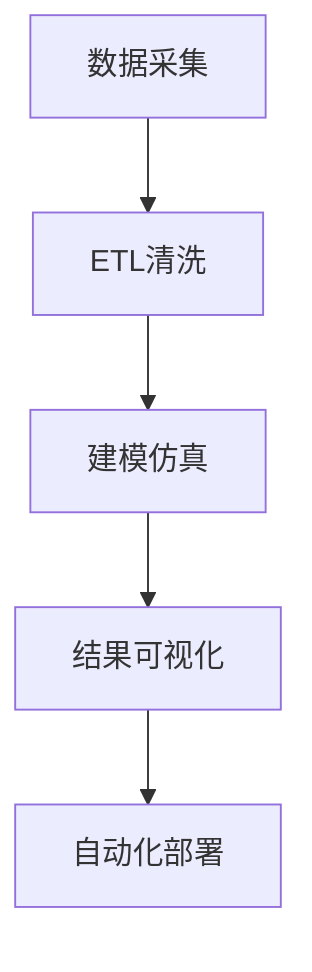

# 5.2 科学计算 主题导航与多表征案例

## 目录结构与本地跳转

- [5.2.1 科学计算基础理论](./5.2.1-科学计算基础理论.md)

---

## 行业案例与多表征

### 5.2.x 典型行业案例

- 大规模仿真与高性能计算（详见3.5-数据分析与ETL、4-软件架构与工程）
- 科学知识图谱与可视化（详见6-知识图谱与可视化）
- 自动化集成与部署（详见7-持续集成与演进）

### 5.2.x 多表征示例

- 仿真流程图、数据流图、知识网络结构、自动化部署流程、Latex公式等

---

[返回行业应用与场景导航](../README.md)
