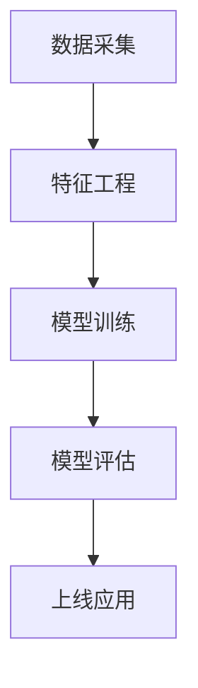

# 5.3.1 机器学习基础理论

## 📑 目录

- [5.3.1 机器学习基础理论](#531-机器学习基础理论)
  - [📑 目录](#-目录)
  - [1. 概述](#1-概述)
    - [1.1. 机器学习定义](#11-机器学习定义)
    - [1.2. 机器学习特点](#12-机器学习特点)
    - [1.3. 机器学习应用领域](#13-机器学习应用领域)
  - [2. 机器学习分类](#2-机器学习分类)
    - [2.1. 学习范式](#21-学习范式)
    - [2.2. 学习任务](#22-学习任务)
  - [3. 监督学习](#3-监督学习)
    - [3.1. 监督学习定义](#31-监督学习定义)
    - [3.2. 监督学习算法](#32-监督学习算法)
    - [3.3. 评估指标](#33-评估指标)
  - [4. 无监督学习](#4-无监督学习)
    - [4.1. 无监督学习定义](#41-无监督学习定义)
    - [4.2. 无监督学习算法](#42-无监督学习算法)
  - [5. 强化学习](#5-强化学习)
    - [5.1. 强化学习定义](#51-强化学习定义)
    - [5.2. 强化学习算法](#52-强化学习算法)
  - [6. 深度学习](#6-深度学习)
    - [6.1. 深度学习定义](#61-深度学习定义)
    - [6.2. 深度学习架构](#62-深度学习架构)
  - [7. 实际应用案例](#7-实际应用案例)
    - [7.1. 机器学习端到端流程](#71-机器学习端到端流程)
    - [7.2. 典型场景](#72-典型场景)
  - [8. 多表征](#8-多表征)

---

## 1. 概述

### 1.1. 机器学习定义

**机器学习（Machine Learning）**是人工智能的一个分支，通过算法让计算机从数据中学习模式，并做出预测或决策。

**机器学习的核心要素**：

1. **数据**：训练数据和测试数据
2. **模型**：学习算法和模型结构
3. **训练**：通过优化算法训练模型
4. **评估**：评估模型性能

### 1.2. 机器学习特点

**机器学习的特点**：

1. **数据驱动**：从数据中学习，而非显式编程
2. **泛化能力**：能够处理未见过的数据
3. **自适应**：能够适应新数据
4. **自动化**：减少人工干预

### 1.3. 机器学习应用领域

**主要应用领域**：

1. **计算机视觉**：图像识别、目标检测
2. **自然语言处理**：文本分析、机器翻译
3. **推荐系统**：个性化推荐
4. **金融**：风险预测、欺诈检测
5. **医疗**：疾病诊断、药物发现

---

## 2. 机器学习分类

### 2.1. 学习范式

**机器学习分类**：

1. **监督学习**：从标记数据中学习
2. **无监督学习**：从无标记数据中发现模式
3. **强化学习**：通过与环境交互学习
4. **半监督学习**：结合标记和无标记数据

### 2.2. 学习任务

**主要学习任务**：

1. **分类**：预测离散类别
2. **回归**：预测连续值
3. **聚类**：发现数据分组
4. **降维**：减少数据维度

---

## 3. 监督学习

### 3.1. 监督学习定义

**监督学习**：从标记数据 $(x_i, y_i)$ 中学习映射函数 $f: X \rightarrow Y$。

**形式化定义**：

给定训练集 $D = \{(x_1, y_1), (x_2, y_2), \ldots, (x_n, y_n)\}$，学习函数：

$$f^* = \arg\min_{f \in \mathcal{F}} \sum_{i=1}^n L(f(x_i), y_i)$$

其中 $L$ 是损失函数，$\mathcal{F}$ 是假设空间。

### 3.2. 监督学习算法

**主要算法**：

1. **线性模型**：线性回归、逻辑回归
2. **决策树**：CART、ID3、C4.5
3. **支持向量机**：SVM、核方法
4. **集成方法**：随机森林、梯度提升

### 3.3. 评估指标

**分类指标**：

- **准确率**：$\text{Accuracy} = \frac{TP + TN}{TP + TN + FP + FN}$
- **精确率**：$\text{Precision} = \frac{TP}{TP + FP}$
- **召回率**：$\text{Recall} = \frac{TP}{TP + FN}$
- **F1分数**：$F1 = \frac{2 \cdot \text{Precision} \cdot \text{Recall}}{\text{Precision} + \text{Recall}}$

**回归指标**：

- **均方误差**：$\text{MSE} = \frac{1}{n}\sum_{i=1}^n (y_i - \hat{y}_i)^2$
- **均方根误差**：$\text{RMSE} = \sqrt{\text{MSE}}$
- **平均绝对误差**：$\text{MAE} = \frac{1}{n}\sum_{i=1}^n |y_i - \hat{y}_i|$

---

## 4. 无监督学习

### 4.1. 无监督学习定义

**无监督学习**：从无标记数据中发现潜在结构。

**形式化定义**：

给定数据集 $D = \{x_1, x_2, \ldots, x_n\}$，学习数据分布或结构：

$$p(x) \text{ 或 } f: X \rightarrow Z$$

其中 $Z$ 是隐变量空间。

### 4.2. 无监督学习算法

**主要算法**：

1. **聚类**：K-means、层次聚类、DBSCAN
2. **降维**：PCA、t-SNE、UMAP
3. **密度估计**：高斯混合模型、核密度估计
4. **生成模型**：VAE、GAN

---

## 5. 强化学习

### 5.1. 强化学习定义

**强化学习**：智能体通过与环境交互学习最优策略。

**形式化定义**：

马尔可夫决策过程 $(S, A, P, R, \gamma)$：

- $S$：状态空间
- $A$：动作空间
- $P$：状态转移概率
- $R$：奖励函数
- $\gamma$：折扣因子

**目标**：学习策略 $\pi^*$ 最大化期望累积奖励：

$$\pi^* = \arg\max_{\pi} \mathbb{E}[\sum_{t=0}^{\infty} \gamma^t r_t | \pi]$$

### 5.2. 强化学习算法

**主要算法**：

1. **基于价值**：Q-learning、DQN
2. **基于策略**：REINFORCE、PPO
3. **基于模型**：AlphaZero、MuZero

---

## 6. 深度学习

### 6.1. 深度学习定义

**深度学习**：使用多层神经网络学习数据的层次化表示。

**神经网络**：

$$y = f_n(f_{n-1}(\ldots f_1(x)))$$

其中 $f_i$ 是第 $i$ 层的变换函数。

### 6.2. 深度学习架构

**主要架构**：

1. **前馈神经网络**：MLP
2. **卷积神经网络**：CNN
3. **循环神经网络**：RNN、LSTM、GRU
4. **Transformer**：注意力机制

---

## 7. 实际应用案例

### 7.1. 机器学习端到端流程

- 数据采集 → 特征工程 → 模型训练 → 模型评估 → 上线应用

### 7.2. 典型场景

- **金融风控**：信用评分、欺诈检测（详见5.1-金融数据分析、3.5.4-专业数据分析算法）
- **医疗诊断**：影像识别、疾病预测（详见3.5.1-数据分析基础理论、3.5.3-数据可视化方法与工具）
- **智能推荐**：用户行为建模与实时推荐（详见3.5.5-数据流处理与架构）

---

## 8. 多表征

本主题支持多种表征方式：

1. **符号表征**：数学公式、形式化定义
2. **图结构**：模型结构图、算法流程图
3. **代码实现**：Python、TensorFlow、PyTorch代码
4. **自然语言**：概念定义、算法描述
5. **可视化**：模型可视化、结果可视化

---

[返回机器学习导航](./README.md)
[跳转到数据分析与ETL](../../3-数据模型与算法/3.5-数据分析与ETL/README.md)
