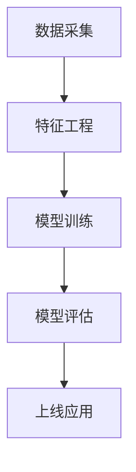

# 6. 行业案例与多表征

## 1. 机器学习端到端流程

- 数据采集 → 特征工程 → 模型训练 → 模型评估 → 上线应用

### 1.1. 典型场景

- 金融风控：信用评分、欺诈检测（详见5.1-金融数据分析、3.5.4-专业数据分析算法）
- 医疗诊断：影像识别、疾病预测（详见3.5.1-数据分析基础理论、3.5.3-数据可视化方法与工具）
- 智能推荐：用户行为建模与实时推荐（详见3.5.5-数据流处理与架构）

### 1.2. 多表征示例

- 机器学习流程图、模型结构图、评估指标表、可视化结果等

---

[返回机器学习导航](./README.md)
[跳转到数据分析与ETL](../../3-数据模型与算法/3.5-数据分析与ETL/README.md)
