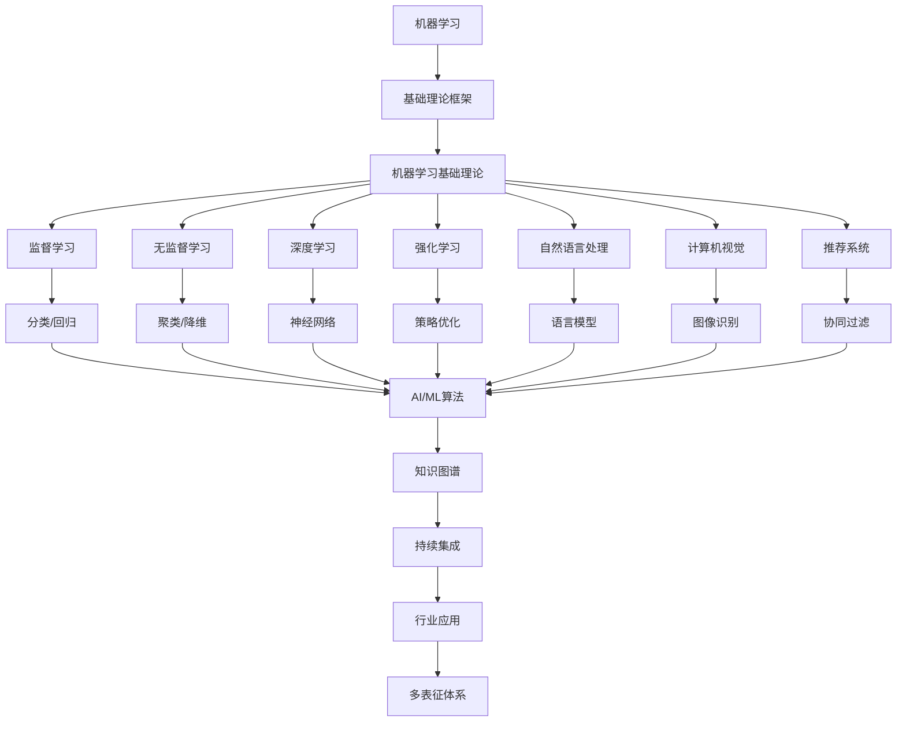

# 5.3-机器学习 分支导航

## 目录结构与本地跳转

- [5.3.1-机器学习基础理论](5.3.1-机器学习基础理论.md) - 预留分支

---

## 主题交叉引用

| 主题      | 基础理论 | 数据模型 | 算法实现 | 系统架构 | 行业案例 | 多表征 | 性能优化 | 安全合规 |
|-----------|----------|----------|----------|----------|----------|--------|----------|----------|
| 机器学习基础理论| 预留 | 预留     | 预留     | 预留     | 预留     | 预留   | 预留     | 预留     |

- 交叉引用：[3.4-AI与机器学习算法](../../../3-数据模型与算法/3.4-AI与机器学习算法/README.md)、[6-知识图谱与可视化](../../../6-知识图谱与可视化/README.md)、[7-持续集成与演进](../../../7-持续集成与演进/README.md)

---

## 全链路知识流（Mermaid流程图）

---

[返回行业应用与场景总导航](../README.md)
