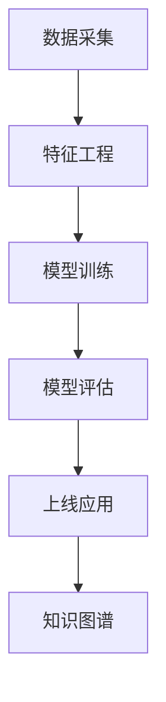

# 5.3 机器学习 主题导航与多表征案例

## 目录结构与本地跳转

- [5.3.1 机器学习基础理论](./5.3.1-机器学习基础理论.md)

---

## 行业案例与多表征

### 5.3.x 典型行业案例

- 金融风控与智能推荐（详见5.1-金融数据分析、3.4-AI与机器学习算法）
- 医疗诊断与辅助决策（详见3.5-数据分析与ETL、6-知识图谱与可视化）
- 自动化测试与持续集成（详见7-持续集成与演进）

### 5.3.x 多表征示例

- 机器学习流程图、模型结构图、评估指标表、知识图谱、Latex公式等

---

[返回行业应用与场景导航](../README.md)
