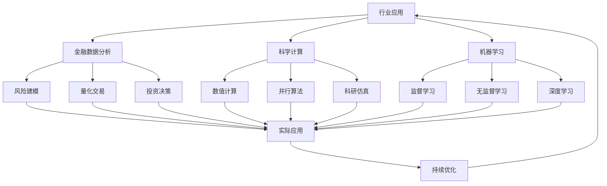

# 5-行业应用与场景

## 📁 目录结构

```text
5-行业应用与场景/
├── 5.1-金融数据分析/
│   ├── 5.1.1-金融数据科学基础理论.md
│   └── README.md
├── 5.2-科学计算/
│   ├── 5.2.1-科学计算基础理论.md
│   └── README.md
├── 5.3-机器学习/
│   ├── 5.3.1-机器学习基础理论.md
│   └── README.md
└── README.md
```

## 🔗 主题交叉引用表

| 应用分支 | 关联理论 | 技术应用 | 实践场景 |
|---------|---------|---------|---------|
| **金融数据分析** | 统计学、时间序列分析 | 风险建模、量化交易 | 投资决策、风险管理 |
| **科学计算** | 数值分析、优化理论 | 高性能计算、并行算法 | 科研仿真、工程设计 |
| **机器学习** | 统计学、优化算法 | 模型训练、特征工程 | 预测分析、模式识别 |

## 🔄 全链路知识流图



## 🎯 知识体系特色

### 理论严谨性

- **数学基础**：基于严格的数学理论体系
- **统计方法**：科学的统计分析框架
- **模型验证**：严格的模型验证和测试

### 技术创新性

- **算法创新**：新算法在行业中的应用
- **技术融合**：多技术领域的交叉应用
- **前沿探索**：新兴技术在行业中的探索

### 实践导向

- **实际问题**：解决行业中的实际问题
- **可操作性**：提供可操作的技术方案
- **效果验证**：注重实际效果和验证

### 持续演进

- **技术更新**：跟随技术发展趋势
- **应用拓展**：向更多行业领域扩展
- **最佳实践**：持续优化和改进

## 📚 学习路径建议

### 🚀 入门路径

1. **机器学习基础** → 建立AI应用思维
2. **金融数据分析** → 理解数据驱动决策
3. **科学计算** → 掌握数值计算方法
4. **行业实践** → 学习实际应用案例

### 🔄 进阶路径

1. **高级算法** → 深入复杂算法应用
2. **行业专精** → 专注特定行业应用
3. **技术融合** → 多技术领域整合
4. **创新应用** → 探索新兴应用场景

### 🎯 专家路径

1. **算法创新** → 开发新的算法和模型
2. **行业引领** → 引领行业技术发展方向
3. **技术架构** → 设计大规模技术架构
4. **战略规划** → 制定技术发展战略

## 🚀 快速导航

### 行业应用

- [金融数据科学基础理论](5.1-金融数据分析/5.1.1-金融数据科学基础理论.md)
- [科学计算基础理论](5.2-科学计算/5.2.1-科学计算基础理论.md)
- [机器学习基础理论](5.3-机器学习/5.3.1-机器学习基础理论.md)

## 🛠️ 技术栈映射

### 金融技术

- **量化交易**：Python、R、MATLAB
- **风险建模**：VaR、Monte Carlo模拟
- **时间序列**：ARIMA、GARCH、LSTM
- **投资组合**：Markowitz理论、Black-Litterman

### 科学计算

- **数值计算**：NumPy、SciPy、MATLAB
- **并行计算**：MPI、OpenMP、CUDA
- **可视化**：Matplotlib、Plotly、VTK
- **高性能**：C++、Fortran、Julia

### 机器学习

- **深度学习**：TensorFlow、PyTorch
- **传统ML**：Scikit-learn、XGBoost
- **NLP**：Hugging Face、SpaCy
- **计算机视觉**：OpenCV、PIL

## 🎯 应用场景体系

### 金融科技

- **量化投资**：算法交易、因子模型
- **风险管理**：VaR计算、压力测试
- **信用评估**：信用评分、反欺诈
- **市场分析**：技术分析、基本面分析

### 科学研究

- **物理仿真**：流体力学、结构分析
- **生物信息**：基因组学、蛋白质结构
- **气候建模**：天气预报、气候变化
- **材料科学**：分子动力学、量子计算

### 工业应用

- **预测性维护**：设备故障预测
- **质量控制**：缺陷检测、质量评估
- **供应链优化**：库存管理、路径优化
- **智能制造**：机器人控制、自动化

### 医疗健康

- **医学影像**：CT、MRI图像分析
- **药物发现**：分子对接、虚拟筛选
- **疾病预测**：风险评估、早期诊断
- **个性化医疗**：精准治疗、药物推荐

---

-**📖 相关导航**

- [返回总导航](../README.md)
- [3-数据模型与算法](../3-数据模型与算法/README.md)
- [4-软件架构与工程](../4-软件架构与工程/README.md)
- [Matter/FormalModel](../Matter/FormalModel/)

## 多表征

本分支支持多种表征方式，包括：

- 符号表征（行业模型、数据结构、算法、流程等）
- 图结构（业务流程图、数据流图、行业知识图谱等）
- 向量/张量（特征向量、参数矩阵、行业嵌入）
- 自然语言（定义、注释、业务描述）
- 图像/可视化（业务结构图、流程图、可视化结果等）
这些表征可互映，提升行业应用理论与实践表达力。

## 形式化语义

- 语义域：$D$，如行业对象集、业务流程空间、数据模型、算法空间
- 解释函数：$I: S \to D$，将符号/结构映射到具体行业语义对象
- 语义一致性：每个结构/流程/算法在$D$中有明确定义

## 形式化语法与证明

- 语法规则：如行业模型定义、业务流程伪代码、推理规则、约束条件
- **定理**：本分支的语法系统具一致性与可扩展性。
- **证明**：由行业模型、流程定义与推理规则递归定义，保证系统一致与可扩展。
