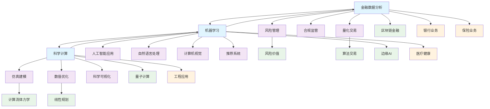

# 5-行业应用与场景 - 知识导航索引

## 📚 目录结构

```
5-行业应用与场景/
├── README.md                           # 本导航文件
├── 5.1-金融数据分析/                   # 金融行业应用
│   ├── 5.1.1-金融数据科学基础理论.md
│   └── README.md
├── 5.2-科学计算/                       # 科学计算应用
│   ├── 5.2.1-科学计算基础理论.md
│   └── README.md
└── 5.3-机器学习/                       # 机器学习应用
    ├── 5.3.1-机器学习基础理论.md
    └── README.md
```

## 🔗 主题交叉引用表

| 应用分支 | 核心概念 | 关联理论 | 应用领域 |
|---------|---------|---------|---------|
| **金融数据分析** | 风险管理、量化交易 | 数据模型算法、统计理论 | 投资银行、保险、监管 |
| **科学计算** | 数值计算、仿真建模 | 数学基础、算法实现 | 物理、化学、工程 |
| **机器学习** | 智能算法、模式识别 | AI算法、数据科学 | 各行各业智能化 |

## 🌊 全链路知识流图



## 🎯 知识体系特色

### 💰 **金融科技驱动**

- 量化交易与风险管理
- 区块链与数字货币
- 智能投顾与合规监管

### 🔬 **科学计算创新**

- 高性能数值计算
- 多物理场仿真建模
- 科学可视化与数据分析

### 🤖 **AI赋能行业**

- 机器学习在各行业的应用
- 自然语言处理与知识图谱
- 计算机视觉与智能识别

### 🌐 **跨领域融合**

- 金融与AI的深度结合
- 科学计算与机器学习的融合
- 多行业场景的技术迁移

## 📖 学习路径建议

### 🥇 **入门路径**

1. **机器学习基础** → 建立AI思维
2. **金融数据分析** → 理解行业应用
3. **科学计算** → 掌握数值方法

### 🥈 **进阶路径**

1. **量化交易** → 金融AI应用
2. **仿真建模** → 科学计算深化
3. **多模态AI** → 跨领域应用

### 🥉 **专家路径**

1. **区块链金融** → 金融科技创新
2. **量子计算** → 前沿计算技术
3. **边缘AI** → 分布式智能

## 🔍 快速导航

- **[金融数据分析](./5.1-金融数据分析/)** - 金融行业应用
- **[科学计算](./5.2-科学计算/)** - 科学计算应用
- **[机器学习](./5.3-机器学习/)** - 机器学习应用

## 🚀 技术栈映射

### 💰 **金融技术**

- 量化分析：Python、R、MATLAB
- 风险管理：VaR、Stress Testing
- 算法交易：高频交易、套利策略
- 区块链：智能合约、DeFi

### 🔬 **科学计算**

- 数值计算：NumPy、SciPy、MATLAB
- 仿真建模：COMSOL、ANSYS、OpenFOAM
- 可视化：Matplotlib、Plotly、VTK
- 并行计算：MPI、OpenMP、CUDA

### 🤖 **机器学习应用**

- 深度学习：TensorFlow、PyTorch
- 自然语言处理：BERT、GPT、Transformer
- 计算机视觉：OpenCV、YOLO、ResNet
- 推荐系统：协同过滤、深度学习推荐

## 📊 行业案例体系

### 🏦 **金融行业**

- **风险管理**：信用评分、市场风险、操作风险
- **量化交易**：算法交易、高频交易、套利策略
- **智能投顾**：资产配置、投资组合优化
- **合规监管**：反洗钱、KYC、监管报告

### 🔬 **科学计算**

- **物理仿真**：流体力学、结构分析、电磁场
- **化学计算**：分子动力学、量子化学
- **工程应用**：CAD/CAM、有限元分析
- **生物信息**：基因组学、蛋白质结构预测

### 🏥 **医疗健康**

- **医学影像**：CT、MRI、X光诊断
- **药物发现**：分子设计、虚拟筛选
- **健康管理**：疾病预测、个性化医疗
- **医疗机器人**：手术辅助、康复训练

### 🚗 **智能制造**

- **工业4.0**：智能工厂、预测性维护
- **自动驾驶**：感知、决策、控制
- **机器人技术**：路径规划、力控制
- **质量控制**：缺陷检测、质量预测

---

*本导航为行业应用与场景体系提供系统化的知识组织框架，支持从技术理论到实际应用的完整学习路径。*
