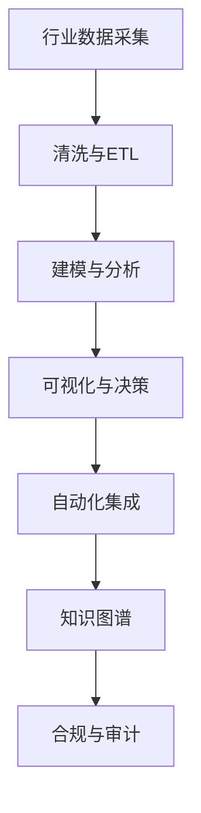

# 5 行业应用与场景 主题导航与多表征案例

## 目录结构与本地跳转

- [5.1 金融数据分析](./5.1-金融数据分析/README.md)
- [5.2 科学计算](./5.2-科学计算/README.md)
- [5.3 机器学习](./5.3-机器学习/README.md)

---

## 行业案例与多表征

### 5.x 典型行业案例

- 金融行业：风险建模、量化交易、反洗钱、知识图谱、合规自动化（详见3.5-数据分析与ETL、6-知识图谱与可视化、7-持续集成与演进）
- 科学计算：大规模仿真、知识网络、自动化集成与部署（详见4-软件架构与工程、6-知识图谱与可视化、7-持续集成与演进）
- 机器学习：智能推荐、医疗诊断、自动化测试与持续集成（详见3.4-AI与机器学习算法、6-知识图谱与可视化、7-持续集成与演进）

### 5.x 多表征示例

- 行业数据流图、建模与分析流程、知识图谱结构、自动化集成流程、合规审计流程、Latex公式等

---

[返回数据分析与ETL](../3-数据模型与算法/3.5-数据分析与ETL/README.md)
