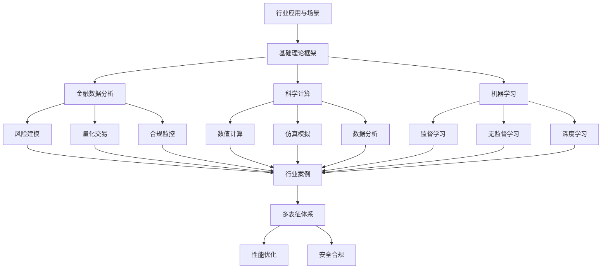

# 5-行业应用与场景 总导航

## 目录结构与本地跳转
- [5.1-金融数据分析](5.1-金融数据分析/README.md) - 预留分支
- [5.2-科学计算](5.2-科学计算/README.md) - 预留分支
- [5.3-机器学习](5.3-机器学习/README.md) - 预留分支

---

## 主题交叉引用
| 分支      | 基础理论 | 数据模型 | 算法实现 | 系统架构 | 行业案例 | 多表征 | 性能优化 | 安全合规 |
|-----------|----------|----------|----------|----------|----------|--------|----------|----------|
| 金融数据分析| 预留   | 预留     | 预留     | 预留     | 预留     | 预留   | 预留     | 预留     |
| 科学计算  | 预留     | 预留     | 预留     | 预留     | 预留     | 预留   | 预留     | 预留     |
| 机器学习  | 预留     | 预留     | 预留     | 预留     | 预留     | 预留   | 预留     | 预留     |

- 交叉引用：[1-数据库系统](../1-数据库系统/README.md)、[2-形式科学理论](../2-形式科学理论/README.md)、[3-数据模型与算法](../3-数据模型与算法/README.md)、[4-软件架构与工程](../4-软件架构与工程/README.md)、[6-知识图谱与可视化](../6-知识图谱与可视化/README.md)

---

## 全链路知识流（Mermaid流程图）

---

[返回Analysis总导航](../README.md)
