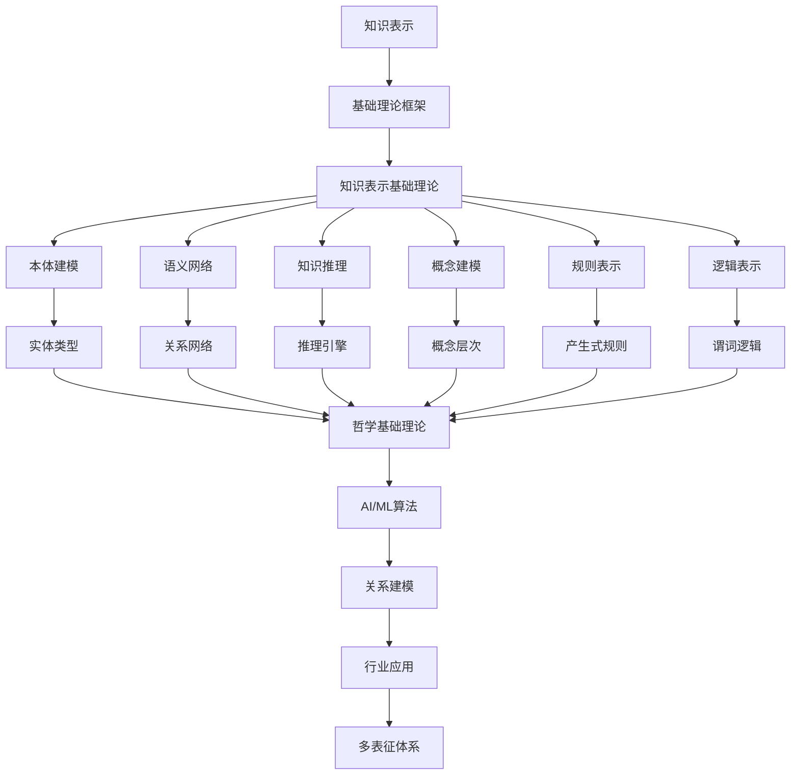

# 6.1-知识表示 分支导航

## 目录结构与本地跳转

- [6.1.1-知识表示基础理论](6.1.1-知识表示基础理论.md) - 预留分支

---

## 主题交叉引用

| 主题      | 基础理论 | 知识表示 | 关系建模 | 可视化技术 | 行业应用 | 多表征 | 交互设计 | 性能优化 |
|-----------|----------|----------|----------|------------|----------|--------|----------|----------|
| 知识表示基础理论| 预留 | 预留     | 预留     | 预留       | 预留     | 预留   | 预留     | 预留     |

- 交叉引用：[2.9-哲学基础理论](../../../2-形式科学理论/2.9-哲学基础理论/README.md)、[3.4-AI与机器学习算法](../../../3-数据模型与算法/3.4-AI与机器学习算法/README.md)、[6.2-关系建模](../6.2-关系建模/README.md)

---

## 全链路知识流（Mermaid流程图）

---

[返回知识图谱与可视化总导航](../README.md)

## 多表征

知识表示分支支持多种表征方式，包括：

- 符号表征（逻辑、集合、代数结构）
- 图结构（知识图谱、语义网络）
- 向量/张量（嵌入、特征）
- 自然语言（定义、注释）
- 图像/可视化（结构图、流程图）
这些表征可互映，提升理论表达力。

## 形式化语义

- 语义域：$D$，如对象集、关系结构、模型空间
- 解释函数：$I: S \to D$，将符号/结构映射到具体语义对象
- 语义一致性：每个结构/公式在$D$中有明确定义

## 形式化语法与证明

- 语法规则：如产生式、推理规则、约束条件
- **定理**：知识表示分支的语法系统具一致性与可扩展性。
- **证明**：由产生式与推理规则递归定义，保证系统一致与可扩展。
