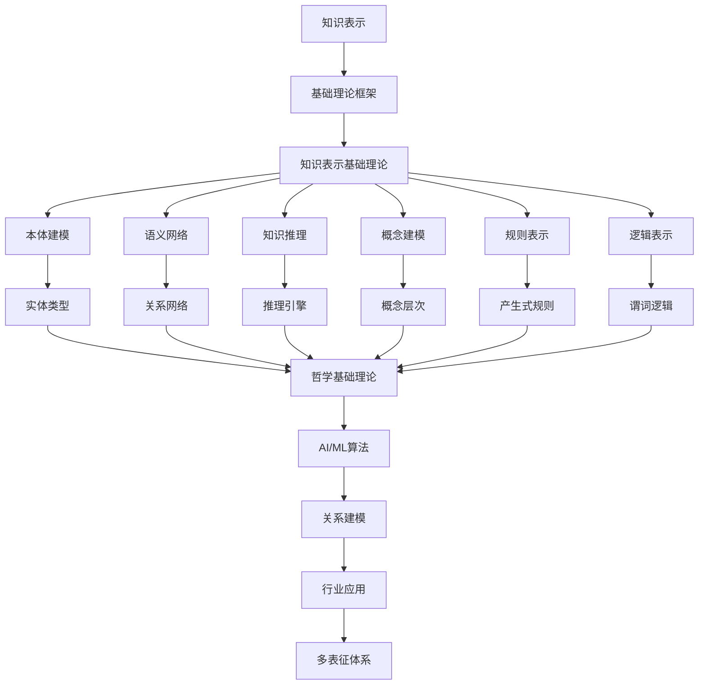

# 6.1-知识表示 分支导航

## 目录结构与本地跳转

- [6.1.1-知识表示基础理论](6.1.1-知识表示基础理论.md) - 预留分支

---

## 主题交叉引用

| 主题      | 基础理论 | 知识表示 | 关系建模 | 可视化技术 | 行业应用 | 多表征 | 交互设计 | 性能优化 |
|-----------|----------|----------|----------|------------|----------|--------|----------|----------|
| 知识表示基础理论| 预留 | 预留     | 预留     | 预留       | 预留     | 预留   | 预留     | 预留     |

- 交叉引用：[2.9-哲学基础理论](../../../2-形式科学理论/2.9-哲学基础理论/README.md)、[3.4-AI与机器学习算法](../../../3-数据模型与算法/3.4-AI与机器学习算法/README.md)、[6.2-关系建模](../6.2-关系建模/README.md)

---

## 全链路知识流（Mermaid流程图）

---

[返回知识图谱与可视化总导航](../README.md)

## 多表征

知识表示分支支持多种表征方式，包括：

- 符号表征（逻辑、集合、代数结构）
- 图结构（知识图谱、语义网络）
- 向量/张量（嵌入、特征）
- 自然语言（定义、注释）
- 图像/可视化（结构图、流程图）
这些表征可互映，提升理论表达力。

## 形式化语义

- 语义域：$D$，如对象集、关系结构、模型空间
- 解释函数：$I: S \to D$，将符号/结构映射到具体语义对象
- 语义一致性：每个结构/公式在$D$中有明确定义

## 形式化语法与证明

- 语法规则：如产生式、推理规则、约束条件
- **定理**：知识表示分支的语法系统具一致性与可扩展性。
- **证明**：由产生式与推理规则递归定义，保证系统一致与可扩展。

---

## 核心概念详解

### 知识表示概述

知识表示是人工智能和知识工程的核心问题，涉及如何用计算机可处理的形式表示人类知识。

**表示方法分类**：

- **符号表示**：逻辑、规则、框架
- **连接主义**：神经网络、深度学习
- **混合表示**：符号与连接主义结合

### 本体论

**本体定义**：

本体是对共享概念的形式化、显式规范，包括：

- **概念**：类、实体类型
- **关系**：属性、关系类型
- **公理**：约束、规则

**本体语言**：

- **RDF**：资源描述框架
- **OWL**：Web本体语言
- **RDFS**：RDF模式

### 语义网络

**网络结构**：

- **节点**：概念、实体
- **边**：关系、属性
- **层次**：概念层次、继承关系

**语义网络类型**：

- **分类网络**：概念分类
- **命题网络**：命题表示
- **框架网络**：框架表示

### 知识推理

**推理类型**：

- **演绎推理**：从一般到特殊
- **归纳推理**：从特殊到一般
- **类比推理**：基于相似性

**推理方法**：

- **前向推理**：从事实到结论
- **后向推理**：从目标到事实
- **双向推理**：前向和后向结合

---

## 理论基础

### 逻辑基础

**一阶逻辑**：

- **谓词**：表示关系和属性
- **量词**：全称量词、存在量词
- **连接词**：与、或、非、蕴含

**描述逻辑**：

- **概念**：类、概念描述
- **角色**：属性、关系
- **个体**：实例、对象

### 知识表示形式化

**形式化定义**：

$$KR = (L, I, R)$$

其中：

- $L$ 是表示语言
- $I$ 是解释函数
- $R$ 是推理规则

---

## 应用场景

### 智能问答

- 知识库问答
- 语义搜索
- 对话系统

### 知识管理

- 企业知识库
- 文档管理
- 知识检索

### 专家系统

- 医疗诊断
- 法律咨询
- 故障诊断

---

## 工具与框架

### 本体工具

- **Protégé**：本体编辑器
- **OWL API**：OWL API库
- **Jena**：RDF框架

### 推理引擎

- **Pellet**：OWL推理器
- **HermiT**：OWL推理器
- **RDFox**：RDF推理器

---

## 最佳实践

### 本体设计

- 明确领域范围
- 定义核心概念
- 建立概念关系
- 定义约束规则

### 知识建模

- 标准化建模
- 模块化设计
- 可扩展性
- 质量保证

---

## 多表征

本分支支持多种表征方式，包括：符号表征（逻辑、集合、代数结构）、图结构（知识图谱、语义网络）、向量/张量（嵌入、特征）、自然语言（定义、注释）、图像/可视化（结构图、流程图）。这些表征可互映，提升理论表达力。

---

## 形式化语义

- 语义域：$D$，如对象集、关系结构、模型空间
- 解释函数：$I: S \to D$，将符号/结构映射到具体语义对象
- 语义一致性：每个结构/公式在$D$中有明确定义

---

## 形式化语法与证明

- 语法规则：如产生式、推理规则、约束条件
- **定理**：知识表示分支的语法系统具一致性与可扩展性。
- **证明**：由产生式与推理规则递归定义，保证系统一致与可扩展。

---

## 深入学习建议

### 理论基础强化

**数学基础**：

- **逻辑学**：命题逻辑、谓词逻辑、模态逻辑
- **集合论**：集合、关系、函数
- **图论**：图的基本概念、图算法
- **离散数学**：离散结构、组合数学

**计算机科学基础**：

- **数据结构**：树、图、哈希表
- **算法设计**：图算法、搜索算法
- **数据库理论**：关系数据库、图数据库
- **人工智能**：知识表示、推理

### 实践能力提升

**编程能力**：

- **Python**：RDFLib、NetworkX、SPARQL
- **Java**：Jena、OWL API
- **JavaScript**：RDF.js、SPARQL.js
- **Rust**：Oxigraph、Sophia

**工具使用**：

- **Protégé**：本体编辑器
- **Neo4j**：图数据库
- **Apache Jena**：RDF框架
- **Pellet**：OWL推理器

### 研究能力培养

**文献阅读**：

- **经典论文**：知识表示经典论文
- **前沿研究**：最新研究进展
- **应用论文**：实际应用案例
- **会议论文**：顶级会议论文

---

## 学习资源汇总

### 在线课程

- **Coursera**：知识图谱课程
- **edX**：语义网课程
- **Udemy**：本体建模课程
- **YouTube**：知识表示教程

### 书籍推荐

- **入门书籍**：《知识表示与推理》
- **进阶书籍**：《Semantic Web Primer》
- **应用书籍**：《Building Knowledge Graphs》
- **工具书籍**：《Protégé User Guide》

### 学术资源

- **期刊**：Journal of Web Semantics、Semantic Web
- **会议**：ISWC、ESWC、WWW
- **数据库**：IEEE Xplore、ACM Digital Library
- **预印本**：arXiv、ResearchGate

---

## 实践项目建议

### 基础项目

- **本体构建**：构建领域本体
- **知识抽取**：从文本抽取知识
- **知识推理**：实现推理引擎
- **知识查询**：SPARQL查询实现

### 进阶项目

- **知识图谱构建**：构建完整知识图谱
- **知识融合**：多源知识融合
- **知识问答**：知识库问答系统
- **知识可视化**：知识图谱可视化

### 高级项目

- **多模态知识图谱**：文本、图像、视频融合
- **实时知识图谱**：流式知识图谱
- **联邦知识图谱**：分布式知识图谱
- **知识图谱应用**：实际应用系统

---

## 职业发展路径

### 学术研究

- **研究方向**：知识表示、知识推理、知识图谱
- **职业路径**：博士研究、博士后、教职、研究机构

### 工业应用

- **应用领域**：智能问答、推荐系统、搜索引擎
- **职业路径**：知识工程师、AI工程师、数据科学家

---

## 常见问题与解决方案

### 知识表示挑战

**挑战1：知识不一致性**

- **问题**：不同来源的知识可能存在冲突
- **解决方案**：
  - 知识融合算法
  - 冲突检测与解决
  - 版本控制机制
  - 知识质量评估

**挑战2：知识不完整性**

- **问题**：知识库可能缺少某些信息
- **解决方案**：
  - 知识补全算法
  - 推理机制
  - 知识抽取
  - 众包知识获取

**挑战3：知识可扩展性**

- **问题**：大规模知识库的管理和查询
- **解决方案**：
  - 分布式存储
  - 索引优化
  - 查询优化
  - 缓存机制

### 性能优化建议

**存储优化**：

- **压缩技术**：知识图谱压缩
- **分区策略**：按领域或类型分区
- **索引设计**：多级索引结构
- **缓存策略**：热点数据缓存

**查询优化**：

- **查询重写**：优化SPARQL查询
- **并行处理**：并行查询执行
- **预计算**：常用查询预计算
- **查询计划**：优化查询计划

---

## 行业应用案例

### 智能问答系统

**应用场景**：

- **医疗问答**：基于医学知识图谱的问答
- **法律咨询**：基于法律知识库的咨询
- **技术支持**：基于技术文档的问答

**技术要点**：

- 知识图谱构建
- 问题理解
- 答案生成
- 结果排序

### 推荐系统

**应用场景**：

- **商品推荐**：基于商品知识图谱的推荐
- **内容推荐**：基于内容知识图谱的推荐
- **社交推荐**：基于社交知识图谱的推荐

**技术要点**：

- 实体关系建模
- 相似度计算
- 推荐算法
- 个性化策略

### 知识管理

**应用场景**：

- **企业知识库**：企业内部知识管理
- **学术知识库**：学术文献知识管理
- **领域知识库**：特定领域知识管理

**技术要点**：

- 知识抽取
- 知识组织
- 知识检索
- 知识更新

---

## 最佳实践

### 本体设计最佳实践

1. **明确领域范围**：定义清晰的领域边界
2. **模块化设计**：采用模块化本体设计
3. **重用现有本体**：重用标准本体（如FOAF、Dublin Core）
4. **版本管理**：建立本体版本管理机制
5. **文档化**：详细记录本体设计决策

### 知识建模最佳实践

1. **标准化建模**：遵循标准建模规范
2. **一致性检查**：定期进行一致性检查
3. **质量保证**：建立知识质量评估机制
4. **持续更新**：保持知识的时效性
5. **用户反馈**：收集用户反馈并改进

### 系统开发最佳实践

1. **架构设计**：采用可扩展的架构设计
2. **性能优化**：关注系统性能优化
3. **安全考虑**：考虑知识安全与隐私
4. **监控运维**：建立完善的监控体系
5. **文档维护**：保持文档的及时更新

---

## 总结

知识表示是人工智能和知识工程的核心，通过本体论、语义网络和知识图谱等方法，可以有效地表示和管理知识，为智能应用提供基础支撑。

**核心价值**：

1. **知识组织**：结构化知识组织
2. **智能应用**：支持智能应用开发
3. **知识推理**：支持知识推理
4. **知识管理**：支持知识管理

**未来展望**：

随着AI、大数据、知识图谱等技术的发展，知识表示将继续演进，特别是在多模态知识、实时知识、联邦知识等领域，知识表示将提供更强大的功能和更好的体验。

**技术发展趋势**：

1. **多模态知识表示**：融合文本、图像、视频等多种模态
2. **实时知识更新**：支持实时知识更新和同步
3. **联邦知识图谱**：分布式知识图谱的协同构建
4. **知识自动化**：自动化知识抽取和构建
5. **知识推理增强**：更强大的推理能力

**应用前景**：

- **智能问答**：更准确的智能问答系统
- **推荐系统**：更精准的推荐算法
- **知识管理**：更高效的知识管理系统
- **AI应用**：为AI应用提供知识基础

---

[返回知识图谱与可视化总导航](../README.md)
