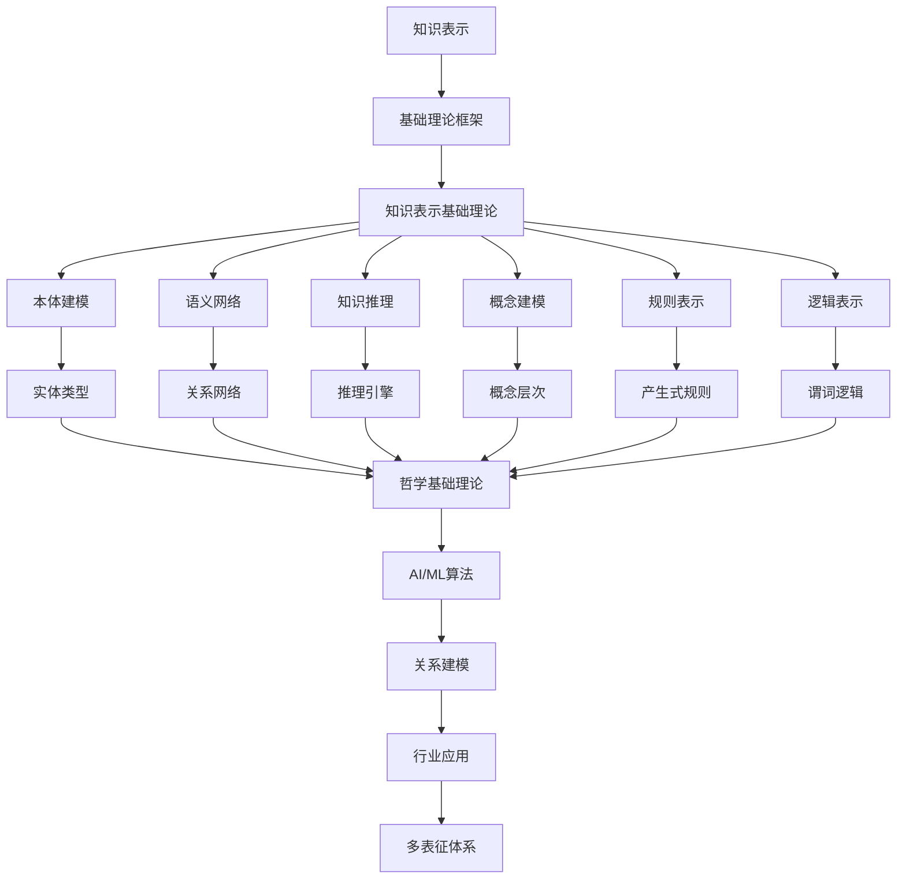

# 6.1-知识表示 分支导航

## 目录结构与本地跳转

- [6.1.1-知识表示基础理论](6.1.1-知识表示基础理论.md) - 预留分支

---

## 主题交叉引用

| 主题      | 基础理论 | 知识表示 | 关系建模 | 可视化技术 | 行业应用 | 多表征 | 交互设计 | 性能优化 |
|-----------|----------|----------|----------|------------|----------|--------|----------|----------|
| 知识表示基础理论| 预留 | 预留     | 预留     | 预留       | 预留     | 预留   | 预留     | 预留     |

- 交叉引用：[2.9-哲学基础理论](../../../2-形式科学理论/2.9-哲学基础理论/README.md)、[3.4-AI与机器学习算法](../../../3-数据模型与算法/3.4-AI与机器学习算法/README.md)、[6.2-关系建模](../6.2-关系建模/README.md)

---

## 全链路知识流（Mermaid流程图）

---

[返回知识图谱与可视化总导航](../README.md)
